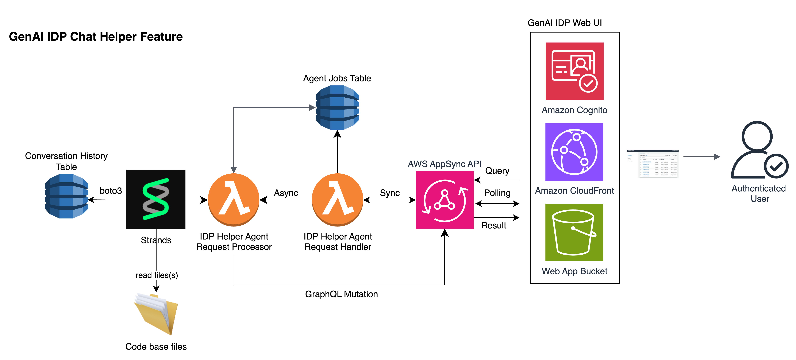
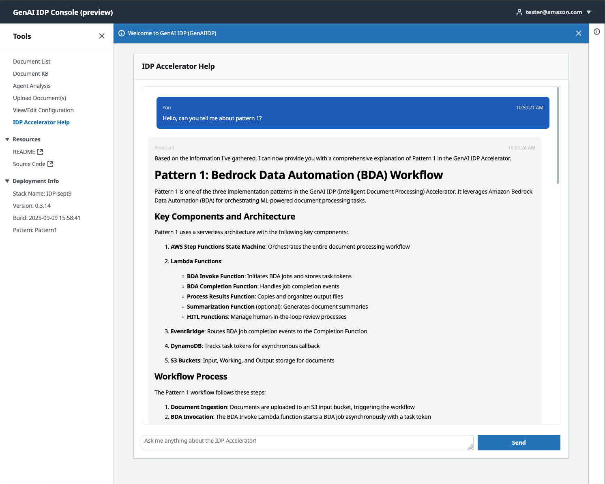

Copyright Amazon.com, Inc. or its affiliates. All Rights Reserved.
SPDX-License-Identifier: MIT-0

# Code Intelligence Feature

The GenAIIDP solution includes an integrated Code Intelligence feature that provides intelligent codebase understanding and analysis capabilities through an AI-powered chat interface. This feature enables developers and users to interactively explore, understand, and analyze complex codebases using natural language queries, making code comprehension and maintenance significantly more efficient.

## Overview

The Code Intelligence feature provides comprehensive codebase analysis and understanding capabilities through:

- **Intelligent Code Analysis**: Natural language queries about codebase structure, functionality, and architecture
- **File System Management**: Efficient handling of large codebases with smart caching and filtering
- **Conversation Memory**: Persistent chat sessions with DynamoDB integration for continuous learning
- **Lambda Integration**: Serverless deployment with automatic codebase extraction and initialization
- **Multi-Format Support**: Support for various file types including Python, JavaScript, Jupyter notebooks, and more
- **Context-Aware Responses**: Deep technical analysis with accurate code references and examples
- **Real-time Code Exploration**: Interactive exploration of codebase components and relationships
- **Secure Architecture**: Enterprise-grade security with comprehensive audit trails and monitoring

## Key Features

- **Natural Language Code Queries**: Ask questions about code functionality, architecture, and implementation details
- **Intelligent File Discovery**: Automatic identification and analysis of relevant code files
- **Codebase Overview Generation**: Comprehensive understanding of project structure and component relationships
- **Multi-File Analysis**: Simultaneous analysis of multiple related files for comprehensive understanding
- **Notebook Support**: Special handling for Jupyter notebooks with image removal and optimization
- **Smart Caching**: File hashing and overview caching for improved performance
- **Conversation Persistence**: Maintain context across multiple queries within a session
- **Advanced Filtering**: Configurable ignore patterns to focus on relevant code
- **Performance Optimization**: Sliding window conversation management and tool result optimization
- **Comprehensive Monitoring**: Detailed logging and performance tracking

## Architecture

The architecture of the Code Intelligence feature is shown below. The Web UI and AppSync API components are the same as used by the rest of the IDP system (with new AppSync endpoints added). The system uses Lambda functions for serverless processing with codebase files stored in the Lambda's /tmp directory (with future plans to migrate to EFS for enhanced scalability).



### System Components

The Code Intelligence feature uses a streamlined architecture with:

1. **IDP Helper Agent Request Handler**: Receives and validates incoming code intelligence requests
2. **IDP Helper Agent Request Processor**: Processes queries using the Strands framework and specialized tools
3. **Conversation History Management**: Persistent storage of chat sessions and analysis results
4. **Codebase File System**: Currently uses Lambda /tmp directory, with future EFS integration planned
5. **Web UI Integration**: Seamless integration with the existing GenAI IDP web interface

### Agent Workflow

1. **Request Reception**: User submits a natural language question about the codebase through the web UI
2. **Codebase Initialization**: System extracts and prepares codebase files in the Lambda environment
3. **Context Loading**: Agent loads codebase overview and determines relevant files for analysis
4. **Intelligent Analysis**: Agent processes the query using specialized tools and codebase understanding
5. **Response Generation**: System generates comprehensive responses with code examples and technical insights
6. **Result Display**: Final results are displayed in the web interface with conversation history

### Code Intelligence Workflow

For codebase analysis queries, the Code Intelligence Agent follows this structured workflow:

1. **Codebase Overview Loading**: Agent loads comprehensive codebase structure and file purposes using `load_codebase_overview_context`
2. **Relevance Assessment**: Determines if specific file contents are needed beyond the overview context
3. **Intelligent File Retrieval**: Retrieves relevant files in ranked order of importance using `read_multiple_files`
4. **Multi-File Analysis**: Analyzes multiple related files simultaneously for comprehensive understanding
5. **Context-Aware Response**: Provides technical responses with code examples, architectural insights, and implementation details
6. **Conversation Continuity**: Maintains context for follow-up questions within the same session

### Security Architecture

The Code Intelligence feature implements enterprise-grade security:

- **Secure File Access**: Controlled access to codebase files with proper authentication and authorization
- **Session Isolation**: Each user's queries and analysis are isolated and tracked separately
- **Audit Trail**: Comprehensive logging of all interactions for security reviews and compliance
- **Data Protection**: Sensitive code information is handled securely with proper encryption
- **Access Control**: Integration with existing IDP authentication and authorization mechanisms
- **Resource Management**: Proper cleanup of temporary files and resources after processing


## Available Tools

The code intelligence agent has access to specialized tools for comprehensive code analysis:

### 1. Codebase Overview Context Tool
- **Purpose**: Loads existing codebase overview with file purposes and relationships
- **Usage**: Automatically called to understand project structure and component relationships
- **Features**: 
  - High-level overview mode for large codebases (300+ files)
  - Detailed analysis mode for comprehensive understanding
  - Cached results for improved performance

### 2. Multi-File Reader Tool
- **Purpose**: Efficiently reads multiple related files for comprehensive analysis
- **Features**: 
  - Character limit management to respect context windows
  - Smart file prioritization and ranking
  - Batch processing for improved performance
  - Support for various file types and encodings

### 3. Notebook Reader Tool
- **Purpose**: Specialized handling of Jupyter notebooks
- **Features**: 
  - Automatic image removal for size optimization
  - JSON structure preservation
  - Size limit enforcement (2GB default)
  - Content extraction and formatting

### 4. File System Management Tools
- **Purpose**: Comprehensive file system operations and caching
- **Features**: 
  - SHA256 hashing for change detection
  - Intelligent ignore pattern matching
  - Directory tree generation
  - File collection with filtering

## Using Code Intelligence

### Accessing the Feature

1. Log in to the GenAI IDP Web UI
2. Navigate to the "IDP Accelerator Help" section in the main navigation
3. You'll see a chat-like interface for querying the codebase



### Types of Questions

The Code Intelligence agent can answer various types of questions about your codebase:

**Architecture and Structure Questions:**
- "What is the main architecture of this codebase?"
- "How are the different modules organized?"
- "What are the key components and their relationships?"
- "Explain the overall system design and data flow"

**Functionality and Implementation Questions:**
- "How does the document processing pipeline work?"
- "What are the different patterns supported by this system?"
- "Explain how the agent framework is implemented"
- "How does the authentication and authorization work?"

**Code Analysis Questions:**
- "What are the main classes and their purposes?"
- "Show me the key functions in the analytics module"
- "How is error handling implemented across the system?"
- "What design patterns are used in this codebase?"

**Configuration and Setup Questions:**
- "How do I configure the system for my environment?"
- "What environment variables are required?"
- "How do I set up the development environment?"
- "What are the deployment requirements?"

### Sample Queries

Here are some example questions you can ask about the IDP codebase:

```
"Explain the difference between Pattern 1, Pattern 2, and Pattern 3 in this IDP system"

"How does the agent framework work and what agents are available?"

"What are the main configuration options and how do I customize them?"

"Show me how document processing works from upload to final results"

"How is the web UI integrated with the backend services?"

"What security measures are implemented in this system?"

"How do I add a new document type for processing?"

"Explain the monitoring and logging capabilities"
```

### Understanding Results

The Code Intelligence agent provides comprehensive responses including:

1. **Technical Explanations**: Detailed explanations of code functionality and architecture
2. **Code Examples**: Relevant code snippets with proper context and annotations
3. **Architectural Insights**: High-level system design and component relationships
4. **Implementation Details**: Specific implementation patterns and best practices
5. **Configuration Guidance**: Setup and configuration instructions with examples
6. **Troubleshooting Help**: Common issues and their solutions

Each response includes:
- Clear technical explanations with appropriate depth
- Direct references to relevant code sections and files
- Step-by-step guidance for complex procedures
- Best practices and recommendations

## File System Architecture

### Current Implementation (Lambda /tmp)

The Code Intelligence feature currently uses the Lambda function's `/tmp` directory for codebase storage:

**Advantages:**
- **Fast Access**: Direct file system access with minimal latency
- **Simple Implementation**: No additional infrastructure required
- **Cost Effective**: No additional storage costs beyond Lambda execution

**Limitations:**
- **Size Constraints**: Limited to 10GB total storage in `/tmp`
- **Ephemeral Storage**: Files are lost when Lambda container is recycled
- **Cold Start Impact**: Codebase extraction required on each cold start

**Current Workflow:**
1. **Initialization**: Codebase zip files are extracted to `/tmp/codebase` on Lambda startup
2. **Processing**: Agent tools read files directly from the `/tmp` directory
3. **Caching**: Overview and hash files are stored in `/tmp/output` for performance
4. **Cleanup**: Temporary files are automatically cleaned up when Lambda container terminates

### Future Implementation (EFS Integration)

Planned migration to Amazon Elastic File System (EFS) for enhanced scalability:

**Planned Advantages:**
- **Persistent Storage**: Codebase files persist across Lambda invocations
- **Larger Capacity**: Support for much larger codebases (petabyte scale)
- **Shared Access**: Multiple Lambda instances can access the same codebase
- **Faster Cold Starts**: No need to extract codebase on each cold start

**Migration Benefits:**
- **Improved Performance**: Faster initialization and reduced cold start times
- **Enhanced Scalability**: Support for enterprise-scale codebases
- **Better Reliability**: Persistent storage reduces initialization failures
- **Cost Optimization**: Reduced Lambda execution time and costs

## Configuration

The Code Intelligence feature is configured through environment variables and CloudFormation parameters:

### Model Selection

**Supported Models:**
- `us.anthropic.claude-3-7-sonnet-20250219-v1:0` (Default - Recommended)
- `us.anthropic.claude-3-5-sonnet-20241022-v2:0`
- `us.anthropic.claude-3-haiku-20240307-v1:0`
- `us.amazon.nova-pro-v1:0`
- `us.amazon.nova-lite-v1:0`

### Infrastructure Components

The feature automatically creates:
- **DynamoDB Tables**: Conversation history and memory management
- **Lambda Functions**: Request handler and processor functions
- **AppSync Resolvers**: GraphQL API endpoints for web UI integration
- **IAM Roles**: Minimal permissions for secure operation
- **S3 Integration**: Codebase storage and caching (future EFS migration)

### Environment Variables

Key configuration settings:
- **CODEBASE_DIR**: Root directory for codebase files
- **OUTPUT_DIR**: Directory for generated outputs and cache
- **ENABLE_MONITORING**: Enable comprehensive monitoring and logging
- **CONTEXT_WINDOW_SIZE**: Maximum context window size in characters
- **MAX_FILE_SIZE**: Maximum individual file size (2MB default)
- **MAX_NOTEBOOK_SIZE**: Maximum notebook size (2GB default)
- **MEMORY_METHOD**: Memory backend method (DynamoDB or AgentCore)
- **BEDROCK_REGION**: AWS Bedrock region for model access

## Best Practices

### Query Optimization

1. **Start with Overview**: Begin with general architecture questions before diving into specifics
2. **Be Specific**: Clearly state what aspect of the code you want to understand
3. **Use Context**: Reference previous responses to build deeper understanding
4. **Ask Follow-ups**: Build on previous answers to explore topics in depth

### Effective Code Exploration

1. **Understand Structure First**: Ask about overall architecture before specific implementations
2. **Focus on Key Components**: Identify and explore the most important modules first
3. **Trace Data Flow**: Follow how data moves through the system
4. **Explore Patterns**: Understand common patterns and design principles used

### Performance Optimization

1. **Efficient Queries**: Ask focused questions to get targeted responses
2. **Batch Related Questions**: Group related questions to leverage context
3. **Use High-Level Overview**: For large codebases, start with high-level overview mode
4. **Monitor Response Times**: Be aware of context window limits for complex queries

## Testing and Development

### Local Testing Setup

The Code Intelligence feature includes comprehensive testing utilities for local development:

1. **Environment Setup**: Create a virtual environment and install required dependencies
2. **Configuration**: Copy and configure environment variables from the provided template
3. **Testing**: Run test queries against the code intelligence system

### Environment Configuration

Required environment variables for testing:
- **CODEBASE_DATA_PATH**: Path to codebase zip files
- **LAMBDA_TMP_DIR**: Temporary directory for Lambda simulation
- **BEDROCK_REGION**: AWS Bedrock region for model access
- **Memory Tables**: DynamoDB table names for conversation history
- **MEMORY_METHOD**: Backend method for conversation persistence

### Sample Test Queries

The testing framework supports various types of queries:

**Architecture Understanding:**
- "Explain the overall system architecture and main components"

**Pattern Comparison:**
- "What are the differences between Pattern 1, Pattern 2, and Pattern 3?"

**Implementation Details:**
- "How is the document processing pipeline implemented?"

**Configuration Guidance:**
- "What environment variables do I need to configure for deployment?"

## Troubleshooting

### Common Issues

**Agent Not Responding:**
- Check CloudWatch logs for the IDP Helper Agent Request Processor Lambda function
- Verify Bedrock model access is enabled for your selected model
- Ensure sufficient Lambda timeout (15 minutes) for complex codebase analysis
- Check that codebase files are properly extracted to `/tmp` directory

**File Reading Errors:**
- Verify codebase zip files are present in the expected location
- Check file permissions and encoding issues
- Monitor file size limits and context window constraints
- Review ignore patterns to ensure relevant files are not excluded

**Memory and Performance Issues:**
- Monitor Lambda memory usage and increase if necessary
- Check context window limits for large file analysis
- Use high-level overview mode for codebases with 300+ files
- Consider breaking complex queries into smaller, focused questions

**Conversation History Issues:**
- Verify DynamoDB table permissions and configuration
- Check session ID consistency across requests
- Monitor DynamoDB write throttling and capacity
- Review conversation manager settings for memory optimization

### Monitoring and Logging

- **CloudWatch Logs**: Detailed logs for Lambda functions with agent execution traces
- **DynamoDB Console**: View conversation history and session data directly
- **Agent Messages**: Real-time display of agent reasoning and tool usage in web UI
- **Performance Metrics**: Monitor response times, file processing, and resource usage

### Debug Mode

Enable detailed debugging for troubleshooting by configuring monitoring and debug output settings in the system configuration.

## Cost Considerations

The Code Intelligence feature uses several AWS services that incur costs:

- **Amazon Bedrock**: Model inference costs for code analysis processing
- **AWS Lambda**: Function execution costs for request handling and processing
- **Amazon DynamoDB**: Storage and request costs for conversation history and memory
- **Amazon S3**: Storage costs for codebase files and caching (current implementation)
- **Amazon EFS**: Storage and throughput costs (future implementation)
- **Amazon CloudWatch**: Logging and monitoring costs

### Cost Optimization Strategies

1. **Model Selection**: Choose appropriate Bedrock models based on accuracy vs. cost requirements
2. **Efficient Queries**: Ask focused questions to minimize processing time
3. **Caching Utilization**: Leverage codebase overview caching to reduce repeated analysis
4. **Memory Management**: Optimize Lambda memory allocation based on codebase size
5. **Session Management**: Use conversation history effectively to avoid redundant processing

Monitor usage through AWS Cost Explorer and set up billing alerts for cost control.

## Integration with Other Features

The Code Intelligence feature integrates seamlessly with other GenAI IDP capabilities:

### Agent Framework Integration
- Shares the same Strands-based agent framework with analytics agents
- Common monitoring and logging infrastructure
- Unified conversation management and memory systems

### Web UI Integration
- Consistent user interface with other IDP features
- Shared authentication and authorization mechanisms
- Common AppSync API patterns and GraphQL resolvers

### Configuration Management
- Integrated with overall IDP configuration system
- Shared environment variable patterns
- Common CloudFormation deployment templates

### Security Integration
- Uses the same security model as other IDP components
- Integrated audit trails and compliance logging
- Shared IAM roles and permission patterns

## Future Enhancements

Planned improvements for the Code Intelligence feature include:

### File System Migration
- **EFS Integration**: Migration from Lambda /tmp to Amazon EFS for persistent storage
- **Enhanced Scalability**: Support for larger codebases and multiple concurrent users
- **Improved Performance**: Faster cold starts and reduced initialization overhead


The Code Intelligence feature represents a significant advancement in making complex codebases more accessible and understandable, enabling developers and stakeholders to quickly gain insights into system architecture, functionality, and implementation details through natural language interaction.
