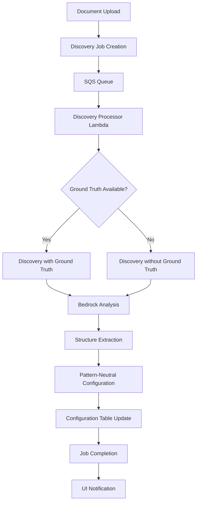
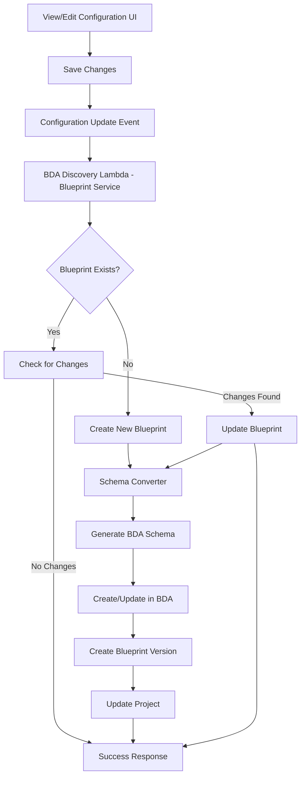
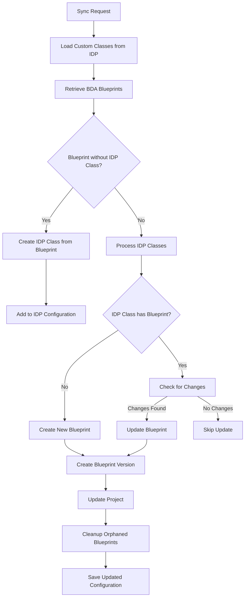

Copyright Amazon.com, Inc. or its affiliates. All Rights Reserved.
SPDX-License-Identifier: MIT-0

# Discovery Module

The Discovery module is an intelligent document analysis system that automatically identifies document structures, field types, and organizational patterns to create document processing blueprints. This module provides a **pattern-neutral discovery process** that works across all processing patterns, with specialized implementations for pattern-specific automation.

Demo video (3m)


https://github.com/user-attachments/assets/101f73f6-27f1-4995-b35e-fa2fb44eb254


Demo video (10m)


https://github.com/user-attachments/assets/ba7f863f-0cac-4778-8bcf-b4beee8a3301


## Pattern-Neutral Discovery vs Pattern-Specific Implementation

The Discovery module operates on two levels:

### 🌐 Pattern-Neutral Discovery Process
- **Document Analysis**: Core discovery logic works across all patterns (Pattern 1, 2, and 3)
- **Standardized Configuration**: Generates consistent document class definitions regardless of target pattern
- **Flexible Output**: Produces pattern-agnostic configuration that can be adapted to any processing workflow
- **Reusable Components**: Common discovery services and configuration management

### 🎯 Pattern-Specific Implementation
- **Pattern 1 (BDA)**: Automated BDA blueprint creation and management
- **Pattern 2 & 3**: Direct configuration updates for Textract + Bedrock workflows
- **Extensible Architecture**: New patterns can implement custom discovery handlers

This dual approach ensures discovery insights can be leveraged across different processing architectures while enabling pattern-specific optimizations.

## Table of Contents

- [Pattern-Neutral Discovery vs Pattern-Specific Implementation](#pattern-neutral-discovery-vs-pattern-specific-implementation)
- [Overview](#overview)
  - [What is Discovery](#what-is-discovery)
  - [Key Features](#key-features)
  - [Use Cases](#use-cases)
- [Architecture](#architecture)
  - [Pattern-Neutral Components](#pattern-neutral-components)
  - [Pattern-Specific Implementations](#pattern-specific-implementations)
  - [Processing Flow](#processing-flow)
  - [Integration Points](#integration-points)
- [Discovery Methods](#discovery-methods)
  - [Discovery Without Ground Truth](#discovery-without-ground-truth)
  - [Discovery With Ground Truth](#discovery-with-ground-truth)
  - [Choosing the Right Method](#choosing-the-right-method)
- [Configuration](#configuration)
  - [Model Configuration](#model-configuration)
  - [Prompt Customization](#prompt-customization)
  - [Output Format Configuration](#output-format-configuration)
- [Using the Discovery Module](#using-the-discovery-module)
  - [Web UI Interface](#web-ui-interface)
  - [API Integration](#api-integration)
  - [Processing Results](#processing-results)
- [Configuration Management](#configuration-management)
  - [Schema Definition](#schema-definition)
  - [Default Configuration](#default-configuration)
  - [Customization Options](#customization-options)
- [BdaIDP Sync Feature](#bdaidp-sync-feature)
  - [How BdaIDP Sync Works](#how-bdaidp-sync-works)
  - [Sync Process Flow](#sync-process-flow)
  - [Key Features](#key-features-1)
  - [Limitations and Constraints](#limitations-and-constraints)
  - [Best Practices for Sync Success](#best-practices-for-sync-success)
  - [Troubleshooting Sync Issues](#troubleshooting-sync-issues)
  - [Schema Design Recommendations](#schema-design-recommendations)
- [Best Practices](#best-practices)
  - [Document Selection](#document-selection)
  - [Ground Truth Preparation](#ground-truth-preparation)
  - [Configuration Tuning](#configuration-tuning)
- [Troubleshooting](#troubleshooting)
  - [Common Issues](#common-issues)
  - [Error Handling](#error-handling)
- [Limitations](#limitations)
  - [Known Limitations](#known-limitations)
  

## Overview

### What is Discovery

The Discovery module analyzes document samples to automatically identify:

- **Document Structure**: Logical groupings of fields and sections
- **Field Types**: Data types (string, number, date, etc.) for each field
- **Field Descriptions**: Contextual information about field purpose and location
- **Document Classes**: Categorization and naming of document types
- **Organizational Patterns**: How fields are grouped and related

This analysis produces structured configuration templates that can be used to configure document processing workflows in any of the supported patterns (Pattern 1, 2, or 3).

### Key Features

- **🤖 Automated Analysis**: Uses advanced LLMs to analyze document structure without manual intervention
- **📋 Blueprint Generation**: Creates ready-to-use configuration templates for document processing
- **🎯 Ground Truth Support**: Leverages existing labeled data to improve discovery accuracy
- **🔧 Configurable Models**: Supports multiple Bedrock models with customizable parameters
- **📝 Custom Prompts**: Allows fine-tuning of analysis behavior through prompt engineering
- **🔄 Iterative Refinement**: Enables progressive improvement of document understanding
- **🌐 Multi-Format Support**: Handles PDF documents and various image formats
- **⚡ Real-Time Processing**: Provides immediate feedback through the web interface

### Use Cases

**New Document Type Onboarding:**
- Analyze sample documents to understand structure
- Generate initial processing configuration
- Reduce time-to-production for new document types

**Configuration Optimization:**
- Improve existing document processing accuracy
- Identify missing fields or incorrect field types
- Refine field descriptions and groupings

**Document Understanding:**
- Explore unknown document formats
- Understand complex document structures
- Document field relationships and dependencies

**Rapid Prototyping:**
- Quickly bootstrap new document processing workflows
- Test processing approaches with minimal setup
- Validate document processing concepts

## Architecture

### Pattern-Neutral Components

**Discovery Processor Lambda (`src/lambda/discovery_processor/index.py`):**
- **Universal Job Processing**: Handles discovery jobs from SQS queue across all patterns
- **Pattern-Agnostic Analysis**: Orchestrates document analysis workflow using common services
- **Standardized Error Handling**: Consistent job status management and error reporting
- **Configuration Event Routing**: Triggers pattern-specific configuration updates

**Classes Discovery Service (`lib/idp_common_pkg/idp_common/discovery/classes_discovery.py`):**
- **Core Discovery Engine**: Pattern-neutral document analysis and structure identification
- **Bedrock Integration**: LLM-powered document understanding with configurable models
- **Universal Configuration Format**: Generates standardized document class definitions
- **Ground Truth Processing**: Supports both guided and unguided discovery methods

**Discovery Panel UI (`src/ui/src/components/discovery/DiscoveryPanel.jsx`):**
- **Pattern-Agnostic Interface**: Unified web interface for all discovery operations
- **Real-time Monitoring**: Job status tracking via GraphQL subscriptions
- **Universal Results Display**: Consistent visualization across all patterns
- **Export Flexibility**: Configuration export adapted to target pattern

**Discovery Tracking Table:**
- **Cross-Pattern Tracking**: DynamoDB table for job status across all patterns
- **Metadata Storage**: Pattern-neutral job information and progress tracking
- **Event Coordination**: Enables real-time updates and pattern-specific notifications

**Configuration Table:**
- **Metadata Storage**: Discovered classes are stored in configuration table as "custom" configuration classes


### Pattern-Specific Implementations

#### Pattern 1: BDA Blueprint Automation

**BDA Discovery Function (`patterns/pattern-1/src/bda_discovery_function/index.py`):**
- **Configuration Event Handler**: Processes configuration update events from discovery jobs
- **Automated Blueprint Management**: Creates and updates BDA blueprints based on discovery results
- **Project Integration**: Seamlessly integrates with existing BDA projects

**BDA Blueprint Service (`lib/idp_common_pkg/idp_common/bda/bda_blueprint_service.py`):**
- **Blueprint Lifecycle Management**: Automated creation, updating, and versioning of BDA blueprints
- **Schema Conversion**: Transforms discovery results into BDA-compatible schemas
- **Project Synchronization**: Maintains consistency between discovery configuration and BDA projects
- **Change Detection**: Intelligent updates only when configuration changes are detected

**Schema Converter (`lib/idp_common_pkg/idp_common/bda/schema_converter.py`):**
- **Format Translation**: Converts pattern-neutral discovery results to BDA blueprint schemas
- **Field Mapping**: Transforms discovery field definitions to BDA-compatible formats
- **Validation**: Ensures generated schemas meet BDA requirements

**Key Features of Pattern 1 Implementation:**
- **🤖 Automated Blueprint Creation**: Discovery results automatically generate BDA blueprints
- **🔄 Intelligent Updates**: Only updates blueprints when actual changes are detected
- **📋 Version Management**: Automatic blueprint versioning and project integration
- **🎯 Zero-Touch Deployment**: No manual blueprint configuration required

#### Pattern 2 & 3: Direct Configuration Updates

**Configuration Update Process:**
- **Direct Integration**: Discovery results directly update pattern configuration
- **Immediate Availability**: New document classes available for processing immediately
- **Manual Review**: Optional human review before configuration activation
- **Rollback Support**: Configuration versioning for easy rollback if needed

#### Extensible Architecture for New Patterns

The discovery system is designed to support additional patterns through:

**Generic Configuration Events:**
```python
# Configuration event structure (pattern-agnostic)
{
    "eventType": "CONFIGURATION_UPDATE",
    "documentClasses": [...],
    "metadata": {...}
}
```

**Pattern Registration:**
- New patterns can register configuration event handlers
- Custom transformation logic for pattern-specific requirements
- Standardized integration points for consistent behavior

**Implementation Guide for New Patterns:**
1. **Create Configuration Handler**: Implement pattern-specific configuration update logic
2. **Register Event Processor**: Subscribe to configuration update events
3. **Define Schema Transformation**: Convert discovery results to pattern format
4. **Integrate with UI**: Ensure discovery results display correctly for the pattern

### Processing Flow

#### Pattern-Neutral Discovery Flow


#### Pattern 1: BDA Blueprint Automation Flow


### Integration Points

**S3 Integration:**
- Document storage and retrieval
- Ground truth file processing
- Result artifact storage

**DynamoDB Integration:**
- Job tracking and status management
- Configuration storage and retrieval
- Metadata persistence

**Bedrock Integration:**
- LLM-powered document analysis
- Configurable model selection
- Prompt-based structure extraction

**GraphQL/AppSync Integration:**
- Real-time job status updates
- UI synchronization and notifications
- Configuration management APIs

## Discovery Methods

### Discovery Without Ground Truth

This method analyzes documents from scratch without any prior knowledge or labeled examples.

**How it Works:**
1. Document is processed through OCR or direct text extraction
2. LLM analyzes the document structure and content
3. Fields are identified based on visual layout and text patterns
4. Document class and description are generated automatically
5. Field groupings and relationships are determined

**Best For:**
- Completely new document types
- Exploratory analysis of unknown formats
- Initial document understanding
- Rapid prototyping scenarios

**Configuration Example:**
```yaml
discovery:
  without_ground_truth:
    model_id: "us.amazon.nova-pro-v1:0"
    temperature: 1.0
    top_p: 0.1
    max_tokens: 10000
    system_prompt: >-
      You are an expert in processing forms. Analyze forms line by line to identify 
      field names, data types, and organizational structure. Focus on creating 
      comprehensive blueprints for document processing without extracting actual values.
    user_prompt: >-
      This image contains forms data. Analyze the form line by line...
```

**Output Structure:**
```json
{
  "document_class": "W4-Form",
  "document_description": "Employee withholding allowance certificate",
  "groups": [
    {
      "name": "EmployeeInformation",
      "description": "Personal details of the employee",
      "attributeType": "group",
      "groupType": "normal",
      "groupAttributes": [
        {
          "name": "FirstName",
          "dataType": "string",
          "description": "Employee's first name from line 1"
        }
      ]
    }
  ]
}
```

### Discovery With Ground Truth

This method uses existing labeled data or known field definitions to optimize the discovery process.

**How it Works:**
1. Ground truth data is loaded from S3 (JSON format)
2. Document is analyzed with reference to expected fields
3. LLM matches document structure to ground truth patterns
4. Field descriptions and types are refined based on known data
5. Missing or additional fields are identified and documented

**Best For:**
- Improving existing configurations
- Leveraging known document structures
- Ensuring consistency with established patterns
- Optimizing field extraction accuracy

**Ground Truth Format:**
```json
{
  "document_class": "W4Form",
  "employee_name": "John Smith",
  "ssn": "123-45-6789",
  "address": "123 Main Street",
  "filing_status": "Single",
  "dependents": 0
}
```

**Configuration Example:**
```yaml
discovery:
  with_ground_truth:
    model_id: "us.amazon.nova-pro-v1:0"
    temperature: 1.0
    top_p: 0.1
    max_tokens: 10000
    system_prompt: >-
      You are an expert in processing forms. Use provided ground truth data as 
      reference to optimize field extraction and ensure consistency with expected 
      document structure and field definitions.
    user_prompt: >-
      This image contains unstructured data. Analyze the data line by line using 
      the provided ground truth as reference...
      <GROUND_TRUTH_REFERENCE>
      {ground_truth_json}
      </GROUND_TRUTH_REFERENCE>
```

### Choosing the Right Method

| Factor | Without Ground Truth | With Ground Truth |
|--------|---------------------|-------------------|
| **Use Case** | New document exploration | Configuration optimization |
| **Accuracy** | Good for structure discovery | Higher accuracy for known patterns |
| **Speed** | Fast, single-pass analysis | Optimized based on reference data |
| **Consistency** | May vary between runs | Consistent with reference patterns |
| **Setup Effort** | Minimal - just upload document | Requires ground truth preparation |
| **Best For** | Unknown document types | Improving existing workflows |

## Configuration

The Discovery module supports comprehensive configuration through the Pattern 1 template and configuration files. All settings can be customized through the web UI or configuration files.

### Model Configuration

**Supported Models:**
- `us.amazon.nova-lite-v1:0` - Fast, cost-effective for simple documents
- `us.amazon.nova-pro-v1:0` - Balanced performance and accuracy (recommended)
- `us.amazon.nova-premier-v1:0` - Highest accuracy for complex documents
- `us.anthropic.claude-3-haiku-20240307-v1:0` - Fast processing
- `us.anthropic.claude-3-5-sonnet-20241022-v2:0` - High accuracy
- `us.anthropic.claude-3-7-sonnet-20250219-v1:0` - Latest capabilities

**Model Parameters:**
```yaml
discovery:
  without_ground_truth:
    model_id: "us.amazon.nova-pro-v1:0"
    temperature: 1.0        # Creativity level (0.0-1.0)
    top_p: 0.1             # Nucleus sampling (0.0-1.0)
    max_tokens: 10000      # Maximum response length
```

**Parameter Guidelines:**
- **Temperature**: Use 1.0 for creative structure discovery, 0.0 for consistent results
- **Top P**: Lower values (0.1) for focused analysis, higher for diverse interpretations
- **Max Tokens**: 10000+ recommended for complex documents with many fields

### Prompt Customization

**System Prompt Configuration:**
```yaml
discovery:
  without_ground_truth:
    system_prompt: >-
      You are an expert in processing forms. Extracting data from images and documents. 
      Analyze forms line by line to identify field names, data types, and organizational 
      structure. Focus on creating comprehensive blueprints for document processing 
      without extracting actual values.
```

**User Prompt Configuration:**
```yaml
discovery:
  without_ground_truth:
    user_prompt: >-
      This image contains forms data. Analyze the form line by line.
      Image may contains multiple pages, process all the pages. 
      Form may contain multiple name value pair in one line. 
      Extract all the names in the form including the name value pair which doesn't have value. 
      Organize them into groups, extract field_name, data_type and field description.
      Field_name should be less than 60 characters, should not have space use '-' instead of space.
      field_description is a brief description of the field and the location of the field 
      like box number or line number in the form and section of the form.
      Field_name should be unique within the group.
      Add two fields document_class and document_description. 
      For document_class generate a short name based on the document content like W4, I-9, Paystub. 
      For document_description generate a description about the document in less than 50 words. 
      Group the fields based on the section they are grouped in the form. 
      Group should have attributeType as "group".
      If the group repeats, add an additional field groupType and set the value as "Table".
      Do not extract the values.
      Return the extracted data in JSON format.
```

**Ground Truth Prompt Features:**
- **Placeholder Support**: Use `{ground_truth_json}` for dynamic ground truth injection
- **Reference Integration**: Automatically includes ground truth data in analysis context
- **Consistency Enforcement**: Ensures field names and types match reference patterns

### Output Format Configuration

**Sample JSON Structure:**
```yaml
discovery:
  output_format:
    sample_json: >-
      {
        "document_class": "Form-1040",
        "document_description": "Brief summary of the document",
        "groups": [
          {
            "name": "PersonalInformation",
            "description": "Personal information of Tax payer",
            "attributeType": "group",
            "groupType": "normal",
            "groupAttributes": [
              {
                "name": "FirstName",
                "dataType": "string",
                "description": "First Name of Taxpayer"
              },
              {
                "name": "Age",
                "dataType": "number",
                "description": "Age of Taxpayer"
              }
            ]
          }
        ]
      }
```

**Field Types Supported:**
- `string` - Text fields, names, addresses
- `number` - Numeric values, amounts, quantities
- `date` - Date fields in various formats
- `boolean` - Yes/no, checkbox fields
- `array` - Lists or repeated elements

**Group Types:**
- `normal` - Standard field groupings
- `List` - Repeating tabular data structures

## Using the Discovery Module

### Web UI Interface

**Accessing Discovery:**
1. Navigate to the main application dashboard
2. Click on the "Discovery" tab or panel
3. Upload document(s) for analysis
4. Optionally upload ground truth file (JSON format)
5. Click "Start Discovery" to begin analysis

**Monitoring Progress:**
- Real-time job status updates via GraphQL subscriptions
- Progress indicators and status messages
- Error notifications and troubleshooting guidance
- Estimated completion times

**Reviewing Results:**
- Interactive preview of discovered structure
- Field-by-field review and validation
- Export options for configuration integration
- Comparison with existing configurations

### API Integration

**GraphQL Mutations:**
```graphql
mutation StartDiscoveryJob($input: DiscoveryJobInput!) {
  startDiscoveryJob(input: $input) {
    jobId
    status
    message
  }
}
```

**Job Status Subscription:**
```graphql
subscription OnDiscoveryJobStatusChange($jobId: ID!) {
  onDiscoveryJobStatusChange(jobId: $jobId) {
    jobId
    status
    progress
    errorMessage
    result
  }
}
```

**Direct API Usage:**
```python
from idp_common.discovery.classes_discovery import ClassesDiscovery

# Initialize with configuration
discovery = ClassesDiscovery(
    input_bucket="my-documents",
    input_prefix="sample-form.pdf",
    config=my_discovery_config,
    region="us-west-2"
)

# Run discovery without ground truth
result = discovery.discovery_classes_with_document(
    input_bucket="my-documents",
    input_prefix="sample-form.pdf"
)

# Run discovery with ground truth
result = discovery.discovery_classes_with_document_and_ground_truth(
    input_bucket="my-documents",
    input_prefix="sample-form.pdf",
    ground_truth_key="ground-truth.json"
)
```

### Processing Results

**Result Structure:**
```json
{
  "status": "SUCCESS",
  "jobId": "discovery-job-12345",
  "message": "Discovery completed successfully",
  "configuration": {
    "document_class": "W4Form",
    "document_description": "Employee withholding certificate",
    "groups": [...],
    "metadata": {
      "processing_time": "45.2s",
      "model_used": "us.amazon.nova-pro-v1:0",
      "confidence_score": 0.92
    }
  }
}
```

**Integration Options:**
- **Direct Configuration Update**: Automatically update existing configuration
- **Export for Review**: Download configuration for manual review and editing
- **Merge with Existing**: Combine with current document class definitions
- **Create New Class**: Add as new document type to existing configuration

## Configuration Event System

The Discovery module uses a generic configuration event system that enables pattern-specific implementations while maintaining a consistent discovery process.

### Event Architecture

**Configuration Update Events:**
Configuration events are triggered when discovery jobs complete and contain pattern-neutral results that can be processed by any pattern implementation.

```json
{
  "eventType": "CONFIGURATION_UPDATE",
  "source": "discovery-processor",
  "timestamp": "2024-01-15T10:30:00Z"
}
```

### Pattern 1: BDA Blueprint Implementation

**Event Processing:**
Pattern 1 implements a sophisticated blueprint management system that responds to configuration events:

```python
# BDA Discovery Function Handler
def handler(event, context):
    """
    Processes configuration update events for Pattern 1.
    Automatically creates/updates BDA blueprints based on discovery results.
    """
    bda_project_arn = os.environ.get("BDA_PROJECT_ARN")
    blueprint_service = BdaBlueprintService(
        dataAutomationProjectArn=bda_project_arn
    )
    
    # Process configuration update event
    result = blueprint_service.create_blueprints_from_custom_configuration()
    return result
```

**Blueprint Lifecycle Management:**
- **Creation**: New document classes automatically generate BDA blueprints
- **Updates**: Changes in discovery results trigger blueprint updates
- **Versioning**: Blueprint versions are managed automatically
- **Project Integration**: Blueprints are seamlessly integrated into BDA projects

**Change Detection:**
The system intelligently detects when updates are needed:

```python
def _check_for_updates(self, custom_class: dict, blueprint: dict):
    """
    Compares discovery results with existing blueprint to determine if updates are needed.
    Only triggers updates when actual changes are detected.
    """
    # Check document class and description changes
    if (custom_class["name"] != schema["class"] or 
        custom_class["description"] != schema["description"]):
        return True
    
    # Check field-level changes
    for group in groups:
        for field in fields:
            if field_changed(field, existing_blueprint_field):
                return True
    
    return False
```

### Implementing Configuration Events for New Patterns

The configuration event system is designed to be extensible for new patterns:

#### Step 1: Create Event Handler
```python
def pattern_x_configuration_handler(event, context):
    """
    Custom configuration handler for Pattern X.
    Processes discovery results according to pattern-specific requirements.
    """
    try:
        # Extract discovery results from event
        # retrieve custom classes from configuration table for processing.
        
        # Transform to pattern-specific format
        pattern_config = transform_to_pattern_x_format(custom_classes)
        
        # Update pattern-specific configuration
        update_pattern_x_configuration(pattern_config)
        
        return {"status": "success", "message": "Configuration updated"}
        
    except Exception as e:
        logger.error(f"Pattern X configuration update failed: {e}")
        return {"status": "error", "message": str(e)}
```

#### Step 2: Register Event Processor
```yaml
# CloudFormation template for Pattern X
PatternXConfigurationHandler:
  Type: AWS::Lambda::Function
  Properties:
    Handler: index.pattern_x_configuration_handler
    Runtime: python3.9
    Environment:
      Variables:
        PATTERN_NAME: "pattern-x"
        CONFIG_TABLE: !Ref ConfigurationTable

# Event source mapping
ConfigurationEventSource:
  Type: AWS::Lambda::EventSourceMapping
  Properties:
    EventSourceArn: !GetAtt ConfigurationQueue.Arn
    FunctionName: !Ref PatternXConfigurationHandler
```

### Benefits of the Generic Event System

**🔄 Loose Coupling**: Patterns can implement discovery integration independently
**📈 Scalability**: New patterns can be added without modifying core discovery logic
**🎯 Flexibility**: Each pattern can optimize configuration handling for its specific needs
**🔧 Maintainability**: Clear separation between discovery logic and pattern-specific implementation
**⚡ Performance**: Asynchronous event processing enables parallel pattern updates

## Configuration Management

### Schema Definition

The Discovery module configuration is defined in the Pattern 1 CloudFormation template with comprehensive UI schema support:

**Schema Structure:**
```yaml
UpdateSchemaConfig:
  Type: AWS::CloudFormation::CustomResource
  Properties:
    ServiceToken: !Ref UpdateConfigurationFunctionArn
    Schema:
      type: object
      properties:
        discovery:
          order: 5
          type: object
          sectionLabel: Discovery Configuration
          description: Configuration for document class discovery functionality
          properties:
            without_ground_truth:
              order: 0
              type: object
              sectionLabel: Discovery Without Ground Truth
              # ... detailed field definitions
```

**UI Integration Features:**
- **Dropdown Model Selection**: Predefined list of supported Bedrock models
- **Range Validation**: Temperature, top_p with proper min/max values
- **Textarea Prompts**: Multi-line editing for system and user prompts
- **Real-time Validation**: Immediate feedback on configuration changes
- **Help Text**: Contextual descriptions for each configuration option

### Default Configuration

**Pattern 1 Default Settings:**
```yaml
discovery:
  without_ground_truth:
    model_id: "us.amazon.nova-pro-v1:0"
    temperature: 1.0
    top_p: 0.1
    max_tokens: 10000
    system_prompt: "You are an expert in processing forms..."
    user_prompt: "This image contains forms data..."
  with_ground_truth:
    model_id: "us.amazon.nova-pro-v1:0"
    temperature: 1.0
    top_p: 0.1
    max_tokens: 10000
    system_prompt: "You are an expert in processing forms..."
    user_prompt: "This image contains unstructured data..."
  output_format:
    sample_json: "{...}"
```

**Configuration Loading Priority:**
1. Custom configuration from DynamoDB (if available)
2. Pattern-specific configuration file
3. Built-in default configuration
4. Environment variable fallbacks

### Customization Options

**Model Selection:**
- Choose models based on document complexity and processing requirements
- Balance accuracy vs. cost vs. speed
- Consider context window limits for large documents

**Prompt Engineering:**
- Customize system prompts for domain-specific terminology
- Adjust user prompts for specific document layouts
- Include examples or constraints in prompts

**Parameter Tuning:**
- Adjust temperature for consistency vs. creativity
- Modify top_p for focused vs. diverse analysis
- Set appropriate max_tokens for document complexity

**Output Customization:**
- Define custom field naming conventions
- Specify required field types and formats
- Configure grouping and organizational patterns

## Pattern 1: BDA Blueprint Management

Pattern 1 provides the most advanced discovery implementation with automated BDA blueprint creation and management.

### Automated Blueprint Creation

**Zero-Touch Blueprint Generation:**
When discovery completes for Pattern 1, the system automatically:

1. **Analyzes Discovery Results**: Processes pattern-neutral discovery output
2. **Converts to BDA Schema**: Transforms field definitions to BDA-compatible format
3. **Creates/Updates Blueprints**: Manages blueprint lifecycle in BDA project
4. **Versions Blueprints**: Automatically creates new versions when changes are detected
5. **Integrates with Project**: Ensures blueprints are available for document processing

**Blueprint Naming Convention:**
```
{StackName}-{DocumentClass}-{UniqueId}
Example: IDP-W4Form-a1b2c3d4
```

### Intelligent Update Detection

The system only updates blueprints when actual changes are detected:

**Change Detection Logic:**
- **Document Class Changes**: Name or description modifications
- **Field Changes**: New fields, modified descriptions, or data type changes
- **Group Changes**: Structural changes in field organization
- **Schema Changes**: Any modification that affects BDA blueprint structure

**Update Process:**
```python
# Example of intelligent update detection
if blueprint_exists:
    if self._check_for_updates(custom_class, existing_blueprint):
        # Update existing blueprint
        self.blueprint_creator.update_blueprint(
            blueprint_arn=blueprint_arn,
            stage="LIVE",
            schema=json.dumps(blueprint_schema)
        )
        # Create new version
        self.blueprint_creator.create_blueprint_version(
            blueprint_arn=blueprint_arn,
            project_arn=self.dataAutomationProjectArn
        )
    else:
        logger.info("No updates needed - blueprint unchanged")
```

### BDA Schema Conversion

**Field Type Mapping:**
Discovery field types are automatically converted to BDA-compatible formats:

| Discovery Type | BDA Schema Type | Description |
|----------------|-----------------|-------------|
| `string` | `string` | Text fields, names, addresses |
| `number` | `number` | Numeric values, amounts |
| `date` | `string` with date format | Date fields with validation |
| `boolean` | `boolean` | Yes/no, checkbox fields |
| `array` | `array` | Lists or repeated elements |

**Group Conversion:**
- **Normal Groups**: Converted to BDA object definitions
- **Table Groups**: Converted to BDA array structures with item templates
- **Nested Groups**: Supported through BDA schema references

**Example Schema Conversion:**
```json
// Discovery Result
{
  "name": "W4Form",
  "description": "Employee withholding certificate",
  "groups": [
    {
      "name": "PersonalInfo",
      "groupAttributes": [
        {
          "name": "FirstName",
          "dataType": "string",
          "description": "Employee first name from line 1"
        }
      ]
    }
  ]
}

// Generated BDA Schema
{
  "class": "W4Form",
  "description": "Employee withholding certificate",
  "definitions": {
    "PersonalInfo": {
      "type": "object",
      "properties": {
        "first-name": {
          "type": "string",
          "instruction": "Employee first name from line 1"
        }
      }
    }
  }
}
```

### Blueprint Lifecycle Management

**Creation Workflow:**
1. **Discovery Completion**: Pattern-neutral discovery results are generated
2. **Configuration Event**: BDA Discovery Function receives configuration update event
3. **Blueprint Service**: Processes configuration and manages blueprint lifecycle
4. **Schema Generation**: Converts discovery results to BDA schema format
5. **Blueprint Creation**: Creates new blueprint in BDA service
6. **Project Integration**: Associates blueprint with BDA project
7. **Version Management**: Creates initial blueprint version

**Update Workflow:**
1. **Change Detection**: Compares new discovery results with existing blueprint
2. **Schema Update**: Generates updated BDA schema if changes detected
3. **Blueprint Update**: Updates existing blueprint with new schema
4. **Version Creation**: Creates new blueprint version
5. **Project Sync**: Ensures project references latest version

### Integration with BDA Projects

**Project Association:**
- Blueprints are automatically associated with the configured BDA project
- Project ARN is specified during stack deployment
- Multiple document classes can share the same BDA project

**Version Management:**
- Each blueprint update creates a new version
- Versions are automatically managed by the system
- Projects always reference the latest blueprint version

**Permissions:**
The system requires specific permissions for BDA integration:
```yaml
BDABlueprintPermissions:
  - bedrock:CreateBlueprint
  - bedrock:UpdateBlueprint
  - bedrock:CreateBlueprintVersion
  - bedrock:ListBlueprints
  - bedrock:GetBlueprint
  - bedrock:DeleteBlueprint
```

### Monitoring and Troubleshooting

**CloudWatch Logs:**
- Blueprint creation/update activities are logged
- Schema conversion details are captured
- Error conditions are clearly documented

**Common Issues:**
- **Permission Errors**: Ensure BDA permissions are correctly configured
- **Schema Validation**: BDA schemas must meet specific format requirements
- **Project Integration**: Verify BDA project ARN is correct and accessible

**Success Indicators:**
- Blueprint appears in BDA console
- Blueprint version is created successfully
- Project shows associated blueprints
- Document processing uses new blueprint

## Best Practices

### Document Selection

**Choose Representative Samples:**
- Select documents that represent typical variations
- Include both simple and complex examples
- Ensure all important sections are represented
- Use high-quality, clear document images

**Document Quality Guidelines:**
- **Resolution**: Minimum 150 DPI for text clarity
- **Format**: PDF preferred, high-quality images acceptable
- **Completeness**: Include all pages of multi-page documents
- **Legibility**: Ensure text is readable and not corrupted

**Sample Size Recommendations:**
- **Single Document**: Good for initial exploration
- **2-3 Documents**: Better for understanding variations
- **5+ Documents**: Optimal for comprehensive analysis
- **Different Layouts**: Include various form versions if available

### Ground Truth Preparation

**JSON Format Requirements:**
```json
{
  "document_class": "FormName",
  "field_name_1": "expected_value_1",
  "field_name_2": "expected_value_2",
  "nested_object": {
    "sub_field": "sub_value"
  },
  "array_field": ["item1", "item2"]
}
```

**Best Practices:**
- **Field Names**: Use descriptive, consistent naming conventions
- **Data Types**: Include examples of all expected data types
- **Completeness**: Cover all important fields in the document
- **Accuracy**: Ensure ground truth data is correct and validated
- **Structure**: Reflect the logical organization of document fields

**Ground Truth Sources:**
- Existing database schemas or data models
- Manual annotation of sample documents
- Previous extraction results (validated)
- Domain expert knowledge and requirements

### Configuration Tuning

**Model Selection Guidelines:**
- **Nova Lite**: Simple forms with clear structure
- **Nova Pro**: Most document types (recommended default)
- **Nova Premier**: Complex layouts, handwritten content
- **Claude Models**: Alternative for specific use cases

**Parameter Optimization:**
```yaml
# For consistent, structured output
discovery:
  without_ground_truth:
    temperature: 0.0    # Low creativity
    top_p: 0.1         # Focused sampling
    
# For creative structure discovery
discovery:
  without_ground_truth:
    temperature: 1.0    # High creativity
    top_p: 0.3         # Diverse sampling
```

**Prompt Engineering Tips:**
- **Be Specific**: Clearly define expected field types and formats
- **Include Examples**: Show desired output structure in prompts
- **Set Constraints**: Specify field naming conventions and limitations
- **Domain Context**: Include relevant domain knowledge and terminology

**Iterative Improvement:**
1. Start with default configuration
2. Run discovery on sample documents
3. Review and validate results
4. Adjust prompts and parameters based on findings
5. Re-run discovery to validate improvements
6. Repeat until satisfactory results are achieved

## Troubleshooting

### Common Issues

**Issue: Discovery Job Fails to Start**
```
Symptoms: Job status remains "PENDING" or shows "FAILED" immediately
Causes: 
- Invalid document format or corrupted file
- Insufficient permissions for S3 access
- Missing or invalid configuration

Solutions:
- Verify document is valid PDF or supported image format
- Check S3 bucket permissions and access policies
- Validate configuration syntax and required fields
- Review CloudWatch logs for specific error messages
```

**Issue: Pattern 1 Blueprint Creation Fails**
```
Symptoms: Discovery completes but BDA blueprints are not created/updated
Causes:
- Missing BDA permissions
- Invalid BDA project ARN
- Schema conversion errors
- BDA service throttling

Solutions:
- Verify BDA permissions in IAM role
- Check BDA project ARN in stack parameters
- Review BDA Discovery Function logs
- Implement retry logic for throttling
- Validate generated schema format
```

**Issue: Configuration Events Not Processing**
```
Symptoms: Discovery completes but pattern-specific updates don't occur
Causes:
- SQS queue configuration issues
- Lambda function errors
- Event routing problems
- Permission issues

Solutions:
- Check SQS queue visibility and permissions
- Review pattern-specific Lambda function logs
- Verify event source mappings
- Validate IAM permissions for event processing
```

**Issue: Poor Field Detection Quality**
```
Symptoms: Missing fields, incorrect field types, poor grouping
Causes:
- Document quality issues (low resolution, poor scan)
- Inappropriate model selection for document complexity
- Generic prompts not suited for document type

Solutions:
- Use higher resolution documents (minimum 150 DPI)
- Try different models (Nova Premier for complex documents)
- Customize prompts with domain-specific terminology
- Provide ground truth data for better guidance
```

**Issue: Inconsistent Results Between Runs**
```
Symptoms: Different field structures on repeated analysis
Causes:
- High temperature setting causing creative variation
- Ambiguous document structure or layout
- Insufficient prompt constraints

Solutions:
- Reduce temperature to 0.0 for consistent results
- Add more specific constraints in user prompts
- Use ground truth data to establish expected patterns
- Include examples in prompts for guidance
```

**Issue: Timeout or Performance Problems**
```
Symptoms: Jobs taking too long or timing out
Causes:
- Large documents exceeding processing limits
- Complex layouts requiring extensive analysis
- Model capacity or throttling issues

Solutions:
- Split large documents into smaller sections
- Use faster models (Nova Lite) for initial analysis
- Implement retry logic with exponential backoff
- Consider preprocessing to simplify document structure
```

### Error Handling

**Configuration Validation:**
```python
def validate_discovery_config(config):
    """Validate discovery configuration before processing."""
    required_fields = ['model_id', 'system_prompt', 'user_prompt']
    
    for scenario in ['without_ground_truth', 'with_ground_truth']:
        scenario_config = config.get('discovery', {}).get(scenario, {})
        for field in required_fields:
            if not scenario_config.get(field):
                raise ValueError(f"Missing required field: {field} in {scenario}")
    
    # Validate model ID
    supported_models = [
        'us.amazon.nova-lite-v1:0',
        'us.amazon.nova-pro-v1:0',
        'us.amazon.nova-premier-v1:0',
        # ... other supported models
    ]
    
    model_id = scenario_config.get('model_id')
    if model_id not in supported_models:
        raise ValueError(f"Unsupported model: {model_id}")
```

**Graceful Degradation:**
```python
def discovery_with_fallback(discovery_service, document_key, ground_truth_key=None):
    """Attempt discovery with fallback strategies."""
    try:
        # Try with ground truth if available
        if ground_truth_key:
            return discovery_service.discovery_classes_with_document_and_ground_truth(
                input_bucket, document_key, ground_truth_key
            )
        else:
            return discovery_service.discovery_classes_with_document(
                input_bucket, document_key
            )
    except Exception as e:
        logger.warning(f"Discovery failed with error: {e}")
        
        # Fallback to simpler model or configuration
        fallback_config = get_fallback_config()
        fallback_service = ClassesDiscovery(
            input_bucket=input_bucket,
            input_prefix=document_key,
            config=fallback_config
        )
        
        return fallback_service.discovery_classes_with_document(
            input_bucket, document_key
        )
```

## BdaIDP Sync Feature

The BdaIDP Sync feature provides bidirectional synchronization between BDA (Bedrock Data Automation) blueprints and IDP (Intelligent Document Processing) custom classes. This feature enables seamless integration between BDA's blueprint management system and IDP's document class configuration.


https://github.com/user-attachments/assets/6016614d-e582-4956-8c39-c189a52f63c6


### How BdaIDP Sync Works

The sync feature operates through the `sync_bda_idp_resolver` Lambda function, which orchestrates the synchronization process:

1. **Bidirectional Sync**: Synchronizes both directions - IDP classes to BDA blueprints and BDA blueprints to IDP classes
2. **Automatic Detection**: Identifies new blueprints in BDA that don't have corresponding IDP classes
3. **Schema Transformation**: Converts between IDP JSON Schema format and BDA blueprint format
4. **Change Detection**: Only updates when actual schema changes are detected
5. **Cleanup Management**: Removes orphaned blueprints that no longer have corresponding IDP classes

### Sync Process Flow



### Key Features

**🔄 Bidirectional Synchronization**
- IDP classes automatically create/update BDA blueprints
- BDA blueprints automatically create corresponding IDP classes
- Maintains consistency between both systems

**🎯 Intelligent Change Detection**
- Uses DeepDiff to compare schemas and detect actual changes
- Only triggers updates when meaningful differences are found
- Prevents unnecessary blueprint versions and API calls

**🧹 Automatic Cleanup**
- Removes BDA blueprints that no longer have corresponding IDP classes
- Maintains clean blueprint inventory in BDA projects
- Prevents accumulation of obsolete blueprints

**📋 Schema Transformation**
- Converts IDP JSON Schema (draft 2020-12) to BDA blueprint format (draft-07)
- Handles field type mapping and structural differences
- Preserves semantic meaning across format conversions

### Limitations and Constraints

#### AWS Managed Blueprints Exclusion

**AWS Managed Blueprints are ignored during sync operations:**
- AWS-provided blueprints (identifiable by `aws:blueprint` in ARN) are read-only
- These blueprints cannot be modified or deleted by users
- Sync process automatically skips AWS managed blueprints to prevent errors
- Only user-created blueprints participate in synchronization

```python
# Example: AWS managed blueprint detection
if "aws:blueprint" in blueprint_arn:
    continue  # Skip AWS managed blueprints
```

#### BDA Schema Limitations

**Nested Objects Not Supported:**
BDA currently has limitations with complex nested structures that affect sync operations:

```json
// ❌ NOT SUPPORTED: Nested objects within objects
{
  "employee": {
    "type": "object",
    "properties": {
      "personalInfo": {
        "type": "object",  // Nested object - not supported
        "properties": {
          "name": {"type": "string"},
          "address": {"type": "string"}
        }
      }
    }
  }
}

// ✅ SUPPORTED: Flat object structure
{
  "employee": {
    "type": "object",
    "properties": {
      "name": {"type": "string"},
      "address": {"type": "string"},
      "department": {"type": "string"}
    }
  }
}
```

**Nested Arrays Not Supported:**
Arrays within object definitions are not supported by BDA:

```json
// ❌ NOT SUPPORTED: Arrays within object definitions
{
  "Employee": {
    "type": "object",
    "properties": {
      "shifts": {
        "type": "array",  // Nested array - not supported
        "items": {"$ref": "#/$defs/Shift"}
      }
    }
  }
}

// ✅ SUPPORTED: Top-level arrays
{
  "employees": {
    "type": "array",
    "items": {"$ref": "#/$defs/Employee"}
  }
}
```

#### Sync Failure Scenarios

**Complex Schema Structures:**
Schemas with nested objects or arrays will cause sync failures:

```json
// Example of problematic schema structure
{
  "$defs": {
    "Employee": {
      "type": "object",
      "properties": {
        "personalInfo": {
          "type": "object",  // This will cause sync failure
          "properties": {
            "firstName": {"type": "string"},
            "lastName": {"type": "string"}
          }
        },
        "workSchedule": {
          "type": "array",   // This will cause sync failure
          "items": {"$ref": "#/$defs/Shift"}
        }
      }
    }
  }
}
```

### Best Practices for Sync Success

#### 1. Use Simplified IDP Schemas

**Flatten Complex Structures:**
```json
// Instead of nested objects
{
  "employee": {
    "type": "object",
    "properties": {
      "firstName": {"type": "string", "description": "Employee first name"},
      "lastName": {"type": "string", "description": "Employee last name"},
      "streetAddress": {"type": "string", "description": "Street address"},
      "city": {"type": "string", "description": "City"},
      "state": {"type": "string", "description": "State"}
    }
  }
}
```

**Use Top-Level Arrays Only:**
```json
// Place arrays at the top level of the schema
{
  "properties": {
    "employees": {
      "type": "array",
      "description": "List of employees",
      "items": {"$ref": "#/$defs/Employee"}
    }
  },
  "$defs": {
    "Employee": {
      "type": "object",
      "properties": {
        "name": {"type": "string"},
        "id": {"type": "string"}
        // No nested arrays or objects here
      }
    }
  }
}
```

#### 2. Pre-Sync Validation

**Check Schema Structure Before Sync:**
```bash
# Use the IDP CLI or API to validate schema structure
# Look for nested objects and arrays that might cause issues
```

**Validation Checklist:**
- ✅ No nested objects within object definitions
- ✅ No arrays within object definitions  
- ✅ All array properties have description or instruction fields
- ✅ Field names follow BDA naming conventions
- ✅ Schema uses supported data types (string, number, boolean)

#### 3. Error Handling and Recovery

**Monitor Sync Results:**
```json
// Sync response includes detailed status for each class
{
  "success": true,
  "message": "Successfully synchronized 2 document classes",
  "processedClasses": ["Invoice", "Receipt"],
  "error": {
    "type": "PARTIAL_SYNC_ERROR",
    "message": "Failed to sync classes: ComplexForm"
  }
}
```

**Handle Partial Failures:**
- Review failed classes for nested structures
- Simplify problematic schemas
- Re-run sync after schema modifications
- Monitor CloudWatch logs for detailed error information

### Troubleshooting Sync Issues

#### Common Error Patterns

**1. Nested Structure Errors**
```
Error: Skipping nested object property 'personalInfo' - not supported by BDA
Solution: Flatten the object structure into individual fields
```

**2. Array Instruction Missing**
```
Error: Array property missing required 'instruction' field
Solution: Add description or instruction field to array properties
```

**3. Schema Validation Failures**
```
Error: BDA schema validation failed
Solution: Ensure schema follows BDA draft-07 format requirements
```

#### Debugging Steps

1. **Check CloudWatch Logs:**
   - Review `sync_bda_idp_resolver` function logs
   - Look for specific error messages about skipped properties
   - Identify which classes failed and why

2. **Validate Schema Structure:**
   - Use JSON Schema validators to check format compliance
   - Look for nested objects and arrays in definitions
   - Verify all required fields are present

3. **Test with Simplified Schema:**
   - Create a minimal test schema without nested structures
   - Verify sync works with simple structure
   - Gradually add complexity while monitoring for failures

### Schema Design Recommendations

#### Recommended Pattern
```json
{
  "$schema": "https://json-schema.org/draft/2020-12/schema",
  "$id": "SimpleInvoice",
  "type": "object",
  "description": "Simple invoice document",
  "properties": {
    "invoiceNumber": {
      "type": "string",
      "description": "Invoice number"
    },
    "invoiceDate": {
      "type": "string", 
      "description": "Invoice date"
    },
    "lineItems": {
      "type": "array",
      "description": "Invoice line items",
      "items": {"$ref": "#/$defs/LineItem"}
    }
  },
  "$defs": {
    "LineItem": {
      "type": "object",
      "properties": {
        "description": {"type": "string", "description": "Item description"},
        "quantity": {"type": "number", "description": "Item quantity"},
        "unitPrice": {"type": "number", "description": "Unit price"},
        "totalPrice": {"type": "number", "description": "Total price"}
      }
    }
  }
}
```

#### Avoid These Patterns
```json
{
  // ❌ Avoid nested objects
  "$defs": {
    "Employee": {
      "type": "object", 
      "properties": {
        "address": {
          "type": "object",  // This will be skipped
          "properties": {
            "street": {"type": "string"},
            "city": {"type": "string"}
          }
        }
      }
    }
  }
}
```

The BdaIDP Sync feature provides powerful integration capabilities while working within BDA's current limitations. By following these guidelines and using simplified schema designs, you can ensure successful synchronization between IDP and BDA systems.

## Limitations

### Known Limitations
**Configuration Table**
- Discovery feature stores all custom classes as an array in Configuration table with "custom" key. 
- DynamoDB has hard limit of 440 KB per item. We have to refactor to store classes in multiple items in DynamoDB.
**Discovery Output Format**
- Output format is configuration via View/Edit configuration. JSON format should follow custom classes format.  
- Output in any other format will result in failure.
**Production Usage**
- We recommend not to use the Discovery module in production. This is to reduce the risk of any hallunication during the document discovery. 
- We recommend to use discovery module in your lower environment to discovery and construct the configurations. Export the tested configuration to production deployment.


The Discovery module provides a powerful foundation for understanding and processing new document types. By following these guidelines and best practices, you can effectively leverage the module to bootstrap document processing workflows and continuously improve their accuracy and coverage.
