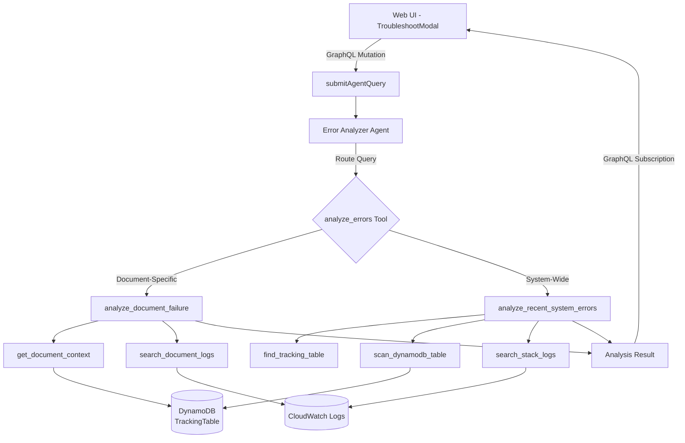
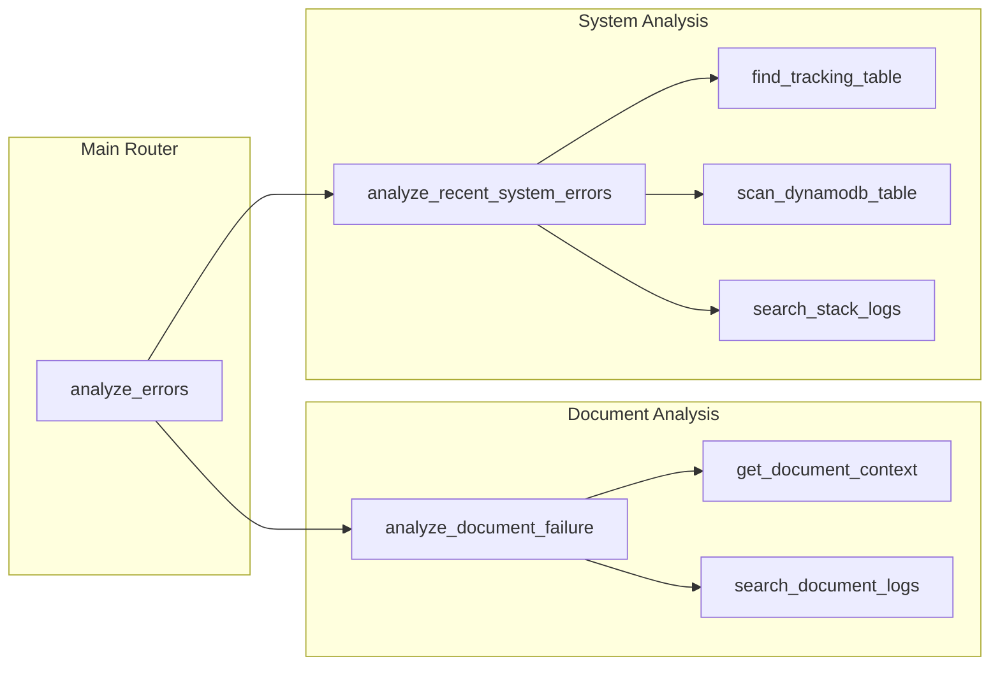
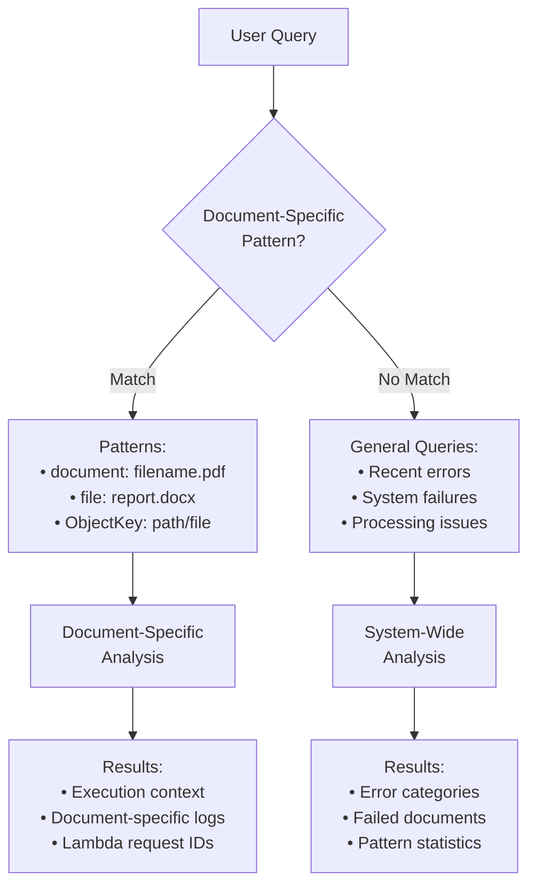
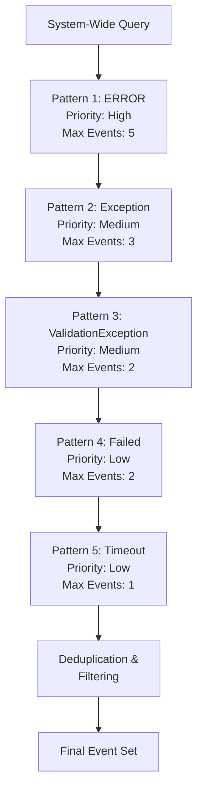
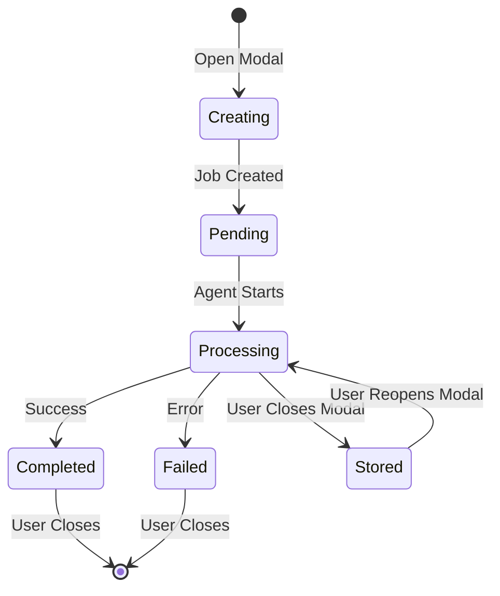

# Error Analyzer (Troubleshooting Tool) - PREVIEW

## Overview

The Error Analyzer is an intelligent AI-powered troubleshooting tool that helps diagnose and resolve document processing failures in the GenAI IDP Accelerator. It uses Amazon Bedrock's Claude Sonnet 4 model with the Strands agent framework to automatically analyze CloudWatch logs, DynamoDB tracking data, and Step Functions execution history to identify root causes and provide actionable recommendations.

This tool is not yet mature - we expect to refine and improve the capabilities in successive releases. Try it, and give us feedback via GitHub Issues.

https://github.com/user-attachments/assets/78764207-0fcf-4523-ad12-f428581a685f


### Key Capabilities

- **Automatic Failure Diagnosis**: AI agent automatically investigates document processing failures
- **Intelligent Query Routing**: Distinguishes between document-specific and system-wide analysis
- **Multi-Source Analysis**: Correlates data from CloudWatch Logs, DynamoDB, and Step Functions
- **Contextual Recommendations**: Provides specific guidance for configuration, operational, or code issues
- **Real-Time Updates**: Live job status with progress tracking and resumption capability
- **Evidence-Based Analysis**: Shows detailed log evidence supporting diagnostic conclusions

### When to Use the Error Analyzer

- **Document Processing Failures**: Investigate why a specific document failed to process
- **Recurring Error Patterns**: Identify systemic issues affecting multiple documents
- **Performance Investigation**: Analyze timeout errors and processing bottlenecks
- **System Health Checks**: Review recent errors across the entire system
- **Troubleshooting Support**: Generate detailed error reports for support escalation

## Architecture

### System Design



### Tool Ecosystem

The Error Analyzer uses 8 specialized tools organized in a modular architecture:



**Tool Descriptions:**

1. **analyze_errors** (Main Router)
   - Classifies query intent (document-specific vs system-wide)
   - Routes to appropriate analysis tool
   - Manages time range parsing

2. **analyze_document_failure** (Document-Specific)
   - Investigates individual document failures
   - Retrieves execution context and Lambda request IDs
   - Searches document-specific logs

3. **analyze_recent_system_errors** (System-Wide)
   - Analyzes error patterns across the system
   - Categorizes errors by type
   - Provides statistical summaries

4. **get_document_context** (Lambda Integration)
   - Retrieves document tracking data
   - Extracts Step Functions execution ARN
   - Provides Lambda request IDs for tracing

5. **search_document_logs** (CloudWatch)
   - Filters logs by document ObjectKey
   - Searches across multiple log groups
   - Returns events with timestamps and context

6. **search_stack_logs** (CloudWatch)
   - System-wide log pattern matching
   - Multi-pattern prioritized search
   - Adaptive sampling for context management

7. **find_tracking_table** (DynamoDB Discovery)
   - Locates TrackingTable by stack name
   - Validates table existence

8. **scan_dynamodb_table** (DynamoDB Query)
   - Scans for failed documents
   - Filters by status and time range
   - Returns document metadata

### Query Classification Logic



## Using the Error Analyzer

### Via Web UI

#### Accessing the Troubleshoot Modal

1. **Navigate to Dashboard**: Open the GenAI IDP Web UI
2. **Find Failed Document**: Locate a document with `FAILED` status
3. **Click Troubleshoot Button**: Opens the TroubleshootModal
4. **Automatic Analysis**: Agent immediately begins analyzing the failure

#### Understanding the Interface

The TroubleshootModal displays:

- **Document Information**: Shows the ObjectKey being analyzed
- **Status Indicator**: 
  - `PENDING`: Job submitted, waiting to start
  - `PROCESSING`: Agent actively analyzing with real-time messages
  - `COMPLETED`: Analysis finished, results available
  - `FAILED`: Analysis encountered an error
- **Agent Messages**: Live progress updates during processing
- **Results Display**: Formatted analysis with collapsible sections
- **Job Resumption**: If you close and reopen the modal, the existing job resumes

#### Reading Analysis Results

Results are structured in three sections:

**1. Root Cause**
```
The underlying technical reason for the failure. Focuses on the primary 
cause rather than symptoms.

Example: "Bedrock throttling exception due to exceeding token rate limits 
for the configured model."
```

**2. Recommendations**
```
Specific, actionable steps to resolve the issue. Limited to top three 
recommendations with clear guidance.

Example:
• Increase provisioned throughput for the Bedrock model
• Adjust retry configuration in classification settings
• Consider using batch processing to reduce concurrent requests
```

**3. Evidence** (Collapsible)
```html
<details>
<summary><strong>Evidence</strong></summary>

**Log Group:**  
/aws-stack-name/lambda/ClassificationFunction

**Log Stream:**  
2025/01/03/[$LATEST]abc123def456

[ERROR] 2025-01-03T14:23:45.123Z ThrottlingException: Rate exceeded
</details>
```

### Query Patterns

#### Document-Specific Queries

Use these patterns to analyze a specific document:

```
document: lending_package.pdf
file: bank_statement.docx  
ObjectKey: uploads/2024/contract.pdf
```

The query **must** include the keyword (`document:`, `file:`, or `ObjectKey:`) followed immediately by a colon and the filename.

#### System-Wide Queries

Use natural language for general analysis:

```
Find recent processing errors
What errors occurred in the last week?
Show me system failures
Summarize recent problems
```

#### Time Range Specifications

The agent interprets time ranges intelligently:

| Query Phrase | Time Range |
|--------------|------------|
| "recent" or "recently" | 1 hour |
| "last hour" | 1 hour |
| "last day" or "yesterday" | 24 hours |
| "last week" | 168 hours (7 days) |
| No time specified | 24 hours (default) |

## Configuration

### Agent Configuration in template.yaml

The Error Analyzer is configured in the CloudFormation template under the `agents` section of the configuration schema:

```yaml
agents:
  error_analyzer:
    type: object
    sectionLabel: Error Analysis Agent
    properties:
      model_id:
        type: string
        enum: [
          "anthropic.claude-3-sonnet-20240229-v1:0",
          "us.anthropic.claude-3-5-sonnet-20241022-v2:0",
          "us.anthropic.claude-3-7-sonnet-20250219-v1:0",
          "us.anthropic.claude-sonnet-4-20250514-v1:0"
        ]
        default: "us.anthropic.claude-sonnet-4-20250514-v1:0"
      system_prompt:
        type: string
        format: textarea
      parameters:
        type: object
        properties:
          max_log_events:
            type: integer
            default: 5
          time_range_hours_default:
            type: integer
            default: 24
```

### Configuration Parameters

#### model_id

**Purpose**: Selects the Bedrock model for error analysis

**Recommended**: `us.anthropic.claude-sonnet-4-20250514-v1:0`
- Superior reasoning for complex error diagnosis
- Better structured output formatting
- More accurate root cause identification

**Alternative Options**:
- `us.anthropic.claude-3-7-sonnet-20250219-v1:0`: Good balance of cost and capability
- `us.anthropic.claude-3-5-sonnet-20241022-v2:0`: Cost-effective for simple errors
- `anthropic.claude-3-sonnet-20240229-v1:0`: Legacy option

#### system_prompt

**Purpose**: Defines agent behavior and response formatting

**Key Requirements**:
1. Enforce three-section structure (Root Cause, Recommendations, Evidence)
2. Specify evidence formatting with collapsible HTML details
3. Define recommendation guidelines for different issue types
4. Set time range parsing rules

**Default Prompt Highlights**:
```
You are an intelligent error analysis agent for the GenAI IDP system.

ALWAYS format your response with exactly these three sections:
## Root Cause
## Recommendations
<details><summary><strong>Evidence</strong></summary>...</details>

RECOMMENDATION GUIDELINES:
For code/system bugs: Do not suggest code modifications
For configuration issues: Direct users to UI configuration panel
For operational issues: Provide immediate troubleshooting steps
```

#### parameters.max_log_events

**Purpose**: Limits log events returned to manage context window

**Default**: `5` events
**Range**: 1-100
**Considerations**:
- Higher values provide more context but consume more tokens
- For system-wide analysis, uses adaptive sampling across patterns
- Individual log messages are truncated if exceeding 200 characters

**Tuning Guidance**:
- Simple errors: 3-5 events sufficient
- Complex investigations: 10-20 events
- Pattern analysis: 20-50 events

#### parameters.time_range_hours_default

**Purpose**: Default lookback period when not specified in query

**Default**: `24` hours (1 day)
**Range**: 1-168 hours (1 week)
**Considerations**:
- Longer ranges increase CloudWatch Logs query time
- Wider time windows may return less relevant results
- Balance between coverage and performance

**Tuning Guidance**:
- Active development: 1-6 hours
- Production monitoring: 24 hours
- Post-mortem analysis: 72-168 hours

### Configuration Example (config.yaml)

```yaml
agents:
  error_analyzer:
    model_id: us.anthropic.claude-sonnet-4-20250514-v1:0
    system_prompt: |
      You are an intelligent error analysis agent for the GenAI IDP system.
      
      Use the analyze_errors tool to investigate issues. ALWAYS format your 
      response with exactly these three sections in this order:
      
      ## Root Cause
      Identify the specific underlying technical reason why the error occurred.
      
      ## Recommendations
      Provide specific, actionable steps to resolve the issue. Limit to top 
      three recommendations only.
      
      <details>
      <summary><strong>Evidence</strong></summary>
      Format log entries with their source information...
      </details>
    parameters:
      max_log_events: 5
      time_range_hours_default: 24
```

## Understanding Results

### Root Cause Analysis

The Root Cause section identifies **the underlying technical reason** for the failure, not just symptoms.

**Good Root Cause Examples**:
```
✓ "Bedrock model returned ValidationException due to malformed JSON in the 
   extraction prompt, caused by unescaped special characters in attribute 
   descriptions"

✓ "Lambda function timeout after 900 seconds during assessment processing, 
   triggered by processing a document with 247 pages exceeding memory limits"

✓ "Access denied error when reading OCR results from S3, caused by missing 
   kms:Decrypt permission on the customer-managed encryption key"
```

**Poor Root Cause Examples** (too vague):
```
✗ "The document failed to process"
✗ "There was an error in the system"
✗ "Lambda function had a problem"
```

### Recommendations

Recommendations are **specific, actionable steps** tailored to the issue type.

#### Configuration-Related Recommendations

For configuration issues, the agent directs users to the UI:

```
Recommendations:
• Navigate to Configuration panel in the Web UI
• Update 'extraction.model' to use a higher-capacity model
• Adjust 'assessment.granular.max_workers' from 4 to 2 to reduce memory pressure
```

#### Operational Recommendations

For operational issues, provides immediate troubleshooting:

```
Recommendations:
• Retry the failed document - error appears transient
• Check AWS Service Health Dashboard for Bedrock service issues
• Monitor CloudWatch metrics for throttling patterns in next 30 minutes
```

#### Code/System Bug Recommendations

For code issues, focuses on reporting not fixing:

```
Recommendations:
• Report to development team with error details and timestamp
• Include Lambda request ID: abc-123-def-456 for debugging
• Avoid reprocessing this document type until patch is deployed
```

### Evidence Section

The Evidence section provides **verifiable log data** supporting the analysis.

**Structure**:
```html
<details>
<summary><strong>Evidence</strong></summary>

**Log Group:**  
/aws-stack-name/lambda/ExtractionFunction

**Log Stream:**  
2025/01/03/[$LATEST]abc123def456

**Events:**
```
[ERROR] 2025-01-03T15:42:13.456Z RequestId: xyz-789 
ValidationException: JSON parsing error at line 42
```

</details>
```

**Reading Evidence**:
1. **Log Group**: Identifies which Lambda function encountered the error
2. **Log Stream**: Provides exact execution instance for deep-dive investigation
3. **Events**: Shows actual error messages with timestamps
4. **Truncation**: Long messages truncated to "... [truncated]" for readability

## Advanced Features

### Intelligent Query Classification

The agent uses regex pattern matching to determine analysis type:

```python
# Document-specific patterns (require colon immediately after keyword)
document: filename.pdf   # Matches
file: report.docx       # Matches
ObjectKey: path/file    # Matches

# General analysis (no specific pattern)
recent errors           # System-wide
find failures          # System-wide
what happened          # System-wide
```

**Pattern Detection Logic**:
```
If query matches "document:\s*([^\s]+)" → Document-Specific Analysis
If query matches "file:\s*([^\s]+)" → Document-Specific Analysis  
If query matches "ObjectKey:\s*([^\s]+)" → Document-Specific Analysis
Otherwise → System-Wide Analysis
```

### Multi-Pattern Error Detection

System-wide analysis uses prioritized pattern matching:



**Prioritization Strategy**:
1. **ERROR**: Highest priority, captures 5 events
2. **Exception**: Important errors, captures 3 events
3. **ValidationException**: Specific validation issues, 2 events
4. **Failed**: General failures, 2 events
5. **Timeout**: Performance issues, 1 event

**Context Management**:
- Respects `max_log_events` parameter as total limit
- Uses adaptive sampling across patterns
- Deduplicates similar error messages
- Truncates long messages at 200 characters

### Error Categorization

System-wide analysis categorizes errors for pattern identification:

**Category Definitions**:

1. **validation_errors**
   - Keywords: "validation", "invalid"
   - Indicates data quality or format issues
   - Often fixable through configuration

2. **processing_errors**
   - Keywords: "exception", "error"
   - Core processing failures
   - May require code fixes

3. **timeout_errors**
   - Keywords: "timeout"
   - Performance/resource issues
   - Adjustable through memory/timeout settings

4. **access_errors**
   - Keywords: "access", "denied"
   - Permission problems
   - Requires IAM policy updates

5. **system_errors**
   - Catch-all for other errors
   - Infrastructure or service issues

**Category Summary Example**:
```json
{
  "error_categories": {
    "validation_errors": {
      "count": 12,
      "sample": "ValidationException: Invalid attribute schema..."
    },
    "timeout_errors": {
      "count": 5,
      "sample": "Task timed out after 900.00 seconds"
    }
  }
}
```

### Job Resumption

The Web UI maintains job state for seamless resumption:



**How It Works**:
1. **Job Creation**: Modal creates job with unique `jobId`
2. **Parent Tracking**: Component stores job state in parent
3. **Modal Close**: Job continues running in background
4. **Modal Reopen**: Automatically resumes displaying existing job
5. **Status Updates**: Real-time updates via GraphQL subscription

**User Experience**:
- Users can close modal without losing analysis
- Reopening shows current progress or final results
- No need to re-submit for in-progress or completed jobs
- New jobs only created when previous job is COMPLETED/FAILED

## Best Practices

### When to Use the Error Analyzer

#### ✓ Ideal Use Cases

1. **Document Processing Failures**
   ```
   Scenario: Specific document failed with FAILED status
   Query: "document: customer_form_2024.pdf"
   Benefit: Pinpoints exact Lambda function and error cause
   ```

2. **Recurring Error Patterns**
   ```
   Scenario: Multiple documents failing with similar errors
   Query: "What errors occurred in the last 6 hours?"
   Benefit: Identifies systemic issues affecting multiple documents
   ```

3. **Performance Investigation**
   ```
   Scenario: Documents timing out during processing
   Query: "Show me timeout errors in the last day"
   Benefit: Reveals resource constraints and bottlenecks
   ```

4. **Post-Deployment Validation**
   ```
   Scenario: New configuration deployed, checking for issues
   Query: "Recent processing errors"
   Benefit: Quick health check after changes
   ```

5. **Support Ticket Creation**
   ```
   Scenario: Need detailed error report for escalation
   Query: "document: problem_file.pdf"
   Benefit: Generates formatted report with evidence
   ```

#### ✗ Not Suitable For

- **Pre-deployment Testing**: Use evaluation tools and test sets instead
- **Performance Optimization**: Use CloudWatch metrics and dashboards
- **Capacity Planning**: Use monitoring and reporting features
- **Cost Analysis**: Use the cost calculator and pricing reports

### Query Formulation Best Practices

#### Be Specific with Document IDs

```
Good ✓
document: lending_package_2024_Q1.pdf
file: bank_statement_january.docx
ObjectKey: uploads/healthcare/prior_auth_12345.pdf

Poor ✗
document lending package        # Missing colon
find document                   # Too vague
check that failed file         # No specific ID
```

#### Use Appropriate Time Ranges

```
Good ✓
Show errors in the last hour    # Recent issues
What happened yesterday?        # Specific timeframe
Recent system failures          # Uses default 24h

Poor ✗
Show all errors ever           # Too broad, slow query
Find problems                  # No time context
Check everything               # Vague and expensive
```

#### Let the Agent Classify Intent

```
Good ✓
document: contract.pdf         # Clear document-specific
Recent validation errors       # Clear system-wide
What went wrong today?         # Natural language OK

Poor ✗
Analyze document contract.pdf  # Ambiguous format
Find errors for file: x.pdf and system  # Mixed intents
```

### Interpreting Results Effectively

#### 1. Focus on Root Cause, Not Symptoms

**Example Analysis**:
```
Root Cause: Lambda function exhausted 4096 MB memory limit while processing 
a 150-page document with high-resolution images during OCR conversion

Symptoms (don't focus on these):
- Lambda timeout after 15 minutes
- No results written to S3
- Document stuck in PROCESSING status
```

**Action**: Address the root cause (memory limit) rather than symptoms (timeout).

#### 2. Prioritize Top Recommendations

The agent limits recommendations to **top three most impactful actions**:

```
Recommendation Priority:
1. Immediate Fix: Increase OCR Lambda memory to 8192 MB
2. Short-term: Implement image preprocessing to reduce resolution
3. Long-term: Add document size validation before processing
```

**Don't try to implement all suggestions at once** - start with #1.

#### 3. Use Evidence for Verification

Cross-reference recommendations with evidence:

```
Recommendation: "Increase Lambda memory allocation"

Evidence Validation:
✓ Log shows: "@maxMemoryUsed: 4089 MB" (near 4096 MB limit)
✓ Event type: "Task timed out after 900.00 seconds"
✓ Pattern: Occurs on documents with >100 pages
```

If evidence doesn't support recommendation, request clarification.

#### 4. Consider Error Categories

System-wide analysis categorizes errors:

```
Categories Found:
- validation_errors: 15 (most common)
- timeout_errors: 3
- access_errors: 1

Action: Focus on validation_errors first as they affect most documents
```

### Configuration Best Practices

#### Model Selection

Choose model based on error complexity:

```yaml
# Simple validation errors, frequent analysis
model_id: us.anthropic.claude-3-5-sonnet-20241022-v2:0

# Complex multi-component failures, critical analysis
model_id: us.anthropic.claude-sonnet-4-20250514-v1:0  # Recommended

# Legacy support only
model_id: anthropic.claude-3-sonnet-20240229-v1:0
```

#### Adjusting max_log_events

Tune based on analysis type:

```yaml
parameters:
  # Development/testing - need detailed context
  max_log_events: 20
  
  # Production monitoring - balance detail and cost
  max_log_events: 5  # Default
  
  # Quick health checks - minimize cost
  max_log_events: 3
```

#### Time Range Optimization

Set default based on deployment frequency:

```yaml
parameters:
  # Frequent deployments (multiple per day)
  time_range_hours_default: 6
  
  # Daily deployments
  time_range_hours_default: 24  # Default
  
  # Weekly deployments
  time_range_hours_default: 72
```

## Troubleshooting Common Issues

### Agent Not Available

**Symptom**: Error message "Error-Analyzer-Agent-v1 agent is not available"

**Causes**:
1. Agent configuration not deployed
2. Stack configuration outdated
3. Agent ID mismatch

**Resolution**:
```
1. Check template.yaml includes agents.error_analyzer section
2. Verify configuration deployed: 
   aws cloudformation describe-stacks --stack-name <stack-name>
3. Check available agents in Web UI Configuration panel
4. Redeploy stack if configuration missing
```

### Job Timeout or Failure

**Symptom**: Job status shows FAILED or times out

**Causes**:
1. Lambda function timeout (15 min limit)
2. Insufficient memory
3. Invalid permissions
4. Bedrock throttling

**Resolution**:
```
1. Check CloudWatch Logs for agent Lambda function:
   /aws/<stack-name>/lambda/AgentFunction
   
2. Look for specific error messages:
   - "Task timed out" → Increase memory or reduce query scope
   - "AccessDeniedException" → Check IAM permissions
   - "ThrottlingException" → Wait and retry
   
3. For document-specific queries, ensure document exists:
   - Verify ObjectKey is correct
   - Check document in DynamoDB TrackingTable
```

### Incomplete Analysis Results

**Symptom**: Analysis missing Root Cause or Recommendations sections

**Causes**:
1. Model output formatting issue
2. System prompt not enforced
3. Token limit exceeded

**Resolution**:
```
1. Verify system_prompt includes formatting requirements:
   "ALWAYS format your response with exactly these three sections"
   
2. Check model_id is using recommended Claude Sonnet 4:
   us.anthropic.claude-sonnet-4-20250514-v1:0
   
3. If token limit reached, reduce max_log_events or time range
```

### Permission-Related Issues

**Symptom**: "Access denied" or "Permission denied" errors

**Causes**:
1. Missing CloudWatch Logs permissions
2. DynamoDB access denied
3. KMS key permissions

**Resolution**:
```
IAM Permissions Required:
- CloudWatch Logs:
  * logs:FilterLogEvents
  * logs:DescribeLogGroups
  * logs:DescribeLogStreams
  
- DynamoDB:
  * dynamodb:GetItem
  * dynamodb:Query
  * dynamodb:Scan
  
- KMS (if using customer-managed keys):
  * kms:Decrypt
  * kms:DescribeKey
  
Check Lambda execution role has these permissions.
```

### Evidence Section Not Showing

**Symptom**: Evidence section is empty or missing

**Causes**:
1. No matching log events in time range
2. CloudWatch log retention expired
3. Incorrect log group names

**Resolution**:
```
1. Increase time range: "Show errors in the last week"
2. Check log retention in CloudWatch console
3. Verify log group naming convention:
   /{StackName}/lambda/{FunctionName}
4. Use system-wide query to check if any logs available
```

## Technical Details

### Integration Points

#### AppSync GraphQL API

**Mutations**:
```graphql
mutation SubmitAgentQuery {
  submitAgentQuery(
    query: "document: lending_package.pdf"
    agentIds: ["Error-Analyzer-Agent-v1"]
  ) {
    jobId
    status
  }
}
```

**Queries**:
```graphql
query GetAgentJobStatus($jobId: ID!) {
  getAgentJobStatus(jobId: $jobId) {
    jobId
    status
    result
    agent_messages
    error
  }
}
```

**Subscriptions**:
```graphql
subscription OnAgentJobComplete($jobId: ID!) {
  onAgentJobComplete(jobId: $jobId) {
    jobId
    status
  }
}
```

#### CloudWatch Logs Integration

**Log Group Discovery**:
```python
# Pattern for stack log groups
log_group_pattern = f"/{stack_name}/lambda/"

# Searches across:
- /stack-name/lambda/OCRFunction
- /stack-name/lambda/ClassificationFunction
- /stack-name/lambda/ExtractionFunction
- /stack-name/lambda/AssessmentFunction
- /stack-name/lambda/SummarizationFunction
```

**Log Filtering**:
```python
# Document-specific filter
filter_pattern = f'"ObjectKey" = "{document_id}" "ERROR"'

# System-wide patterns (prioritized)
patterns = ["ERROR", "Exception", "ValidationException", "Failed", "Timeout"]
```

#### DynamoDB Tracking Integration

**Table Schema** (relevant fields):
```python
{
  "ObjectKey": "uploads/document.pdf",    # Partition key
  "ObjectStatus": "FAILED",               # Document status
  "ExecutionArn": "arn:aws:states:...",  # Step Functions ARN
  "CompletionTime": "2025-01-03T15:30:00Z",
  "ErrorMessage": "Processing failed...", # Optional error
  "LastModified": "2025-01-03T15:30:00Z"
}
```

**Query Patterns**:
```python
# Find document by ObjectKey
response = table.get_item(Key={"ObjectKey": document_id})

# Scan for recent failures
response = table.scan(
    FilterExpression="ObjectStatus = :status AND CompletionTime > :time",
    ExpressionAttributeValues={
        ":status": "FAILED",
        ":time": threshold_timestamp
    }
)
```

#### Step Functions Integration

**Execution Context**:
```python
# Extract execution ID from DynamoDB
execution_arn = "arn:aws:states:us-east-1:123456789012:execution:StateMachine:abc-123"
execution_id = execution_arn.split(":")[-1]  # "abc-123"

# Used for log filtering
filter_pattern = f'"execution_id" = "{execution_id}"'
```

### Tool Implementation Reference

#### analyze_errors (Main Router)

**Location**: `lib/idp_common_pkg/idp_common/agents/error_analyzer/tools/error_analysis_tool.py`

**Function Signature**:
```python
@tool
def analyze_errors(query: str, time_range_hours: int = 1) -> Dict[str, Any]:
    """
    Intelligent error analysis with precise query classification.
    
    Args:
        query: User's error analysis query
        time_range_hours: Hours to look back (default: 1, uses config default)
    
    Returns:
        Dict containing analysis results or error information
    """
```

**Classification Logic**:
```python
def _classify_query_intent(query: str) -> Tuple[str, str]:
    """
    Classify query as document-specific vs general system analysis.
    
    Returns:
        Tuple of (intent_type, document_id)
        - intent_type: "document_specific" or "general_analysis"
        - document_id: Extracted document ID or empty string
    """
    specific_doc_patterns = [
        r"document:\s*([^\s]+)",
        r"file:\s*([^\s]+)",
        r"ObjectKey:\s*([^\s]+)",
    ]
    
    for pattern in specific_doc_patterns:
        match = re.search(pattern, query, re.IGNORECASE)
        if match:
            return ("document_specific", match.group(1).strip())
    
    return ("general_analysis", "")
```

#### analyze_document_failure

**Location**: `lib/idp_common_pkg/idp_common/agents/error_analyzer/tools/document_analysis_tool.py`

**Purpose**: Document-specific failure analysis

**Key Operations**:
1. Retrieves document context from DynamoDB
2. Searches CloudWatch logs filtered by ObjectKey
3. Extracts Lambda request IDs for tracing
4. Correlates execution context with errors

#### analyze_recent_system_errors

**Location**: `lib/idp_common_pkg/idp_common/agents/error_analyzer/tools/general_analysis_tool.py`

**Purpose**: System-wide error pattern analysis

**Key Operations**:
1. Scans DynamoDB for recent failures
2. Multi-pattern CloudWatch log search
3. Error categorization and statistics
4. Adaptive sampling for context management

### Performance Considerations

**CloudWatch Logs Queries**:
- Each query scans specified time range across log groups
- Longer time ranges increase query latency
- Max 10,000 events per FilterLogEvents call

**Cost Optimization**:
```python
# Efficient queries
max_log_events = 5           # Minimal context window usage
time_range_hours = 1         # Recent errors only

# Expensive queries (use sparingly)
max_log_events = 50          # Large context window
time_range_hours = 168       # Full week scan
```

**Token Usage**:
- System prompt: ~800 tokens
- Log events: ~100-200 tokens each
- Analysis response: ~500-1000 tokens
- Total per query: ~2000-4000 tokens average

## Related Documentation

- **[Troubleshooting Guide](troubleshooting.md)**: General troubleshooting for common issues (manual steps)
  - Use the Error Analyzer for automated diagnosis
  - Refer to Troubleshooting Guide for manual resolution steps, performance tuning, and infrastructure issues
- **[Monitoring](monitoring.md)**: CloudWatch dashboards and metrics
- **[Web UI](web-ui.md)**: User interface features and navigation
- **[Architecture](architecture.md)**: Overall system architecture
- **[Configuration](configuration.md)**: Configuration management

## Error Analyzer vs Manual Troubleshooting

**Use Error Analyzer for:**
- Document processing failures (root cause analysis)
- Recent error patterns across the system
- Automated log correlation and diagnosis
- Quick troubleshooting with AI-powered recommendations

**Use Manual Troubleshooting Guide for:**
- Infrastructure and deployment issues
- Performance optimization and tuning
- Security and authentication problems
- Build and configuration management
- DLQ processing and queue management

## FAQ

### How does the Error Analyzer differ from CloudWatch Insights?

**Error Analyzer**:
- AI-powered root cause identification
- Automated correlation across services
- Natural language query interface
- Actionable recommendations
- Integrated with IDP workflow

**CloudWatch Insights**:
- Manual query writing required
- Single log group analysis
- Technical query language
- Raw log data output
- Generic AWS service

### Can I customize the system prompt?

Yes, the system prompt is fully customizable in the configuration:

1. Navigate to Configuration panel in Web UI
2. Expand "Agent Configuration" section
3. Edit "Error Analysis Agent" → "system_prompt"
4. Save configuration

**Caution**: Modifying the system prompt may affect output formatting and quality.

### How many concurrent analysis jobs can run?

The Error Analyzer supports:
- **Multiple users**: Each can have active jobs
- **Job per document**: One active job per user per document
- **System-wide queries**: Unlimited concurrent queries
- **Resource limits**: Subject to Lambda concurrency and Bedrock quotas

### What happens if analysis times out?

**Timeout Handling**:
1. Lambda has 15-minute timeout
2. Job status set to FAILED
3. Partial results (if any) are saved
4. User can retry with narrower scope:
   - Reduce `time_range_hours`
   - Reduce `max_log_events`
   - Use document-specific query

### Can I export analysis results?

**Export Options**:
1. **Copy from UI**: Select and copy formatted text
2. **API Access**: Use `getAgentJobStatus` query
3. **CloudWatch Logs**: Agent logs contain full results
4. **Future Enhancement**: Export to PDF/JSON (roadmap)

### How long are analysis results retained?

**Retention Policy**:
- **In-memory**: Active jobs only
- **DynamoDB**: Not persisted (stateless)
- **CloudWatch Logs**: Per log group retention (default: 7-90 days)
- **Recommendation**: Screenshot or copy important analyses

### Does the analyzer work with custom Lambda functions?

Yes, if custom Lambda functions:
1. Write to CloudWatch Logs with stack-based log group names
2. Include ObjectKey in log messages
3. Follow standard error logging patterns

The analyzer will automatically discover and search these logs.

## Limitations

### Current Limitations

1. **Single Agent**: Only Error-Analyzer-Agent-v1 supported
2. **English Only**: Optimized for English log messages
3. **AWS Services**: CloudWatch and DynamoDB only (no external logs)
4. **Pattern Matching**: Regex-based classification may miss edge cases
5. **Context Window**: Limited by Bedrock model token limits

### Known Issues

1. **Long Document IDs**: ObjectKeys >200 characters may be truncated
2. **Special Characters**: Some Unicode in logs may cause parsing issues
3. **High Volume**: Systems with >1000 errors/hour may hit throttling
4. **Multi-Region**: Analyzer only searches current region

### Future Enhancements

- **Multi-language Support**: Non-English log analysis
- **Custom Patterns**: User-defined error patterns
- **Trend Analysis**: Historical error pattern tracking
- **Predictive Alerts**: Proactive failure prediction
- **Export Features**: PDF/JSON report generation
- **Integration**: Slack/Teams notifications

## Summary

The Error Analyzer is a powerful AI-driven troubleshooting tool that:

✓ **Automates** failure diagnosis with AI-powered analysis  
✓ **Accelerates** root cause identification from hours to minutes  
✓ **Correlates** data across CloudWatch, DynamoDB, and Step Functions  
✓ **Provides** actionable, context-specific recommendations  
✓ **Integrates** seamlessly with the Web UI workflow  
✓ **Supports** both document-specific and system-wide analysis

For optimal results:
- Use Claude Sonnet 4 model for complex errors
- Be specific with document IDs in queries
- Focus on root causes, not symptoms
- Verify recommendations with evidence
- Adjust configuration based on deployment patterns

The Error Analyzer significantly reduces troubleshooting time and improves operational efficiency for GenAI IDP deployments.
