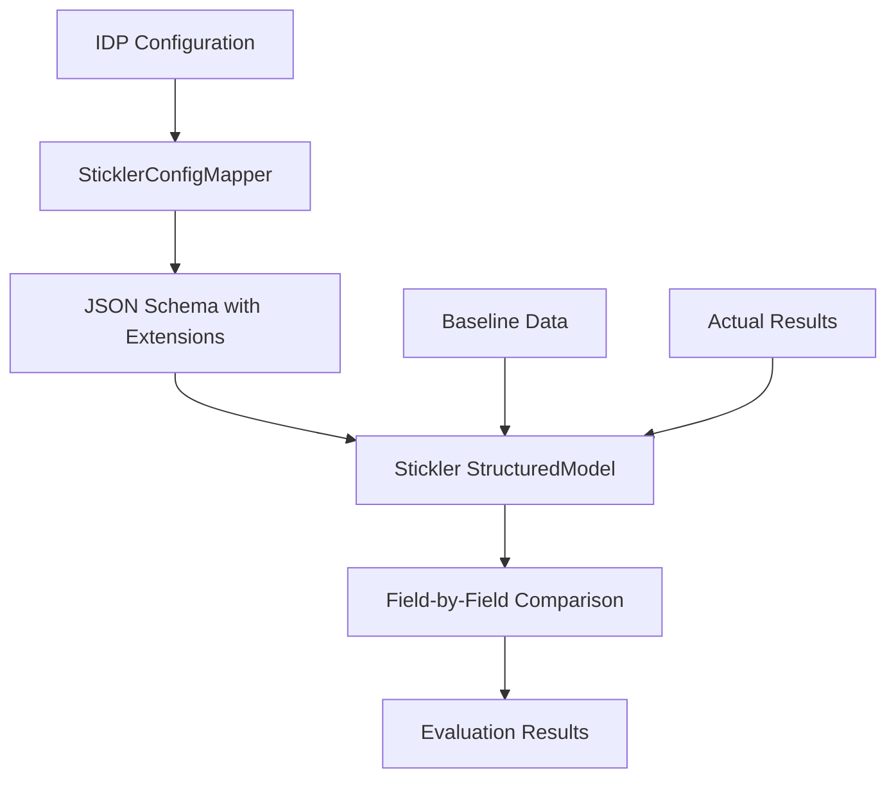
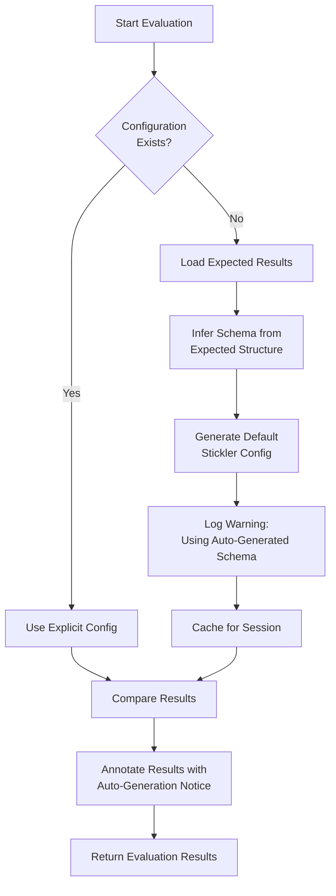

Copyright Amazon.com, Inc. or its affiliates. All Rights Reserved.
SPDX-License-Identifier: MIT-0

# Evaluation Framework

The GenAIIDP solution includes a built-in evaluation framework to assess the accuracy of document processing outputs. This allows you to:

- Compare processing outputs against baseline (ground truth) data
- Generate detailed evaluation reports using configurable methods and thresholds
- Track and improve processing accuracy over time


https://github.com/user-attachments/assets/0ff17f3e-1eb5-4883-9d6f-3d4e4e84cbea


## Table of Contents

- [Evaluation Framework](#evaluation-framework)
  - [Stickler Evaluation Engine](#stickler-evaluation-engine)
    - [Architecture](#architecture)
  - [How It Works](#how-it-works)
  - [Dynamic Schema Generation](#dynamic-schema-generation)
    - [How It Works](#how-it-works-1)
    - [Type Inference Rules](#type-inference-rules)
    - [Auto-Generated Schema Example](#auto-generated-schema-example)
    - [Result Annotation](#result-annotation)
    - [When to Use Auto-Generation](#when-to-use-auto-generation)
    - [Logging and Monitoring](#logging-and-monitoring)
    - [Implementation Details](#implementation-details)
  - [Evaluation Methods](#evaluation-methods)
    - [Supported Methods and Their Characteristics](#supported-methods-and-their-characteristics)
    - [Threshold Display in Reports](#threshold-display-in-reports)
  - [Field Weighting for Business Criticality](#field-weighting-for-business-criticality)
    - [Configuration](#configuration)
    - [Weighted Score Calculation](#weighted-score-calculation)
    - [Benefits](#benefits)
    - [Best Practices](#best-practices)
  - [Type Coercion and Data Compatibility](#type-coercion-and-data-compatibility)
    - [Automatic Type Conversion](#automatic-type-conversion)
    - [When Type Coercion Happens](#when-type-coercion-happens)
    - [Benefits](#benefits-1)
    - [Limitations](#limitations)
    - [Best Practices](#best-practices-1)
  - [Assessment Confidence Integration](#assessment-confidence-integration)
    - [Confidence Score Display](#confidence-score-display)
    - [Enhanced Evaluation Reports](#enhanced-evaluation-reports)
    - [Quality Analysis Benefits](#quality-analysis-benefits)
    - [Backward Compatibility](#backward-compatibility)
  - [Configuration](#configuration-1)
    - [Stack Deployment Parameters](#stack-deployment-parameters)
    - [Runtime Configuration](#runtime-configuration)
    - [Attribute-Specific Evaluation Methods](#attribute-specific-evaluation-methods)
    - [Simple Attributes](#simple-attributes)
    - [Group Attributes](#group-attributes)
    - [List Attributes](#list-attributes)
    - [Understanding Threshold vs Match-Threshold](#understanding-threshold-vs-match-threshold)
    - [Method Compatibility Rules](#method-compatibility-rules)
  - [Attribute Processing and Evaluation](#attribute-processing-and-evaluation)
    - [Group Attribute Processing](#group-attribute-processing)
    - [List Attribute Processing](#list-attribute-processing)
    - [Evaluation Reports for Nested Structures](#evaluation-reports-for-nested-structures)
    - [Evaluation Metrics for Complex Documents](#evaluation-metrics-for-complex-documents)
  - [Document Split Classification Metrics](#document-split-classification-metrics)
    - [Overview](#overview)
    - [Three Types of Accuracy](#three-types-of-accuracy)
    - [Report Structure](#report-structure)
    - [Data Structure Requirements](#data-structure-requirements)
  - [Setup and Usage](#setup-and-usage)
    - [Step 1: Creating Baseline Data](#step-1-creating-baseline-data)
    - [Understanding the Baseline Structure](#understanding-the-baseline-structure)
    - [Step 2: Viewing Evaluation Reports](#step-2-viewing-evaluation-reports)
  - [Best Practices](#best-practices-2)
    - [Baseline Management](#baseline-management)
    - [Evaluation Strategy](#evaluation-strategy)
    - [Configuration Best Practices](#configuration-best-practices)
  - [Automatic Field Discovery](#automatic-field-discovery)
  - [Semantic vs LLM Evaluation](#semantic-vs-llm-evaluation)
  - [Metrics and Monitoring](#metrics-and-monitoring)
  - [Aggregate Evaluation Analytics and Reporting](#aggregate-evaluation-analytics-and-reporting)
    - [ReportingDatabase Overview](#reportingdatabase-overview)
    - [Querying Evaluation Results](#querying-evaluation-results)
    - [Analytics Notebook](#analytics-notebook)
    - [Data Retention and Partitioning](#data-retention-and-partitioning)
    - [Best Practices for Analytics](#best-practices-for-analytics)
  - [Migration from Legacy Evaluation](#migration-from-legacy-evaluation)
    - [What Changed](#what-changed)
    - [What Stayed the Same](#what-stayed-the-same)
    - [Migration Checklist](#migration-checklist)
    - [Stickler Version Information](#stickler-version-information)
  - [Troubleshooting Evaluation Issues](#troubleshooting-evaluation-issues)


## Stickler Evaluation Engine

The evaluation framework is powered by [Stickler](https://github.com/awslabs/stickler), AWS's open-source library for structured object comparison. Stickler provides:

- **Field-Level Weighting**: Prioritize accuracy on business-critical fields
- **Optimal List Matching**: Hungarian algorithm for comparing arrays of objects
- **Extensible Comparators**: Support for exact, fuzzy, numeric, semantic, and LLM-based comparison
- **Native JSON Schema Support**: Direct use of JSON Schema with custom extensions

The IDP solution uses a feature branch of Stickler (commit: de7d0fda) that adds JSON Schema construction support. This will migrate to the main branch once [PR #20](https://github.com/awslabs/stickler/pull/20) merges.

### Architecture



The `SticklerConfigMapper` translates IDP's evaluation extensions (`x-aws-idp-evaluation-*`) to Stickler's format (`x-aws-stickler-*`), maintaining independence from any specific evaluation backend.

## How It Works

1. **Baseline Data**
   - Store validated baseline data in a dedicated S3 bucket
   - Use an existing bucket or let the solution create one
   - Can use outputs from another GenAIIDP stack to compare different patterns/prompts

2. **Integrated Evaluation Step**
   - Evaluation runs as the final step in the Step Functions workflow (after summarization)
   - Executes **before** the workflow marks documents as COMPLETE, eliminating race conditions
   - When `evaluation.enabled: true` in configuration, evaluates against baseline data if available
   - When `evaluation.enabled: false` in configuration, step executes but skips processing
   - Generates detailed markdown reports using AI analysis

3. **Evaluation Reports**
   - Compare section classification accuracy
   - Analyze extracted field differences 
   - Identify patterns in discrepancies
   - Assess severity of differences (cosmetic vs. substantial)

## Dynamic Schema Generation

When running evaluation without explicit configuration for a document class, the evaluation service can automatically generate a default document schema based on the structure of the expected (baseline) document. This enables evaluation even when document classes haven't been formally configured.

### How It Works



### Type Inference Rules

The auto-generation system infers evaluation methods based on detected data types:

| Data Type | Evaluation Method | Default Threshold | Use Case |
|-----------|-------------------|-------------------|----------|
| `string` | FUZZY | 0.85 | Text fields, names, addresses |
| `integer` | NUMERIC_EXACT | 0.01 | Counts, IDs, whole numbers |
| `float` | NUMERIC_EXACT | 0.01 | Amounts, percentages, decimals |
| `boolean` | EXACT | N/A | True/false flags |
| `object` | Nested structure | N/A | Address, contact info (recursive) |
| `array[object]` | HUNGARIAN | N/A | Transactions, line items (optimal matching) |
| `array[primitive]` | Simple array | N/A | Tags, categories, lists |
| `null` | EXACT (string) | N/A | Optional fields, missing values |

### Auto-Generated Schema Example

**Input Data:**
```json
{
  "invoice_number": "INV-12345",
  "amount": 1250.50,
  "customer_address": {
    "street": "123 Main St",
    "city": "Seattle"
  },
  "line_items": [
    {"description": "Widget", "price": 10.50}
  ]
}
```

**Generated Schema:**
```json
{
  "$schema": "https://json-schema.org/draft/2020-12/schema",
  "type": "object",
  "x-aws-idp-document-type": "Invoice",
  "x-aws-idp-evaluation-match-threshold": 0.8,
  "properties": {
    "invoice_number": {
      "type": "string",
      "x-aws-idp-evaluation-method": "FUZZY",
      "x-aws-idp-evaluation-threshold": 0.85
    },
    "amount": {
      "type": "number",
      "x-aws-idp-evaluation-method": "NUMERIC_EXACT",
      "x-aws-idp-evaluation-threshold": 0.01
    },
    "customer_address": {
      "type": "object",
      "properties": {
        "street": {
          "type": "string",
          "x-aws-idp-evaluation-method": "FUZZY"
        },
        "city": {
          "type": "string",
          "x-aws-idp-evaluation-method": "FUZZY"
        }
      }
    },
    "line_items": {
      "type": "array",
      "x-aws-idp-evaluation-method": "HUNGARIAN",
      "items": {
        "type": "object",
        "properties": {
          "description": {"type": "string"},
          "price": {"type": "number"}
        }
      }
    }
  }
}
```

### Result Annotation

When using auto-generated schemas, all evaluation results include a clear annotation in the `reason` field:

**With Auto-Generated Schema:**
```
"reason": "Exact match. Note: Schema inferred (no config)"
```

**With Explicit Configuration:**
```
"reason": "Exact match"
```

This transparency ensures users can immediately identify which evaluations used carefully crafted configurations versus quick defaults.

### When to Use Auto-Generation

✅ **Recommended For:**
- **Exploratory Testing**: Quick evaluation without config setup
- **Development Iteration**: Fast feedback during development
- **Schema Discovery**: Understanding document structure before formalizing config
- **Ad-hoc Analysis**: One-time evaluations without production setup

⚠️ **Not Recommended For:**
- **Production Workloads**: Lacks domain-specific comparison logic
- **Complex Requirements**: Cannot encode business rules or custom thresholds
- **Regulatory Compliance**: Explicit configs provide audit trail and governance

### Logging and Monitoring

Auto-generation events are logged with WARNING level for visibility:

```
WARNING: Auto-generated schema for document class 'Invoice' from expected data structure.
For production use, please define an explicit configuration. Generated 8 properties.
```

### Implementation Details

The dynamic schema generation uses:
- **genson library**: Industry-standard, production-ready JSON Schema generator
- **Automatic type detection**: Handles strings, numbers, booleans, nested objects, arrays
- **Union type support**: Correctly handles mixed-type fields (e.g., `["string", "integer"]`)
- **Robust edge case handling**: Empty arrays, null values, deeply nested structures


## Evaluation Methods

The framework supports multiple comparison methods. All method names in evaluation reports use **PascalCase** formatting (e.g., `Fuzzy`, `NumericExact`) to match the UI configuration interface.

### Supported Methods and Their Characteristics

The evaluation framework provides different comparison methods optimized for various data types and use cases:

| Method | Use Case | Uses Threshold? | Default Value | Description |
|--------|----------|----------------|---------------|-------------|
| **Exact** | IDs, codes, booleans | No | N/A | Character-by-character comparison after normalizing whitespace and punctuation. Returns 1.0 for match, 0.0 otherwise |
| **NumericExact** | Amounts, quantities | No (uses tolerance) | N/A | Numeric comparison with configurable tolerance for rounding differences. Uses absolute/relative tolerance, not similarity threshold |
| **Fuzzy** | Names, addresses, general text | Yes | 0.7 | Token-based fuzzy matching allowing minor variations and reordering. Threshold controls minimum similarity score |
| **Levenshtein** | Text with typos, variations | Yes | 0.7 | Edit distance-based string comparison for detecting character-level differences. Threshold controls minimum similarity score |
| **Semantic** | Descriptions, free text | Yes | 0.7 | Embedding-based similarity using Bedrock Titan embeddings for meaning comparison. Threshold controls minimum similarity score |
| **LLM** | Complex semantic equivalence | No (binary) | N/A | AI-powered comparison with detailed reasoning. Returns binary match decision (1.0 or 0.0), not similarity score |
| **Hungarian** | Arrays of structured objects | Yes (match_threshold) | 0.8 | Optimal bipartite matching algorithm for list comparison. Uses document-level match threshold for item pairing |
| **AggregateObject** | Nested objects | No | N/A | Recursive field-by-field comparison of nested structures. No top-level threshold |

### Threshold Display in Reports

Evaluation reports display thresholds **only for methods that use similarity-based scoring**:

**Methods WITH Threshold Display:**
- `Fuzzy (threshold: 0.70)` - Using Stickler's default
- `Fuzzy (threshold: 0.85)` - Using field-specific configuration
- `Levenshtein (threshold: 0.70)` - Using default
- `Semantic (threshold: 0.70)` - Using default
- `Hungarian (threshold: 0.80)` - Using document-level match threshold

**Methods WITHOUT Threshold Display:**
- `Exact` - Binary comparison (no threshold concept)
- `NumericExact` - Uses tolerance, not threshold
- `LLM` - Returns binary match decision
- `AggregateObject` - Recursive comparison

This distinction ensures clarity: thresholds are shown only when they represent a similarity score cutoff, not for binary or tolerance-based comparisons

## Field Weighting for Business Criticality

Stickler supports field-level weights to prioritize accuracy on business-critical fields. Fields with higher weights contribute more to the overall evaluation score, allowing you to maintain high standards for critical data while being more tolerant of errors in less important fields.

### Configuration

Add the `x-aws-idp-evaluation-weight` extension to any field in your schema:

```yaml
classes:
  - $schema: "https://json-schema.org/draft/2020-12/schema"
    x-aws-idp-document-type: invoice
    properties:
      invoice_number:
        type: string
        x-aws-idp-evaluation-method: EXACT
        x-aws-idp-evaluation-weight: 2.0  # Critical field - double weight
      invoice_date:
        type: string
        x-aws-idp-evaluation-method: FUZZY
        x-aws-idp-evaluation-weight: 1.5  # Important field
      vendor_name:
        type: string
        x-aws-idp-evaluation-method: FUZZY
        x-aws-idp-evaluation-weight: 1.0  # Normal weight (default)
      vendor_notes:
        type: string
        x-aws-idp-evaluation-method: SEMANTIC
        x-aws-idp-evaluation-weight: 0.5  # Less critical - half weight
```

### Weighted Score Calculation

The evaluation framework calculates a `weighted_overall_score` that reflects field importance:

- **Section-level**: Aggregates weighted scores across all fields in the section
- **Document-level**: Averages section-level weighted scores across all sections
- **Displayed in reports**: Shows alongside traditional accuracy metrics

**Example Calculation:**
```
Field A: score=1.0, weight=2.0 → weighted contribution = 2.0
Field B: score=0.8, weight=1.0 → weighted contribution = 0.8
Field C: score=0.6, weight=0.5 → weighted contribution = 0.3

Weighted Overall Score = (2.0 + 0.8 + 0.3) / (2.0 + 1.0 + 0.5) = 3.1 / 3.5 = 0.886
```

### Benefits

- **Business Alignment**: Evaluation scores reflect business priorities, not just technical accuracy
- **Flexible Tolerances**: Accept minor errors in low-priority fields while demanding perfection for critical data
- **Actionable Metrics**: Quickly identify when important fields are failing evaluation
- **Cost Optimization**: Focus human review efforts on documents with low weighted scores

### Best Practices

1. **Weight Critical Fields Higher**: Invoice amounts, dates, IDs should have weights ≥ 1.5
2. **Use Default Weight for Standard Fields**: Most fields should use weight=1.0 (or omit for default)
3. **Reduce Weight for Optional Fields**: Notes, descriptions can use weight=0.5
4. **Test Different Weightings**: Adjust weights based on business feedback and error impact analysis

## Type Coercion and Data Compatibility

The evaluation framework automatically coerces data types to match schema expectations, preventing validation errors from type mismatches between baseline and actual data.

### Automatic Type Conversion

The system intelligently converts data types when baseline format differs from schema:

**Common Scenarios:**
- Baseline has float `1250.5` but schema expects string → Converts to `"1250.5"`
- Baseline has string `"123"` but schema expects integer → Converts to `123`
- Baseline has string `"true"` but schema expects boolean → Converts to `true`
- Nested objects and arrays are recursively coerced

### When Type Coercion Happens

Type coercion occurs automatically during evaluation:

1. **Schema Analysis**: System examines expected field types from JSON Schema
2. **Data Loading**: Baseline and actual results loaded from S3
3. **Type Detection**: Identifies mismatches between data and schema types
4. **Automatic Coercion**: Converts values to match schema expectations
5. **Evaluation**: Performs comparison using coerced, type-compatible values

### Benefits

- **Flexible Baselines**: Use baseline data from any source without format concerns
- **Focus on Semantics**: Evaluation focuses on content accuracy, not type strictness
- **Backward Compatibility**: Works with legacy baseline data created before schema standardization
- **Reduced Errors**: Prevents Pydantic validation failures from type mismatches

### Limitations

- **Loss of Precision**: Some conversions may lose precision (e.g., very large integers to floats)
- **String Coercion**: Complex objects converted to strings may not convert back perfectly
- **Null Handling**: Null values are preserved and handled as missing fields

### Best Practices

1. **Create Consistent Baselines**: Use processed outputs as baseline templates when possible
2. **Test with Representative Data**: Validate type coercion with real documents
3. **Monitor Warnings**: Check logs for type coercion warnings during development
4. **Update Schemas**: Define schema types that match your baseline data format when practical

## Assessment Confidence Integration

The evaluation framework automatically integrates with the assessment feature to provide enhanced quality insights. When documents have been processed with assessment enabled via the configuration `assessment.enabled: true` property, the evaluation reports include confidence scores alongside traditional accuracy metrics.

### Confidence Score Display

The evaluation framework automatically extracts confidence scores from the `explainability_info` section of assessment results and displays them in both JSON and Markdown evaluation reports:

- **Confidence**: Confidence score for extraction results being evaluated

### Enhanced Evaluation Reports

When confidence data is available, evaluation reports include additional columns:

```
| Status | Attribute | Expected | Actual | Confidence | Score | Method | Reason |
| :----: | --------- | -------- | ------ | :---------------: | ----- | ------ | ------ |
| ✅ | invoice_number | INV-2024-001 | INV-2024-001 | 0.92 | 1.00 | EXACT | Exact match |
| ❌ | vendor_name | ABC Corp | XYZ Inc | 0.75 | 0.00 | EXACT | Values do not match |
```

### Quality Analysis Benefits

The combination of evaluation accuracy and confidence scores provides deeper insights:

2. **Extraction Quality Assessment**: Low confidence highlights extraction results requiring human verification
3. **Quality Prioritization**: Focus improvement efforts on attributes with both low confidence and low accuracy
4. **Pattern Identification**: Analyze relationships between confidence levels and evaluation outcomes

### Backward Compatibility

The confidence integration is fully backward compatible:
- Evaluation reports without assessment data show "N/A" in confidence columns
- All existing evaluation workflows continue to function unchanged
- No additional configuration required to enable confidence display

## Configuration

### Stack Deployment Parameters

Set the following parameter during stack deployment:

```yaml
EvaluationBaselineBucketName:
  Description: Existing bucket with baseline data, or leave empty to create new bucket
```

### Runtime Configuration

Control evaluation behavior through the configuration file (no stack redeployment needed):

```yaml
evaluation:
  enabled: true  # Set to false to disable evaluation processing
  llm_method:
    model: "us.anthropic.claude-3-haiku-20240307-v1:0"  # Model for evaluation reports
    temperature: "0.0"
    top_p: "0.0"
    max_tokens: "4096"
    # Additional model parameters...
```

**Benefits of Configuration-Based Control:**
- Enable/disable evaluation without stack redeployment
- Runtime control similar to summarization and assessment features
- Zero LLM costs when disabled (step executes but skips processing)
- Consistent feature control pattern across the solution

### Attribute-Specific Evaluation Methods

You can also configure evaluation methods for specific document classes and attributes through the solution's configuration. The framework supports three types of attributes with different evaluation approaches:

### Simple Attributes

Basic single-value extractions evaluated as individual fields:

```yaml
classes:
  - $schema: "https://json-schema.org/draft/2020-12/schema"
    $id: invoice
    x-aws-idp-document-type: invoice
    type: object
    properties:
      invoice_number:
        type: string
        description: The unique identifier for the invoice
        x-aws-idp-evaluation-method: EXACT  # Use exact string matching
      amount_due:
        type: string
        description: The total amount to be paid
        x-aws-idp-evaluation-method: NUMERIC_EXACT  # Use numeric comparison
      vendor_name:
        type: string
        description: Name of the vendor
        x-aws-idp-evaluation-method: FUZZY  # Use fuzzy matching
        x-aws-idp-confidence-threshold: 0.8  # Minimum similarity threshold
```

### Group Attributes

Nested object structures where each sub-attribute is evaluated individually:

```yaml
classes:
  - $schema: "https://json-schema.org/draft/2020-12/schema"
    $id: BankStatement
    x-aws-idp-document-type: "Bank Statement"
    type: object
    properties:
      Account Holder Address:
        type: object
        description: "Complete address information for the account holder"
        properties:
          Street Number:
            type: string
            description: "House or building number"
            x-aws-idp-evaluation-method: FUZZY
            x-aws-idp-confidence-threshold: 0.9
          Street Name:
            type: string
            description: "Name of the street"
            x-aws-idp-evaluation-method: FUZZY
            x-aws-idp-confidence-threshold: 0.8
          City:
            type: string
            description: "City name"
            x-aws-idp-evaluation-method: FUZZY
            x-aws-idp-confidence-threshold: 0.9
          State:
            type: string
            description: "State abbreviation (e.g., CA, NY)"
            x-aws-idp-evaluation-method: EXACT
          ZIP Code:
            type: string
            description: "5 or 9 digit postal code"
            x-aws-idp-evaluation-method: EXACT
```

### List Attributes

Arrays of items where each item's attributes are evaluated individually across all list entries.

**Important**: Structured arrays (arrays of objects) use **HUNGARIAN matching** with a special `match-threshold` parameter that applies to the entire list, not individual fields.

```yaml
classes:
  - $schema: "https://json-schema.org/draft/2020-12/schema"
    $id: BankStatement
    x-aws-idp-document-type: "Bank Statement"
    type: object
    properties:
      Transactions:
        type: array
        description: "List of all transactions in the statement period"
        x-aws-idp-list-item-description: "Individual transaction record"
        x-aws-idp-evaluation-method: HUNGARIAN  # Required for List[Object]
        x-aws-idp-evaluation-match-threshold: 0.8  # Threshold for item matching
        items:
          type: object
          properties:
            Date:
              type: string
              description: "Transaction date (MM/DD/YYYY)"
              x-aws-idp-evaluation-method: FUZZY
              x-aws-idp-evaluation-threshold: 0.9
            Description:
              type: string
              description: "Transaction description or merchant name"
              x-aws-idp-evaluation-method: SEMANTIC
              x-aws-idp-evaluation-threshold: 0.7
            Amount:
              type: string
              description: "Transaction amount"
              x-aws-idp-evaluation-method: NUMERIC_EXACT
```

### Understanding Threshold vs Match-Threshold

The evaluation framework uses **two different threshold concepts** depending on the field type:

#### For Regular Fields (String, Number, Object):
Use `x-aws-idp-evaluation-threshold` to control how closely values must match:

```yaml
vendor_name:
  type: string
  x-aws-idp-evaluation-method: FUZZY
  x-aws-idp-evaluation-threshold: 0.85  # 85% similarity required
```

#### For Structured Arrays (List[Object] with HUNGARIAN):
Use `x-aws-idp-evaluation-match-threshold` to control item pairing:

```yaml
CityTaxes:
  type: array
  x-aws-idp-evaluation-method: HUNGARIAN
  x-aws-idp-evaluation-match-threshold: 0.8  # 80% match for optimal pairing
  items:
    type: object
    properties:
      city: 
        type: string
      tax_amount:
        type: number
```

**Why the distinction?**
- **Regular threshold**: Applied to individual field comparisons
- **Match threshold**: Applied to Hungarian algorithm's optimal item pairing logic
- Using the wrong threshold type will result in a validation error

**UI Behavior**:
- When you select an array field with object items in the configuration UI
- And choose HUNGARIAN method
- The UI automatically shows "Match Threshold" instead of "Evaluation Threshold"
- The system prevents you from using incompatible method-field combinations

### Method Compatibility Rules

Different evaluation methods work with different field types:

| Method | Compatible Types | Requires |
|--------|-----------------|----------|
| EXACT | String, Number, Integer, Boolean | `evaluation-threshold` (optional) |
| NUMERIC_EXACT | Number, Integer, String | `evaluation-threshold` (tolerance) |
| FUZZY | String | `evaluation-threshold` (required) |
| LEVENSHTEIN | String | `evaluation-threshold` (required) |
| SEMANTIC | String, Object | `evaluation-threshold` (required) |
| LLM | String, Object, Array | `evaluation-threshold` (required) |
| HUNGARIAN | Array[Object] ONLY | `evaluation-match-threshold` (required) |

**Validation**:
- Backend validates method-type compatibility and raises clear errors for mismatches
- UI filters available methods based on the selected field type
- Cannot select HUNGARIAN for non-array fields
- Cannot select other methods for structured arrays (must use HUNGARIAN)

## Attribute Processing and Evaluation

The evaluation framework automatically processes nested structures by flattening them into individual evaluable fields:

### Group Attribute Processing

Group attributes are flattened using dot notation:
- `Account Holder Address.Street Number` (evaluated with FUZZY method)
- `Account Holder Address.City` (evaluated with FUZZY method)
- `Account Holder Address.State` (evaluated with EXACT method)

### List Attribute Processing

List attributes are processed by creating individual evaluations for each array item:
- `Transactions[0].Date` (evaluated with FUZZY method)
- `Transactions[0].Amount` (evaluated with NUMERIC_EXACT method)
- `Transactions[1].Date` (evaluated with FUZZY method)
- `Transactions[1].Amount` (evaluated with NUMERIC_EXACT method)
- And so on for each transaction in the list...

### Evaluation Reports for Nested Structures

The evaluation reports provide detailed breakdowns for all nested attributes:

**Group Attribute Results:**
```
| Status | Attribute | Expected | Actual | Confidence | Score | Method | Reason |
| :----: | --------- | -------- | ------ | :--------: | ----- | ------ | ------ |
| ✅ | Account Holder Address.Street Number | 123 | 123 | 0.95 | 1.00 | FUZZY | Exact match |
| ✅ | Account Holder Address.City | Seattle | Seattle | 0.88 | 1.00 | FUZZY | Exact match |
| ❌ | Account Holder Address.State | WA | Washington | 0.82 | 0.00 | EXACT | Values do not match exactly |
```

**List Attribute Results:**
```
| Status | Attribute | Expected | Actual | Confidence | Score | Method | Reason |
| :----: | --------- | -------- | ------ | :--------: | ----- | ------ | ------ |
| ✅ | Transactions[0].Date | 01/15/2024 | 01/15/2024 | 0.94 | 1.00 | FUZZY | Exact match |
| ✅ | Transactions[0].Amount | -25.00 | -25.00 | 0.92 | 1.00 | NUMERIC_EXACT | Exact numeric match |
| ✅ | Transactions[1].Description | Coffee Shop | Starbucks Coffee | 0.85 | 0.88 | SEMANTIC | Semantically similar |
```

### Evaluation Metrics for Complex Documents

For documents with nested structures, the evaluation framework provides comprehensive metrics at multiple levels:

1. **Overall Document Metrics**: Aggregate accuracy across all attributes (simple, group, and list)
2. **Section-Level Metrics**: Performance within each document section
3. **Attribute-Level Metrics**: Individual performance for each flattened attribute
4. **Group-Level Insights**: Summary statistics for related attributes within groups
5. **List-Level Analysis**: Pattern analysis across list items (e.g., transaction accuracy trends)

This multi-level analysis helps identify specific areas for improvement, such as:
- Consistent issues with certain group attributes (e.g., address parsing)
- Performance degradation with larger transaction lists
- Specific list item attributes that frequently fail evaluation

## Document Split Classification Metrics

In addition to extraction accuracy evaluation, the framework now includes document split classification metrics to assess how accurately documents are classified and split into sections. This provides a comprehensive evaluation of both **what** was extracted and **how** documents were classified and organized.

https://github.com/user-attachments/assets/289cc6a7-3d83-488b-a4b1-4b749858cd9e


### Overview

Document split classification metrics evaluate three key aspects:

1. **Page-Level Classification**: Accuracy of classifying individual pages
2. **Document Split Grouping**: Accuracy of grouping pages into sections
3. **Page Order Preservation**: Accuracy of maintaining correct page order within sections

These metrics are calculated by comparing the `document_class` and `split_document.page_indices` fields in each section's result JSON.

### Three Types of Accuracy

#### 1. Page Level Accuracy
**Purpose**: Measures how accurately individual pages are classified, regardless of how they're grouped into sections.

**Calculation**: For each page index across all sections, compare the expected `document_class` with the predicted `document_class`.

**Use Case**: Identify if pages are being assigned to the correct document types.

**Example**:
```
Expected: Page 0 → Invoice, Page 1 → Invoice, Page 2 → Receipt
Predicted: Page 0 → Invoice, Page 1 → Receipt, Page 2 → Receipt
Result: 2/3 pages correct = 66.7% accuracy
```

#### 2. Split Accuracy (Without Page Order)
**Purpose**: Measures whether pages are correctly grouped into sections with the right classification, regardless of page order.

**Calculation**: For each expected section, check if any predicted section has:
- The same set of page indices (as a set, order doesn't matter)
- The same `document_class`

Both conditions must be met for a section to be marked as correct.

**Use Case**: Verify that pages belonging together are kept together, even if their order might vary.

**Example**:
```
Expected Section A: Class=Invoice, Pages={0, 1, 2}
Predicted Section X: Class=Invoice, Pages={2, 0, 1}  ✅ Match (same set)

Expected Section B: Class=Receipt, Pages={3, 4}
Predicted Section Y: Class=Receipt, Pages={3, 4}  ✅ Match

Expected Section C: Class=Payslip, Pages={5}
Predicted Section Z: Class=Invoice, Pages={5}  ❌ No match (wrong class)

Result: 2/3 sections correct = 66.7% accuracy
```

#### 3. Split Accuracy (With Page Order)
**Purpose**: Most strict evaluation - measures correct grouping with exact page order preservation.

**Calculation**: Same as "Without Order" but the page indices list must match exactly (same pages, same order).

**Use Case**: Verify that multi-page documents maintain correct page sequence.

**Example**:
```
Expected Section A: Class=Invoice, Pages=[0, 1, 2]
Predicted Section X: Class=Invoice, Pages=[0, 1, 2]  ✅ Match (exact order)

Expected Section B: Class=Receipt, Pages=[3, 4]
Predicted Section Y: Class=Receipt, Pages=[4, 3]  ❌ No match (wrong order)

Result: 1/2 sections correct = 50% accuracy
```

### Report Structure

Document split metrics are integrated into the unified evaluation report:

```markdown
# Evaluation Report

## Summary
**Document Split Classification:**
- Page Level Accuracy: 🟢 85/100 pages [████████████████░░░░] 85%
- Split Accuracy (Without Order): 🟡 15/20 sections [███████████████░░░░░] 75%
- Split Accuracy (With Order): 🟠 12/20 sections [████████████░░░░░░░░] 60%

**Document Extraction:**
- Match Rate: 🟢 145/150 attributes matched [███████████████████░] 97%
- Precision: 0.97 | Recall: 0.95 | F1 Score: 🟢 0.96

## Overall Metrics

### Document Split Classification Metrics
| Metric | Value | Rating |
| page_level_accuracy | 0.8500 | 🟡 Good |
| split_accuracy_without_order | 0.7500 | 🟡 Good |
| split_accuracy_with_order | 0.6000 | 🟠 Fair |

### Document Extraction Metrics
| Metric | Value | Rating |
| precision | 0.9700 | 🟢 Excellent |
| recall | 0.9500 | 🟢 Excellent |
| f1_score | 0.9600 | 🟢 Excellent |
```

### Data Structure Requirements

For doc split metrics to be calculated, each section's result JSON must include:

```json
{
  "document_class": {
    "type": "Invoice"
  },
  "split_document": {
    "page_indices": [0, 1]
  },
  "inference_result": {
    // Extracted attributes
  }
}
```

- Page indices are **0-based** and **may be non-sequential**
- Missing or null fields are handled gracefully (treated as "Unknown" class or empty page list)

## Setup and Usage

### Step 1: Creating Baseline Data

Creating accurate baseline data is the foundation of the evaluation framework. There are two main approaches:

### Method 1: Use Existing Processing Results (Using Copy to Baseline Feature)

1. Process documents through the GenAIIDP solution
2. Review the output in the web UI
3. Make any necessary corrections
4. For documents with satisfactory results, click "Copy to Baseline"
5. The system will asynchronously copy all processing results to the baseline bucket
6. The document status will update to indicate baseline availability:
   - BASELINE_COPYING: Copy operation in progress
   - BASELINE_AVAILABLE: Document successfully copied to baseline
   - BASELINE_ERROR: Error occurred during the copy operation

### Method 2: Create Baseline Data Manually

**Important:** Baselines must follow the correct directory structure:
- Create a directory named after your document (e.g., `invoice.pdf/`)
- Inside, create a `sections/1/` subdirectory
- Place your `result.json` file in `sections/1/`
- Upload the entire directory structure to the baseline bucket

**Best Practices for Creating Baseline Files:**

The easiest way to create accurate baseline files is to start with processed results:

1. **Option A: Use Processed Results as Template**
   - Process your document through the GenAIIDP solution first
   - Download the results from the OutputBucket
   - Locate the `sections/1/result.json` file in the output
   - Find the `inference_result` section within that file
   - Use this as your baseline template, making any necessary corrections
   - The `inference_result` contains the extracted attributes in the correct format

2. **Option B: Use the Solution UI**
   - Process your document through the GenAIIDP solution
   - In the Web UI, navigate to the processed document
   - Click "View / Edit data" to review the extracted results
   - Correct any errors directly in the UI
   - Export or copy the corrected data to create your baseline
   - This ensures your baseline matches the exact structure expected by the evaluation framework

**Manual Steps:**

1. Create the directory structure following the pattern: `<document-name>/sections/1/`
2. Create a `result.json` file with extracted attributes in the correct format (using one of the methods above)
3. Upload the complete directory structure to the baseline bucket

**Example structure to upload:**
```
invoice.pdf/
└── sections/
    └── 1/
        └── result.json
```

**Example result.json content:**
```json
{
  "inference_result": {
    "Invoice Number": "INV-2024-001",
    "Invoice Date": "2024-01-15",
    "Total Amount": "$1,250.00",
    "Vendor Name": "Acme Corp"
  }
}
```

### Understanding the Baseline Structure

All baselines must follow this directory structure in your S3 baseline bucket:

```
baseline-bucket/
├── document1.pdf/
│   └── sections/
│       └── 1/
│           └── result.json    # Baseline for document1.pdf
├── document2.pdf/
│   └── sections/
│       └── 1/
│           └── result.json    # Baseline for document2.pdf
└── subfolder/
    └── document3.pdf/
        └── sections/
            └── 1/
                └── result.json  # Baseline for subfolder/document3.pdf
```

**Key Structure Rules:**
- Directory name matches the document filename (e.g., `invoice.pdf/`)
- Contains a `sections/1/` subdirectory
- The `result.json` file contains the inference results in this format:

```json
{
  "inference_result": {
    "Invoice Number": "INV-2024-001",
    "Invoice Date": "2024-01-15",
    "Total Amount": "$1,250.00",
    "Vendor Name": "Acme Corp"
  }
}
```

### Step 2: Viewing Evaluation Reports

Once documents are processed with baselines:

1. In the Web UI, select a document from the Documents list
2. Click "View Evaluation Report" button
3. The report displays:
   - Section classification accuracy
   - Field-by-field comparison with visual indicators (✅/❌)
   - Analysis of differences with detailed reasons
   - Overall accuracy assessment with color-coded metrics (🟢 Excellent, 🟡 Good, 🟠 Fair, 🔴 Poor)
   - Progress bar visualizations for match rates
   - Comprehensive metrics and performance ratings
   - Confidence scores (if assessment is enabled)

## Best Practices

### Baseline Management
- **Start with high-quality baselines**: Use processed results from the UI and correct any errors before creating baselines
- **Maintain baseline consistency**: Ensure all baseline files follow the correct directory structure
- **Version your baselines**: Keep different baseline sets for different document versions or testing scenarios

### Evaluation Strategy

- **Enable auto-evaluation during testing/tuning phases**: Get immediate feedback on accuracy
- **Disable auto-evaluation in production**: Reduce costs by evaluating only when needed
- **Use evaluation reports to**:
  - Compare different processing patterns
  - Test effects of prompt changes
  - Monitor accuracy over time
  - Identify areas for improvement

### Configuration Best Practices

- **Choose appropriate evaluation methods**: Match methods to your data types (EXACT for IDs, FUZZY for names, SEMANTIC for descriptions)
- **Set realistic thresholds**: Start with strict thresholds (0.9+) and adjust based on your accuracy requirements
- **Configure confidence tracking**: Enable assessment to get confidence scores in evaluation reports

## Automatic Field Discovery

The evaluation framework automatically discovers and evaluates fields that exist in the data but are not defined in the configuration:

- Detects fields present in actual results, expected results, or both
- Uses LLM evaluation method by default for discovered fields
- Clearly marks discovered fields in the report
- Handles cases where fields are missing from either actual or expected results

This capability is valuable when:
- The complete schema is not yet fully defined
- You're handling variations in extraction outputs
- Identifying potential new fields to add to your configuration
- Ensuring comprehensive evaluation coverage

## Semantic vs LLM Evaluation

The framework offers two approaches for semantic evaluation:

- **SEMANTIC Method**: Uses embedding-based comparison with Bedrock Titan embeddings
  - Faster and more cost-effective than LLM-based evaluation
  - Provides similarity scores without explanations
  - Great for high-volume comparisons where speed is important
  - Configurable threshold for matching sensitivity
  
- **LLM Method**: Uses Bedrock Claude or other LLM models
  - Provides detailed reasoning for why values match or don't match
  - Better at handling implicit/explicit information differences
  - More nuanced understanding of semantic equivalence
  - Ideal for cases where understanding the rationale is important
  - Used as the default method for attributes discovered in the data but not in the configuration

## Metrics and Monitoring

The evaluation framework includes comprehensive monitoring through CloudWatch metrics:

- **Evaluation Success/Failure Rates**: Track evaluation completion and error rates
- **Baseline Data Availability**: Monitor percentage of documents with baseline data for comparison
- **Report Generation Performance**: Track time to generate evaluation reports
- **Model Usage Metrics**: Monitor token consumption and API calls for evaluation models
- **Accuracy Trends**: Historical tracking of processing accuracy over time

The framework calculates the following detailed metrics for each document and section:

**Extraction Accuracy Metrics:**
- **Precision**: Accuracy of positive predictions (TP / (TP + FP))
- **Recall**: Coverage of actual positive cases (TP / (TP + FN))
- **F1 Score**: Harmonic mean of precision and recall
- **Accuracy**: Overall correctness (TP + TN) / (TP + TN + FP + FN)
- **False Alarm Rate**: Rate of false positives among negatives (FP / (FP + TN))
- **False Discovery Rate**: Rate of false positives among positive predictions (FP / (FP + TP))
- **Weighted Overall Score**: Field-importance-weighted aggregate score

**Document Split Classification Metrics:**
- **Page Level Accuracy**: Classification accuracy for individual pages
- **Split Accuracy (Without Order)**: Correct page grouping regardless of order
- **Split Accuracy (With Order)**: Correct page grouping with exact order
- **Total Pages**: Total number of pages evaluated
- **Total Splits**: Total number of document sections/splits evaluated
- **Correctly Classified Pages**: Count of pages with correct classification
- **Correctly Split Sections**: Count of sections with correct page grouping

The evaluation also tracks different evaluation statuses:
- **RUNNING**: Evaluation is in progress
- **COMPLETED**: Evaluation finished successfully
- **FAILED**: Evaluation encountered errors
- **NO_BASELINE**: No baseline data available for comparison
- **BASELINE_COPYING**: Process of copying document to baseline is in progress
- **BASELINE_AVAILABLE**: Document is available in the baseline
- **BASELINE_ERROR**: Error occurred during the baseline copy operation

## Aggregate Evaluation Analytics and Reporting

The solution includes a comprehensive analytics system that stores evaluation metrics in a structured database for advanced reporting and trend analysis.

### ReportingDatabase Overview

The evaluation framework automatically saves detailed metrics to an AWS Glue database (available from CloudFormation stack outputs as `ReportingDatabase`) containing three main tables:

#### 1. document_evaluations
Stores document-level metrics including:

**Extraction Metrics:**
- Document ID, input key, evaluation date
- Overall accuracy, precision, recall, F1 score
- False alarm rate, false discovery rate
- Weighted overall score
- Execution time performance metrics

**Document Split Classification Metrics:**
- Page level accuracy (double)
- Split accuracy without order (double)
- Split accuracy with order (double)
- Total pages (int)
- Total splits (int)
- Correctly classified pages (int)
- Correctly split without order (int)
- Correctly split with order (int)

#### 2. section_evaluations  
Stores section-level metrics including:
- Document ID, section ID, section type
- Section-specific accuracy, precision, recall, F1 score
- Section classification performance
- Evaluation timestamps

#### 3. attribute_evaluations
Stores detailed attribute-level metrics including:
- Document ID, section context, attribute name
- Expected vs actual values, match results
- Individual attribute scores and evaluation methods
- Detailed reasoning for matches/mismatches

### Querying Evaluation Results

You have two primary ways to analyze evaluation data:

#### Option 1: Agent Analytics (Recommended for Most Users)

The **Agent Analytics** feature in the Web UI provides a natural language interface to query and analyze evaluation results without writing SQL:

- **Natural Language Queries**: Ask questions like "Show me documents with accuracy below 80%" or "What attributes have the lowest match rates?"
- **Automatic SQL Generation**: The AI agent automatically writes optimized Athena queries based on your questions
- **Interactive Visualizations**: Generate charts, graphs, and tables to visualize evaluation trends
- **No SQL Knowledge Required**: Ideal for business users and analysts

Access Agent Analytics through the Web UI's "Document Analytics" section. For detailed guidance, see [`docs/agent-analysis.md`](./agent-analysis.md).

#### Option 2: Direct Athena SQL Queries

For advanced users and automated workflows, you can query the evaluation tables directly with Amazon Athena.

All evaluation data is partitioned by date and document for efficient querying:

```sql
-- Example: Find documents with low accuracy in the last 7 days
SELECT document_id, accuracy, evaluation_date 
FROM "your-database-name".document_evaluations 
WHERE evaluation_date >= current_date - interval '7' day 
  AND accuracy < 0.8
ORDER BY accuracy ASC;

-- Example: Analyze attribute-level performance trends
SELECT attribute_name, 
       COUNT(*) as total_evaluations,
       AVG(CASE WHEN matched THEN 1.0 ELSE 0.0 END) as match_rate,
       AVG(score) as avg_score
FROM "your-database-name".attribute_evaluations 
WHERE evaluation_date >= current_date - interval '30' day
GROUP BY attribute_name
ORDER BY match_rate ASC;

-- Example: Section type performance analysis
SELECT section_type,
       COUNT(*) as total_sections,
       AVG(accuracy) as avg_accuracy,
       AVG(f1_score) as avg_f1_score
FROM "your-database-name".section_evaluations
GROUP BY section_type
ORDER BY avg_accuracy DESC;

-- Example: Query doc split classification performance
SELECT document_id,
       page_level_accuracy,
       split_accuracy_without_order,
       split_accuracy_with_order,
       total_pages,
       total_splits,
       evaluation_date
FROM "your-database-name".document_evaluations
WHERE page_level_accuracy < 0.9
ORDER BY page_level_accuracy ASC;

-- Example: Compare doc split vs extraction accuracy
SELECT 
  AVG(page_level_accuracy) as avg_page_classification_accuracy,
  AVG(split_accuracy_without_order) as avg_split_grouping_accuracy,
  AVG(precision) as avg_extraction_precision,
  AVG(recall) as avg_extraction_recall,
  AVG(f1_score) as avg_extraction_f1
FROM "your-database-name".document_evaluations
WHERE evaluation_date >= current_date - interval '7' day;

-- Example: Identify documents with page classification issues
SELECT document_id,
       total_pages,
       correctly_classified_pages,
       page_level_accuracy,
       ROUND((total_pages - correctly_classified_pages), 0) as misclassified_pages
FROM "your-database-name".document_evaluations
WHERE page_level_accuracy < 1.0
ORDER BY misclassified_pages DESC;

-- Example: Analyze split accuracy trends over time
SELECT 
  DATE_TRUNC('day', evaluation_date) as eval_day,
  COUNT(*) as documents_evaluated,
  AVG(split_accuracy_without_order) as avg_split_accuracy_unordered,
  AVG(split_accuracy_with_order) as avg_split_accuracy_ordered
FROM "your-database-name".document_evaluations
WHERE evaluation_date >= current_date - interval '30' day
GROUP BY DATE_TRUNC('day', evaluation_date)
ORDER BY eval_day DESC;
```

### Analytics Notebook

The solution includes a comprehensive Jupyter notebook (`notebooks/evaluation_reporting_analytics.ipynb`) that provides:

- **Automated Data Loading**: Connects to Athena and automatically loads partitions for all evaluation tables
- **Table Testing**: Validates connectivity and shows content summaries for document, section, and attribute evaluation tables
- **Multi-level Analysis**: Document, section, and attribute-level performance insights with detailed breakdowns
- **Visual Analytics**: Rich charts and graphs showing accuracy trends, problem areas, and performance distributions
- **Problem Identification**: Automatically flags low-performing documents, sections, and attributes requiring attention
- **Trend Analysis**: Historical accuracy tracking showing improvement/regression patterns over time
- **Configurable Filters**: Dynamic filtering by date ranges, document name patterns, and accuracy thresholds
- **Method Comparison**: Analysis of different evaluation methods and their effectiveness
- **Processing Time Analysis**: Correlation between execution time and accuracy performance

#### Key Analytics Features:

1. **Comprehensive Dashboard**: Interactive summary report with health indicators and top issues
2. **Problem Detection Reports**: 
   - Documents with lowest accuracy scores
   - Section types with poor performance 
   - Attributes with low match rates and common failure reasons
3. **Accuracy Trend Analysis**: Track same documents over time to identify improvement/regression patterns
4. **Processing Performance**: Analyze correlation between processing time and accuracy
5. **Method Effectiveness**: Compare different evaluation methods' performance and coverage
6. **Export Capabilities**: Save analysis results to CSV files for further analysis or reporting

#### Using the Analytics Notebook:

1. **Configuration**: Set your ReportingDatabase name, AWS region, and S3 output location for Athena
2. **Filter Setup**: Configure date range, document name filters, and accuracy thresholds
3. **Automated Analysis**: Run partition loading, table testing, and comprehensive reporting
4. **Interactive Updates**: Use `update_filters()` function to dynamically change parameters and re-run analyses
5. **Visual Insights**: Review generated charts and visualizations for patterns and trends
6. **Export Results**: Optional CSV export for stakeholder reporting and further analysis

#### Sample Analytics Use Cases:

- **Quality Monitoring**: Weekly accuracy assessments across all document types
- **Performance Tuning**: Identify which attributes or sections need prompt improvements
- **Trend Tracking**: Monitor if recent changes improved or degraded accuracy
- **Method Optimization**: Compare evaluation methods to select the most effective approach
- **Problem Prioritization**: Focus improvement efforts on consistently problematic areas

### Data Retention and Partitioning

- Evaluation data is automatically partitioned by year/month/day/document for efficient querying
- Data retention follows the stack's `DataRetentionInDays` parameter
- Partitions are automatically loaded when using the analytics notebook
- Historical data enables long-term trend analysis and accuracy monitoring

### Best Practices for Analytics

1. **Regular Monitoring**: Use the analytics notebook weekly to identify accuracy trends
2. **Threshold Tuning**: Adjust accuracy thresholds based on your use case requirements
3. **Pattern Recognition**: Look for patterns in low-performing document types or sections
4. **Comparative Analysis**: Compare performance across different prompt configurations
5. **Automated Alerts**: Set up CloudWatch alarms based on accuracy metrics stored in the database

## Migration from Legacy Evaluation

The feature/stickler branch introduces a new Stickler-based evaluation service while preserving the legacy implementation for backward compatibility:

- **New**: `service.py` (Stickler-based) - default for new deployments
- **Legacy**: `service_legacy.py` - preserved for existing workflows

All existing configurations are compatible with the Stickler service through the `SticklerConfigMapper`, which translates IDP evaluation extensions to Stickler format transparently.

### What Changed

1. **Backend Engine**: Stickler for structured comparison instead of custom comparators
2. **Field Weighting**: New capability for business-critical fields (`x-aws-idp-evaluation-weight`)
3. **Dynamic Schema Generation**: Auto-generate schemas from baseline data when configuration is missing
4. **Type Coercion**: Automatic type conversion for baseline data compatibility
5. **Weighted Scores**: New `weighted_overall_score` metric in evaluation results
6. **Enhanced Error Handling**: Graceful degradation with zero-metric results for failed section evaluations

### What Stayed the Same

1. **API**: Same `evaluate_document()` and `evaluate_section()` methods
2. **Configuration Format**: Same JSON Schema with evaluation extensions
3. **Report Format**: Same Markdown and JSON outputs
4. **Evaluation Methods**: Same EXACT, FUZZY, NUMERIC_EXACT, SEMANTIC, LLM, HUNGARIAN
5. **Assessment Integration**: Same confidence score display in reports
6. **Analytics Database**: Same table structure and querying capabilities

### Migration Checklist

✅ **No Action Required** - Existing configurations work with Stickler service automatically

✅ **Optional Enhancements**:
- Add `x-aws-idp-evaluation-weight` to critical fields for business-aligned scoring
- Review auto-generated schema warnings in logs and create explicit configs
- Test type coercion with your baseline data format

✅ **Validation**:
- Run evaluation on sample documents to verify results
- Review evaluation reports for accuracy and completeness
- Check CloudWatch logs for any warnings or errors

### Stickler Version Information

The solution uses Stickler from GitHub:
- **Repository**: https://github.com/awslabs/stickler
- **Branch**: `sr/json_schema_construction` (temporary)
- **Commit**: `de7d0fda6d551088d9b43bea5adb39e58d04b314`
- **Migration Path**: Will switch to main branch once [PR #20](https://github.com/awslabs/stickler/pull/20) merges

For version details, see `lib/idp_common_pkg/idp_common/evaluation/stickler_version.py`

## Troubleshooting Evaluation Issues

Common issues and resolutions:

1. **Missing Baseline Data**
   - Verify baseline files exist in the baseline bucket
   - Check that baseline filenames match the input document keys
   - Ensure baseline files are valid JSON

2. **Evaluation Failures**
   - Check Lambda function logs for error details
   - Verify that the evaluation model is available in your region
   - Increase Lambda timeout if needed for complex documents

3. **Low Accuracy Scores**
   - Review document quality and OCR results
   - Examine prompt configurations for classification and extraction
   - Check for processing errors in the workflow execution

4. **Analytics Database Issues**
   - Ensure the ReportingDatabase is accessible from your AWS account
   - Check that evaluation results are being written to the reporting bucket
   - Verify Athena permissions for querying Glue tables
   - Use "MSCK REPAIR TABLE" in Athena to refresh partitions if needed

5. **Stickler Dependency Issues**
   - Ensure Stickler is installed: `pip install -e '.[evaluation]'`
   - Verify installation: `python -c "from stickler import StructuredModel; print('OK')"`
   - Check version: See `lib/idp_common_pkg/idp_common/evaluation/stickler_version.py`
   - Review Stickler documentation: https://github.com/awslabs/stickler

6. **Type Coercion Warnings**
   - Check Lambda logs for type coercion messages
   - Verify baseline data types match schema expectations
   - Update schema to match baseline format if needed
   - Test with representative documents before production

7. **Auto-Generated Schema Warnings**
   - Look for WARNING level logs about auto-generated schemas
   - Create explicit configuration for production document classes
   - Review generated schema structure in logs
   - Test explicit config before disabling auto-generation
