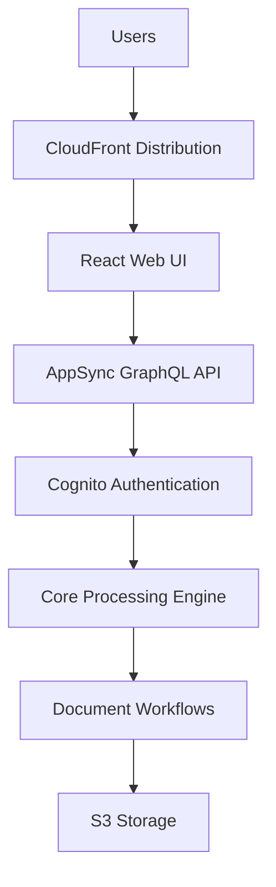
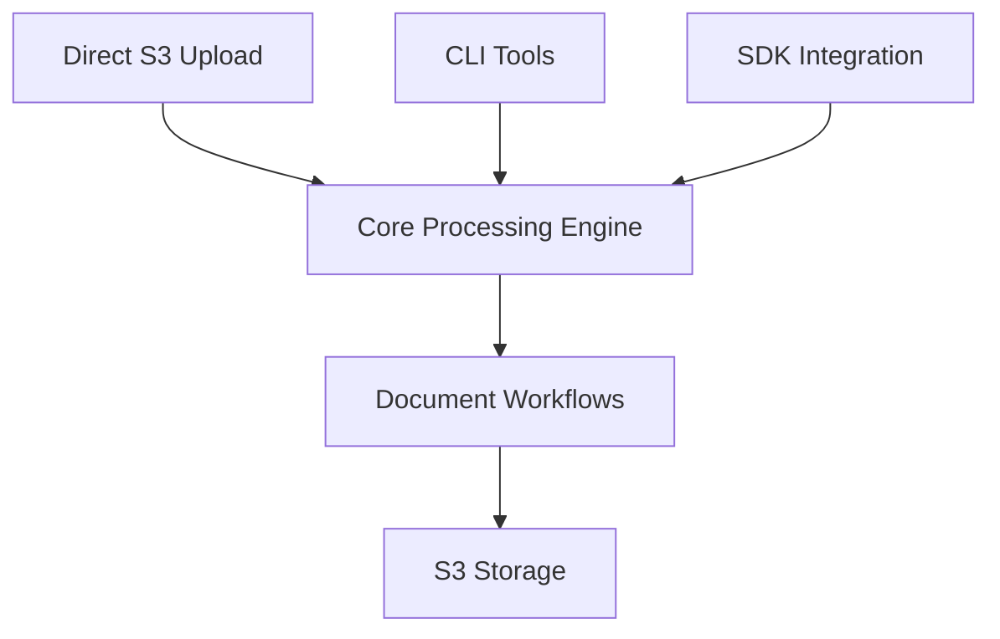

# GovCloud Deployment Guide

## Overview

The GenAI IDP Accelerator now supports deployment to AWS GovCloud regions through a specialized template generation script. This solution addresses two key GovCloud requirements:

1. **ARN Partition Compatibility**: All ARN references use `arn:${AWS::Partition}:` instead of `arn:aws:` to work in both commercial and GovCloud regions
2. **Service Compatibility**: Removes services not available in GovCloud (AppSync, CloudFront, WAF, Cognito UI components)

## Architecture Differences

### Standard AWS Deployment



### GovCloud Deployment



## Deployment Process

### Dependencies

You need to have the following packages installed on your computer:

1. bash shell (Linux, MacOS, Windows-WSL)
2. aws (AWS CLI)
3. [sam (AWS SAM)](https://docs.aws.amazon.com/serverless-application-model/latest/developerguide/install-sam-cli.html)
4. python 3.11 or later
5. A local Docker daemon
6. Python packages for publish.py: `pip install boto3 rich PyYAML botocore setuptools docker`

### Step 1: Generate GovCloud Template

First, generate the GovCloud-compatible template - this run the standard build process first to create all Lambda functions and artifacts, and then creates a stripped down version for GovCloud:

```bash
# Build for GovCloud region
python scripts/generate_govcloud_template.py my-bucket-govcloud my-prefix us-gov-west-1

# Or build for commercial region first (for testing)
python scripts/generate_govcloud_template.py my-bucket my-prefix us-east-1
```

### Step 2: Deploy to GovCloud

Deploy the generated template to GovCloud using the AWS CloudFormation console (recommended) or deploy using AWS CLI e.g:

```bash
aws cloudformation deploy \
  --template-file .aws-sam/idp-govcloud.yaml \
  --stack-name my-idp-govcloud-stack \
  --region us-gov-west-1 \
  --capabilities CAPABILITY_NAMED_IAM CAPABILITY_AUTO_EXPAND \
  --parameter-overrides \
    IDPPattern="Pattern2 - Packet processing with Textract and Bedrock"
```

## Services Removed in GovCloud

The following services are automatically removed from the GovCloud template:

### Web UI Components (22 resources removed)

- CloudFront distribution and origin access identity
- WebUI S3 bucket and build pipeline
- CodeBuild project for UI deployment
- Security headers policy

### API Layer (20+ resources removed)

- AppSync GraphQL API and schema
- All GraphQL resolvers and data sources
- 10+ Lambda resolver functions
- API authentication and authorization

### Authentication (8 resources removed)

- Cognito User Pool and Identity Pool
- User pool client and domain
- Admin user and group management
- Email verification functions

### WAF Security (6 resources removed)

- WAF WebACL and IP sets
- IP set updater functions
- CloudFront protection rules

### Analytics Features (8 resources removed)

- Analytics processing functions
- Knowledge base query functions
- Chat with document features
- Text-to-SQL query capabilities

### HITL Support

- SageMaker A2I Human-in-the-Loop
- Private workforce configuration
- Human review workflows

## Core Services Retained

The following essential services remain available:

### Document Processing

- ✅ All 3 processing patterns (BDA, Textract+Bedrock, Textract+SageMaker+Bedrock)
- ✅ Complete 6-step pipeline (OCR, Classification, Extraction, Assessment, Summarization, Evaluation)
- ✅ Step Functions workflows
- ✅ Lambda function processing
- ✅ Custom prompt Lambda integration

### Storage & Data

- ✅ S3 buckets (Input, Output, Working, Configuration, Logging)
- ✅ DynamoDB tables (Tracking, Configuration, Concurrency)
- ✅ Data encryption with customer-managed KMS keys
- ✅ Lifecycle policies and data retention

### Monitoring & Operations

- ✅ CloudWatch dashboards and metrics
- ✅ CloudWatch alarms and SNS notifications
- ✅ Lambda function logging and tracing
- ✅ Step Functions execution logging

### Integration

- ✅ SQS queues for document processing
- ✅ EventBridge rules for workflow orchestration
- ✅ Post-processing Lambda hooks
- ✅ Evaluation and reporting systems

## Access Methods

Without the web UI, you can interact with the system through:

### 1. Direct S3 Upload

````bash
# Upload documents directly to input bucket
aws s3 cp my-document.pdf s3://InputBucket/my-document.pdf


### 2. Check progress
Using the lookup script
```bash
# Use the lookup script to check document status
./scripts/lookup_file_status.sh documents/my-document.pdf MyStack
````

Or navigate to the AWS Step Functions workflow using the link in the stack Outputs tab in CloudFormation, to visually monitor workflow progress.

## Monitoring & Troubleshooting

### CloudWatch Dashboards

Access monitoring through CloudWatch console:

- Navigate to CloudWatch → Dashboards
- Find dashboard: `{StackName}-{Region}`
- View processing metrics, error rates, and performance

### CloudWatch Logs

Monitor processing through log groups:

- `/aws/lambda/{StackName}-*` - Lambda function logs
- `/aws/vendedlogs/states/{StackName}/workflow` - Step Functions logs
- `/{StackName}/lambda/*` - Pattern-specific logs

### Alarms and Notifications

- SNS topic receives alerts for errors and performance issues
- Configure email subscriptions to the AlertsTopic

## Limitations in GovCloud Version

The following features are not available:

### ❌ Removed Features

- Web-based user interface
- Real-time document status updates via websockets
- Interactive configuration management
- User authentication and authorization via Cognito
- CloudFront content delivery and caching
- WAF security rules and IP filtering
- Analytics query interface
- Document knowledge base chat interface

### ✅ Available Workarounds

- Use S3 direct upload instead of web UI
- Monitor through CloudWatch instead of real-time UI
- Edit configuration files in S3 directly
- Use CLI/SDK for authentication needs
- Access content directly from S3
- Implement custom security at application level
- Query data through Athena directly
- Use the lookup function for document queries

## Best Practices

### Security

1. **IAM Roles**: Use least-privilege IAM roles
2. **Encryption**: Enable encryption at rest and in transit
3. **Network**: Deploy in private subnets if required
4. **Access Control**: Implement custom authentication as needed

### Operations

1. **Monitoring**: Set up CloudWatch alarms for critical metrics
2. **Logging**: Configure appropriate log retention policies
3. **Backup**: Implement backup strategies for important data
4. **Updates**: Plan for template updates and maintenance

### Performance

1. **Concurrency**: Adjust `MaxConcurrentWorkflows` based on load
2. **Timeouts**: Configure appropriate timeout values
3. **Memory**: Optimize Lambda memory settings
4. **Batching**: Use appropriate batch sizes for processing

## Troubleshooting

### Common Issues

**Missing Dependencies**

- Ensure all Bedrock models are enabled in the region
- Verify IAM permissions for service roles
- Check S3 bucket policies and access

**Processing Failures**

- Check CloudWatch logs for detailed error messages
- Verify document formats are supported
- Confirm configuration settings are valid

### Support Resources

1. **AWS Documentation**: [GovCloud User Guide](https://docs.aws.amazon.com/govcloud-us/)
2. **Bedrock in GovCloud**: [Model Availability](https://docs.aws.amazon.com/bedrock/latest/userguide/models-regions.html)
3. **Service Limits**: [GovCloud Service Quotas](https://docs.aws.amazon.com/govcloud-us/latest/UserGuide/govcloud-limits.html)

## Migration from Commercial AWS

If migrating an existing deployment:

1. **Export Configuration**: Download all configuration from existing stack
2. **Export Data**: Copy any baseline or reference data
3. **Deploy GovCloud**: Use the generated template
4. **Import Configuration**: Upload configuration to new stack
5. **Validate**: Test processing with sample documents

## Cost Considerations

GovCloud pricing may differ from commercial regions:

- Review [GovCloud Pricing](https://aws.amazon.com/govcloud-us/pricing/)
- Update cost estimates in configuration files
- Monitor actual usage through billing dashboards

## Compliance Notes

- The GovCloud version maintains the same security features
- Data encryption and retention policies are preserved
- All processing remains within GovCloud boundaries
- No data egress to commercial AWS regions
