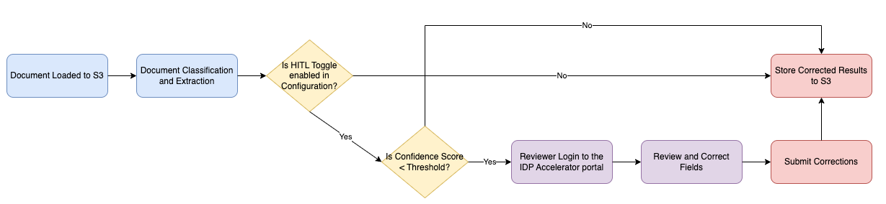

# Human-in-the-Loop (HITL) Review

Copyright Amazon.com, Inc. or its affiliates. All Rights Reserved.
SPDX-License-Identifier: MIT-0

## Table of Contents

- [Overview](#overview)
- [Architecture](#architecture)
- [User Management](#user-management)
  - [User Personas](#user-personas)
  - [Managing Users](#managing-users)
- [Workflow](#workflow)
  - [Review Status Values](#review-status-values)
- [Configuration](#configuration)
- [Review Portal](#review-portal)
- [Best Practices](#best-practices)
- [Troubleshooting](#troubleshooting)

## Overview

The GenAI-IDP solution supports Human-in-the-Loop (HITL) review capabilities through a built-in review system integrated directly into the Web UI. This feature enables human reviewers to validate and correct extracted information when the system's confidence falls below a specified threshold, ensuring accuracy for critical document processing workflows.

**Supported Patterns:**
- Pattern 1: BDA processing with HITL review
- Pattern 2: Textract + Bedrock processing with HITL review

**Key Features:**
- Built-in review portal within the GenAI-IDP Web UI
- Role-based access control with Admin and Reviewer personas
- Review ownership model - reviewers claim documents before editing
- Section-by-section review workflow
- Visual editor for viewing and correcting extracted data
- Decoupled from document processing workflow for improved reliability

## Architecture

The HITL system operates independently from the document processing workflow:

- **Built-in Review Portal**: Web interface integrated into the GenAI-IDP UI for validation and correction
- **User Management**: Cognito-based authentication with role-based access control
- **Section Review Tracking**: DynamoDB-based tracking of review progress per document section
- **Decoupled Design**: HITL operations update document status directly without triggering reprocessing

### Review Flow

## User Management

### User Personas

The system supports two user personas with different permission levels:

#### Admin Persona

Admins have full access to all system features:

| Feature | Access |
|---------|--------|
| View Documents | ✅ Full access |
| Upload Documents | ✅ Allowed |
| View/Edit Extraction Results | ✅ Full access |
| Complete Section Reviews | ✅ Allowed |
| Skip All Reviews | ✅ Allowed (Admin only) |
| Release Any Review | ✅ Allowed (can release reviews owned by others) |
| View/Edit Configuration | ✅ Full access |
| User Management | ✅ Full access (create/delete users) |
| Discovery | ✅ Full access |
| Analytics & Agents | ✅ Full access |

#### Reviewer Persona

Reviewers have limited access focused on document review tasks:

| Feature | Access |
|---------|--------|
| View Documents | ✅ Pending and own in-progress reviews only |
| Upload Documents | ❌ Not allowed |
| Start Review | ✅ Claim ownership of pending documents |
| View/Edit Extraction Results | ✅ Can view and edit (only for owned documents) |
| Complete Section Reviews | ✅ Allowed (only for owned documents) |
| Release Review | ✅ Can release own reviews only |
| Skip All Reviews | ❌ Not allowed (Admin only) |
| View/Edit Configuration | ❌ Not allowed |
| User Management | ❌ Not allowed |
| Discovery | ❌ Not allowed |
| Analytics & Agents | ❌ Limited access |

**Note:** Reviewers see only documents that are pending review (unassigned) or documents they have claimed for review.

### Managing Users

User management is available to Admin users through the Web UI.

#### Accessing User Management

1. Log in to the GenAI-IDP Web UI with Admin credentials
2. Navigate to **User Management** in the left navigation menu
3. View the list of all users with their email, persona, and status

#### Creating a New User

1. Click the **Create User** button
2. Enter the user's email address
3. Select the persona:
   - **Admin**: Full system access
   - **Reviewer**: Limited access for document review
4. Click **Create**

The system will:
- Create a user record in DynamoDB
- Create a corresponding user in Cognito
- Add the user to the appropriate Cognito group (Admin or Reviewer)
- Send a temporary password to the user's email

#### Deleting a User

1. Find the user in the user list
2. Click the **Delete** button in the Actions column
3. Confirm the deletion

The system will remove the user from both DynamoDB and Cognito.

#### User Synchronization

The system automatically synchronizes users between Cognito and DynamoDB:
- Existing Cognito users are synced to DynamoDB when the user list is loaded
- User persona is determined by Cognito group membership
- Users in the "Admin" group are assigned Admin persona
- All other users are assigned Reviewer persona

## Workflow

### Review Status Values

Documents progress through the following Review Status values:

| Status | Description |
|--------|-------------|
| **Review Pending** | Document is awaiting review, not yet claimed by a reviewer |
| **Review In Progress** | Document has been claimed by a reviewer and is being reviewed |
| **Review Completed** | All sections have been reviewed and approved |
| **Review Skipped** | Admin has skipped all remaining reviews |

### 1. Automatic Triggering

HITL review is automatically triggered when:
- HITL feature is enabled in your configuration (`assessment.enable_hitl = true`)
- Extraction confidence score falls below the configured threshold
- Document status is set to **Review Pending**

### 2. Review Process

**For Reviewers:**

1. **View Available Documents**: Log in and navigate to the Documents page. You will see only:
   - Documents with status **Review Pending** (available to claim)
   - Documents you have claimed with status **Review In Progress**

2. **Start Review (Claim Document)**:
   - Select a document with **Review Pending** status
   - Click **Start Review** button
   - Document status changes to **Review In Progress**
   - You become the review owner

3. **Review Sections**:
   - In the document detail view, locate the **Sections** panel
   - Click **View/Edit Data** to open the visual editor
   - Review and correct extracted key-value pairs
   - Click **Mark Review Complete** for each section

4. **Release Review** (optional):
   - If you need to stop reviewing, click **Release Review**
   - Document returns to **Review Pending** status
   - Another reviewer can claim it

**For Admins:**

Admins have additional capabilities:

- **Skip All Reviews**: Click **Skip All Reviews** to mark all pending sections as skipped
  - Document status changes to **Review Skipped**
  - The **Review Completed By** field records the admin who skipped
  - No reprocessing is triggered
  
- **Release Any Review**: Admins can release reviews owned by other users

### 3. Result Integration

When all sections are reviewed or skipped:
- Document status changes to **Review Completed** or **Review Skipped**
- Corrected data is saved to S3
- **Review Completed By** field records who completed/skipped the review
- Review history is recorded with reviewer information and timestamps

**Note:** Completing or skipping reviews does not automatically trigger document reprocessing. Use the **Reprocess** button if you need to re-run summarization or evaluation with the corrected data.

## Configuration

### Enabling HITL

HITL can be enabled through two methods:

#### Method 1: CloudFormation Parameter (Initial Setup)

Set the `EnableHITL` parameter to `true` during stack deployment or update.

#### Method 2: Configuration UI (Runtime Toggle)

1. Log in as an Admin user
2. Navigate to **Configuration** in the Web UI
3. Find the **Assessment & HITL Configuration** section
4. Toggle **Enable Human-in-the-Loop (HITL) review** to enable/disable
5. Click **Save** to apply changes

**Note:** Configuration settings take precedence over CloudFormation parameters at runtime.

### Confidence Threshold Configuration

The confidence threshold determines when human review is triggered:

1. Navigate to **Configuration** in the Web UI
2. Find the **Assessment & HITL Configuration** section
3. Set **HITL Confidence Threshold** (0.0-1.0):
   - `0.8` = 80% confidence threshold (recommended starting point)
   - Fields with confidence below this threshold trigger HITL review
4. Click **Save** to apply changes

## Review Portal

### Document List View

**For Admins:** All documents are visible with their current status.

**For Reviewers:** Only documents available for review are shown:
- Documents with **Review Pending** status (available to claim)
- Documents with **Review In Progress** status owned by the current reviewer

Document statuses displayed:
- **Review Pending**: Document is awaiting review
- **Review In Progress**: Document is being reviewed
- **Review Completed**: All sections reviewed
- **Review Skipped**: Admin skipped remaining reviews

### Section Review Interface

The section review interface provides:

- **Section List**: All document sections with review status
- **View/Edit Data**: Opens the visual editor for a section
- **Download Data**: Export extraction results as JSON
- **Mark Review Complete**: Complete the review for a section

### Review Actions

| Action | Available To | Description |
|--------|--------------|-------------|
| **Start Review** | Reviewers, Admins | Claim a pending document for review |
| **Release Review** | Owner, Admins | Release document back to pending status |
| **Skip All Reviews** | Admins only | Skip all remaining sections |
| **Mark Review Complete** | Owner, Admins | Complete review for a section |

### Visual Editor

The visual editor provides a comprehensive review experience with a modern tabbed interface:

#### Navigation Controls
- **Mouse Wheel Zoom**: Zoom in/out using the mouse wheel without requiring modifier keys
- **Click-and-Drag Panning**: Pan around zoomed images by clicking and dragging (cursor shows grab/grabbing state)
- **Section Navigation**: Use Previous/Next buttons to navigate between document sections without closing the editor

#### Tabbed Interface

**Visual Editor Tab**
- Split-pane layout with document image (left) and form-based field editing (right)
- Bounding box overlay highlighting field locations on the document
- Color-coded confidence indicators (green=meets threshold, red=below threshold, black=no threshold)
- Inline editing with visual change tracking (✏️ Edited badges)

**JSON Editor Tab**
- Raw JSON editing for advanced users
- Section filtering with multiselect dropdown to focus on specific sections
- Full JSON validation before saving

**Revision History Tab**
- Complete audit trail of all edits to the document
- Timestamps showing when edits were made
- Reviewer identification showing who made each change
- Field-level diff information showing exactly what was modified

#### Editing Features

**Prediction Editing**
- Edit extracted field values directly in the visual editor
- Change tracking with visual indicators (blue left border on modified fields)
- Save changes directly to S3 with proper versioning
- Discard changes button to revert all edits

**Evaluation Baseline Editing** (when evaluation is enabled)
- Edit baseline (expected) values alongside predictions
- Independent change tracking from predictions (orange left border on modified baseline fields)
- Separate save/discard controls for baseline edits
- Side-by-side comparison of predicted vs expected values

**Save & Reprocess Workflow**

After making edits to predictions or baselines, you can trigger reprocessing to re-run downstream steps with the updated data:

1. **Save Your Edits**: Click "Save Changes" to persist prediction edits or "Save Baseline" to persist baseline edits to S3
2. **Trigger Reprocessing**: After saving, click the "Reprocess" button (or use the document toolbar "Reprocess" action)
3. **Automatic Pipeline Execution**: The document automatically transitions through processing stages:
   - `SUMMARIZING` → Re-generates document summary using updated extraction data
   - `EVALUATING` → Re-runs evaluation comparing updated predictions against baselines
   - `COMPLETE` → Processing finished with updated results
4. **View Updated Results**: Once complete, the evaluation scores and comparison results reflect your edits

**Key Benefits of Save & Reprocess:**
- **Iterative Refinement**: Make corrections and immediately see how they affect evaluation scores
- **Baseline Correction**: Fix ground truth errors and re-evaluate without re-uploading documents
- **Prompt Tuning Workflow**: Edit predictions to match desired output, save as baseline, then use for prompt improvement
- **Quality Assurance**: Verify that corrections properly resolve evaluation mismatches

#### Smart Filtering

- **Low Confidence Filter**: Toggle to show only fields with confidence scores below threshold
- **Evaluation Mismatches Filter**: Toggle to show only fields that don't match baseline (when evaluation enabled)
- **Collapsible Tree Navigation**: Expand/Collapse All buttons for nested data structures
- **Individual Node Toggle**: Click ▶/▼ to expand or collapse specific objects/arrays

#### Evaluation Comparison Mode

When evaluation data is available:
- Side-by-side display of prediction and baseline values for each field
- Match indicators showing ✓ Match or ⚠ Mismatch status
- Evaluation scores and LLM-generated comparison reasons
- Aggregate scores for nested groups and arrays

## Best Practices

### Review Management

- **Claim Before Editing**: Always use "Start Review" to claim a document before making edits
- **Process Promptly**: Review documents promptly to avoid backlogs
- **Release If Unavailable**: Release reviews if you cannot complete them so others can take over
- **Consistent Standards**: Establish consistent correction guidelines across reviewers
- **Quality Checks**: Implement spot-checks on completed reviews for quality assurance

### Threshold Optimization

- **Start Conservative**: Begin with higher thresholds (0.8-0.9) and adjust based on accuracy needs
- **Monitor Patterns**: Track which document types trigger reviews most frequently
- **Iterative Refinement**: Use review corrections to improve extraction prompts

### User Management

- **Least Privilege**: Assign Reviewer persona to users who only need review access
- **Admin Oversight**: Limit Admin access to users who need full system control
- **Regular Audits**: Periodically review user list and remove inactive users

## Troubleshooting

### Common Issues

**Documents Not Triggering HITL:**
- Verify HITL is enabled in Configuration
- Check confidence threshold settings
- Ensure extraction confidence scores are being calculated

**Cannot Start Review:**
- Verify document is in **Review Pending** status
- Check if document is already claimed by another reviewer
- Ensure you have Reviewer or Admin persona

**Cannot Complete Section Review:**
- Verify you are the review owner or have Admin persona
- Check if section is already completed
- Ensure all required fields are filled

**User Cannot See Documents:**
- Reviewers only see pending documents and their own in-progress reviews
- Verify user is in the correct Cognito group
- Check user persona in User Management
- Clear browser cache and re-login

**Estimated Cost Shows Zero After Start Review:**
- This issue has been fixed - HITL operations no longer re-serialize document data
- If still occurring, ensure you have the latest deployment

### Monitoring

Monitor HITL performance through:
- **CloudWatch Metrics**: Track review completion rates
- **Web UI Dashboard**: View document processing status
- **DynamoDB**: Query HITLReviewHistory for audit trails

### Review History

Each completed review is recorded with:
- Section ID
- Reviewer username and email  
- Review completion timestamp
- Action taken (complete, skip_all)

Query the tracking table for `HITLReviewHistory` to audit review activities.

The **Review Completed By** field in the document list shows who completed or skipped the review.
