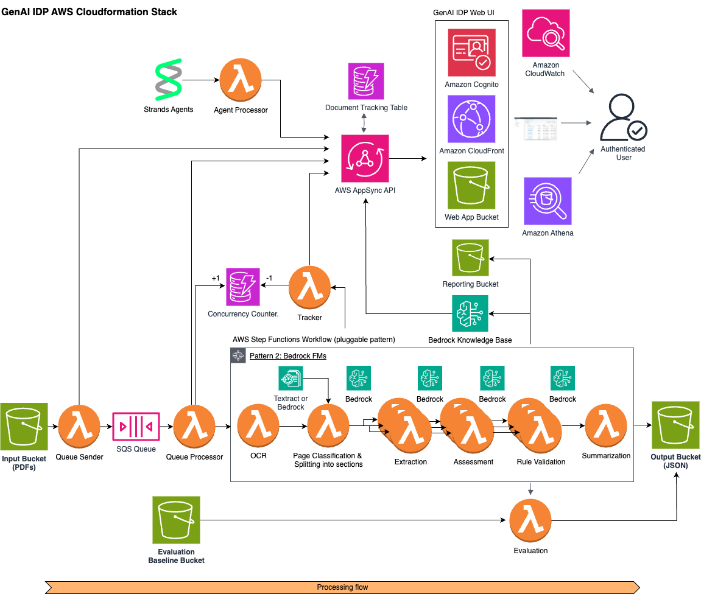

Copyright Amazon.com, Inc. or its affiliates. All Rights Reserved.
SPDX-License-Identifier: MIT-0

# Pattern 2: Bedrock Classification and Extraction

This pattern implements an intelligent document processing workflow that uses Amazon Bedrock with Nova or Claude models for both page classification/grouping and information extraction.



## Table of Contents

- [Architecture Overview](#architecture-overview)
  - [State Machine Workflow](#state-machine-workflow)
  - [Lambda Functions](#lambda-functions)
    - [OCR Function](#ocr-function)
    - [Classification Function](#classification-function)
    - [Extraction Function](#extraction-function)
    - [ProcessResults Function](#processresults-function)
  - [Human-in-the-Loop (HITL)](#human-in-the-loop-hitl)
  - [Monitoring and Metrics](#monitoring-and-metrics)
    - [Performance Metrics](#performance-metrics)
    - [Error Tracking](#error-tracking)
    - [Lambda Function Metrics](#lambda-function-metrics)
  - [Template Outputs](#template-outputs)
  - [Configuration](#configuration)
- [Bedrock OCR Feature](#bedrock-ocr-feature)
  - [Overview](#overview)
  - [Configuration](#configuration-1)
  - [Enabling Bedrock OCR](#enabling-bedrock-ocr)
  - [Benefits](#benefits)
  - [Cost Considerations](#cost-considerations)
- [Customizing Classification](#customizing-classification)
- [Few Shot Example Feature](#few-shot-example-feature)
- [Customizing Extraction](#customizing-extraction)
- [Assessment Feature](#assessment-feature)
- [Testing](#testing)
- [Best Practices](#best-practices)

## Architecture Overview

The workflow consists of three main processing steps with an optional assessment step:
1. OCR processing using Amazon Textract
2. Document classification using Claude via Amazon Bedrock (with two available methods):
   - Page-level classification: Classifies individual pages and groups them
   - Holistic packet classification: Analyzes multi-document packets to identify document boundaries
3. Field extraction using Claude via Amazon Bedrock
4. **Assessment** (optional): Confidence evaluation of extraction results using LLMs

### State Machine Workflow

The Step Functions state machine (`workflow.asl.json`) orchestrates the following flow:

```
OCRStep → ClassificationStep → ProcessPageGroups (Map State for Extraction) → ProcessResultsStep
```

Each step includes comprehensive retry logic for handling transient errors:
- Initial retry after 2 seconds
- Exponential backoff with rate of 2
- Maximum of 8-10 retry attempts depending on the step

### Lambda Functions

#### OCR Function
- **Purpose**: Processes input PDFs using Amazon Textract or Amazon Bedrock
- **Key Features**:
  - Supports two OCR backends:
    - Amazon Textract (default)
    - Amazon Bedrock LLMs (Claude, Nova)
  - Concurrent page processing with ThreadPoolExecutor
  - **Configurable Image Processing**: Enhanced image resizing with aspect-ratio preservation
  - **Configurable DPI**: Adjustable DPI for PDF-to-image conversion
  - **Dual Image Strategy**: Stores original high-DPI images while using resized images for OCR processing
  - **Smart Resizing**: Only downsizes images when necessary (scale factor < 1.0)
  - Image preprocessing and optimization
  - Comprehensive error handling and retries
  - Detailed metrics tracking
- **Input**:
  ```json
  {
    "execution_arn": "<ARN>",
    "output_bucket": "<BUCKET>",
    "input": {
      "detail": {
        "bucket": { "name": "<BUCKET>" },
        "object": { "key": "<KEY>" }
      }
    }
  }
  ```
- **Output**:
  ```json
  {
    "metadata": {
      "input_bucket": "<BUCKET>",
      "object_key": "<KEY>",
      "output_bucket": "<BUCKET>",
      "output_prefix": "<PREFIX>",
      "num_pages": "<NUMBER OF PAGES>"
    },
    "pages": {
      "<PAGE_NUMBER>": {
        "rawTextUri": "<S3_URI>",
        "parsedTextUri": "<S3_URI>",
        "imageUri": "<S3_URI>"
      }
    }
  }
  ```

#### Classification Function
- **Purpose**: Classifies pages or document packets using Claude via Bedrock and segments into sections
- **Key Features**:
  - Two classification methods:
    - Page-level classification (multimodalPageLevelClassification)
    - Holistic packet classification (textbasedHolisticClassification)
  - RVL-CDIP dataset categories for classification
  - Concurrent page processing
  - Automatic image resizing and optimization
  - Robust error handling with exponential backoff
  - **Few shot example support for improved accuracy**
- **Input**: Output from OCR function
- **Output**:
  ```json
  {
    "metadata": "<FROM_OCR>",
    "sections": [
      {
        "id": "<GROUP_ID>",
        "class": "<CLASS>",
        "pages": [...]
      }
    ]
  }
  ```

#### Extraction Function
- **Purpose**: Extracts fields using Claude via Bedrock
- **Key Features**:
  - Document class-specific attribute extraction
  - Configurable extraction attributes
  - Comprehensive error handling
  - Token usage tracking
  - **Few shot example support for improved accuracy**
- **Input**: Individual section from Classification output
- **Output**:
  ```json
  {
    "section": {
      "id": "<ID>",
      "class": "<CLASS>",
      "page_ids": ["<PAGEID>", ...],
      "outputJSONUri": "<S3_URI>"
    },
    "pages": [...]
  }
  ```

#### ProcessResults Function
- **Purpose**: Consolidates results from all sections
- **Output**: Standardized format for GenAIIDP parent stack:
  ```json
  {
    "Sections": [{
      "Id": "<ID>",
      "PageIds": ["<PAGEID>", ...],
      "Class": "<CLASS>",
      "OutputJSONUri": "<S3_URI>"
    }],
    "Pages": [{
      "Id": "<ID>",
      "Class": "<CLASS>",
      "TextUri": "<S3_URI>",
      "ImageUri": "<S3_URI>"
    }],
    "PageCount": "<TOTAL_PAGES>"
  }
  ```

### Human-in-the-Loop (HITL)

Pattern-2 supports Human-in-the-Loop (HITL) review capabilities using Amazon SageMaker Augmented AI (A2I). This feature allows human reviewers to validate and correct extracted information when the system's confidence falls below a specified threshold.

**Pattern-2 Specific Configuration:**
- `EnableHITL`: Boolean parameter to enable/disable the HITL feature
- `IsPattern2HITLEnabled`: Boolean parameter specific to Pattern-2 HITL enablement
- `Pattern2 - Existing Private Workforce ARN`: Optional parameter to use existing private workforce

For comprehensive HITL documentation including workflow details, configuration steps, best practices, and troubleshooting, see the [Human-in-the-Loop Review Guide](./human-review.md).

### Monitoring and Metrics

The pattern includes a comprehensive CloudWatch dashboard with:

#### Performance Metrics
- Document and page throughput
- Token usage (input/output/total)
- Bedrock request statistics
- Processing latencies
- Throttling and retry metrics

#### Error Tracking
- Lambda function errors
- Long-running invocations
- Classification/extraction failures
- Throttling events

#### Lambda Function Metrics
- Duration
- Memory usage
- Error rates
- Concurrent executions

### Template Outputs

The pattern exports these outputs to the parent stack:

- `StateMachineName`: Name of Step Functions state machine
- `StateMachineArn`: ARN of Step Functions state machine
- `StateMachineLogGroup`: CloudWatch log group for state machine
- `DashboardName`: Name of pattern-specific dashboard
- `DashboardArn`: ARN of pattern-specific dashboard

### Configuration

**Stack Deployment Parameters:**
- `ClassificationMethod`: Classification methodology to use (options: 'multimodalPageLevelClassification' or 'textbasedHolisticClassification')
- **Summarization**: Control summarization via configuration file `summarization.enabled` property (replaces `IsSummarizationEnabled` parameter)
- `ConfigurationDefaultS3Uri`: Optional S3 URI to custom configuration (uses default configuration if not specified)
- `MaxConcurrentWorkflows`: Workflow concurrency limit
- `LogRetentionDays`: CloudWatch log retention period
- `ExecutionTimeThresholdMs`: Latency threshold for alerts

**Configuration Management:**
- Model selection is now handled through configuration files rather than CloudFormation parameters
- Configuration supports multiple presets per pattern (e.g., default, checkboxed_attributes_extraction, medical_records_summarization, few_shot_example)
- Configuration can be updated through the Web UI without stack redeployment
- Model choices are constrained through enum constraints in the configuration schema

## Bedrock OCR Feature

### Overview

Pattern 2 now supports Amazon Bedrock LLMs (Claude, Nova) as an alternative OCR backend alongside the traditional Amazon Textract service. This feature enables multimodal document processing where large language models can extract text from document images using their vision capabilities.

### Configuration

Bedrock OCR is configured through the pattern's configuration files. The OCR backend can be selected using the `backend` parameter:

```yaml
ocr:
  backend: "bedrock"  # Options: "textract", "bedrock", "none"
  model_id: "us.anthropic.claude-3-7-sonnet-20250219-v1:0"
  system_prompt: "You are an expert OCR system. Extract all text from the provided image accurately, preserving layout where possible."
  task_prompt: "Extract all text from this document image. Preserve the layout, including paragraphs, tables, and formatting."
```

### Enabling Bedrock OCR

To use Bedrock OCR:

1. **Set the backend**: Configure `backend: "bedrock"` in your OCR configuration
2. **Choose a model**: Select from supported vision-capable models:
   - `us.amazon.nova-lite-v1:0`
   - `us.amazon.nova-pro-v1:0` 
   - `us.amazon.nova-premier-v1:0`
   - `us.amazon.nova-2-lite-v1:0`
   - `us.anthropic.claude-3-haiku-20240307-v1:0`
   - `us.anthropic.claude-haiku-4-5-20251001-v1:0`
   - `us.anthropic.claude-3-5-sonnet-20241022-v2:0`
   - `us.anthropic.claude-3-7-sonnet-20250219-v1:0`
   - `us.anthropic.claude-sonnet-4-20250514-v1:0`
   - `us.anthropic.claude-sonnet-4-20250514-v1:0:1m`
   - `us.anthropic.claude-sonnet-4-5-20250929-v1:0`
   - `us.anthropic.claude-sonnet-4-5-20250929-v1:0:1m`
   - `us.anthropic.claude-opus-4-20250514-v1:0`
   - `us.anthropic.claude-opus-4-1-20250805-v1:0`
   - `us.anthropic.claude-opus-4-5-20251101-v1:0`
   - `eu.amazon.nova-lite-v1:0`
   - `eu.amazon.nova-pro-v1:0`
   - `eu.amazon.nova-2-lite-v1:0`
   - `eu.anthropic.claude-3-haiku-20240307-v1:0`
   - `eu.anthropic.claude-haiku-4-5-20251001-v1:0`
   - `eu.anthropic.claude-3-5-sonnet-20241022-v2:0`
   - `eu.anthropic.claude-3-7-sonnet-20250219-v1:0`
   - `eu.anthropic.claude-sonnet-4-20250514-v1:0`
   - `eu.anthropic.claude-sonnet-4-5-20250929-v1:0`
   - `eu.anthropic.claude-sonnet-4-5-20250929-v1:0:1m`
   - `eu.anthropic.claude-opus-4-5-20251101-v1:0`
   - `qwen.qwen3-vl-235b-a22b`
   - `global.amazon.nova-2-lite-v1:0`
   - `global.anthropic.claude-haiku-4-5-20251001-v1:0`
   - `global.anthropic.claude-sonnet-4-5-20250929-v1:0`
   - `global.anthropic.claude-sonnet-4-5-20250929-v1:0:1m`
   - `global.anthropic.claude-opus-4-5-20251101-v1:0`

3. **Configure prompts**: Customize system and task prompts for your specific use case
4. **Deploy**: The configuration can be updated through the Web UI without stack redeployment

### Benefits

**Advantages of Bedrock OCR:**
- **Multimodal Understanding**: LLMs can understand both visual layout and textual content
- **Context Awareness**: Better handling of complex document structures and relationships
- **Flexibility**: Customizable prompts for domain-specific terminology and formats
- **Advanced Reasoning**: Can handle challenging cases like handwritten text, poor quality scans, or complex layouts
- **Unified Processing**: Same models used for OCR, classification, and extraction provide consistency

**When to Use Bedrock OCR:**
- Documents with complex layouts or mixed content types
- Handwritten or low-quality documents where Textract struggles
- Domain-specific documents requiring contextual understanding
- When you want unified processing across the entire pipeline
- For experimental or specialized use cases requiring prompt customization

### Cost Considerations

**Bedrock OCR Pricing:**
- Charged per input/output token rather than per page
- Typically higher cost per page than Textract for standard documents
- Cost varies significantly by model (Nova Lite < Nova Pro < Claude models)
- Image tokens are more expensive than text tokens

**Cost Optimization Tips:**
1. **Model Selection**: Use Nova Lite for cost-sensitive applications, Claude for quality-critical use cases
2. **Image Preprocessing**: Enable image resizing and preprocessing to reduce token consumption
3. **Prompt Optimization**: Use concise, focused prompts to minimize token usage
4. **Hybrid Approach**: Use Textract for standard documents, Bedrock for complex cases
5. **Batch Processing**: Process multiple pages efficiently with concurrent processing

## OCR Configuration

The OCR service in Pattern 2 supports enhanced image processing capabilities for optimal text extraction:

### DPI Configuration

Configure DPI (Dots Per Inch) for PDF-to-image conversion:

```python
# Example OCR service initialization with custom DPI
ocr_service = OcrService(
    dpi=400,  # Higher DPI for better quality (default: 300)
    resize_config={
        'target_width': 1200,
        'target_height': 1600
    }
)
```

### Image Resizing Configuration

The OCR service supports optional image resizing for processing optimization:

```yaml
# OCR configuration example
ocr:
  image:
    resize_config:
      target_width: 951   # Target width for processing
      target_height: 1268 # Target height for processing
    preprocessing: true   # Enable adaptive binarization preprocessing
```

### OCR Image Processing Features

- **Configurable DPI**: Higher DPI (400+) for better quality, standard DPI (300) for balanced performance
- **Dual Image Strategy**: 
  - Stores original high-DPI images in S3 for archival and downstream processing
  - Uses resized images for OCR processing to optimize performance
- **Aspect Ratio Preservation**: Images are resized proportionally without distortion
- **Smart Scaling**: Only downsizes images when necessary (scale factor < 1.0)
- **Image Preprocessing**: Optional adaptive binarization to improve OCR accuracy on challenging documents
- **Enhanced Logging**: Detailed logging for DPI and resize operations

### Image Preprocessing Configuration

The OCR service supports optional adaptive binarization preprocessing to improve OCR accuracy on challenging documents:

```yaml
# Enable preprocessing for improved OCR accuracy
ocr:
  image:
    preprocessing: true  # Enable adaptive binarization
```

**Adaptive Binarization Benefits:**
- **Improved OCR Accuracy**: Significantly enhances text extraction on documents with uneven lighting, shadows, or low contrast
- **Background Noise Reduction**: Removes background gradients and noise that can interfere with OCR
- **Enhanced Edge Detection**: Sharpens text boundaries for better character recognition
- **Robust Processing**: Handles challenging document conditions like poor scans or faded text

**When to Enable Preprocessing:**
- Documents with uneven lighting or shadows
- Low contrast text or faded documents
- Scanned documents with background noise
- Handwritten or mixed content documents
- When standard OCR accuracy is insufficient

### Configuration Benefits

- **Quality Control**: Higher DPI settings improve OCR accuracy for complex documents
- **Performance Optimization**: Resized images reduce processing time and memory usage
- **Storage Efficiency**: Dual strategy balances quality preservation with processing efficiency
- **Preprocessing Enhancement**: Adaptive binarization improves OCR accuracy on challenging documents
- **Flexibility**: Runtime configuration allows adjustment without code changes
- **Backward Compatibility**: Default values maintain existing behavior

### Best Practices for OCR

1. **DPI Selection**:
   - Use 300 DPI for standard documents
   - Use 400+ DPI for documents with small text or complex layouts
   - Consider processing costs when using higher DPI settings

2. **Image Resizing**:
   - Enable resizing for large documents to improve processing speed
   - Maintain aspect ratios to preserve text readability
   - Test different dimensions based on document types

3. **Performance Tuning**:
   - Monitor processing times and adjust DPI/resize settings accordingly
   - Use concurrent processing for multi-page documents
   - Balance quality requirements with processing costs

## Customizing Classification

The pattern supports two different classification methods:

1. **Page-Level Classification (multimodalPageLevelClassification)**: This is the default method that classifies each page independently based on its visual layout and textual content. It outputs a simple JSON format with a single class label per page.

2. **Holistic Packet Classification (textbasedHolisticClassification)**: This method examines the document as a whole to identify boundaries between different document types within a multi-document packet. It can detect logical document boundaries and identifies document types in the context of the whole document. This is especially useful for packets where individual pages may not be clearly classifiable on their own. It outputs a JSON format that identifies document segments with start and end page numbers.

You can select which method to use by setting the `ClassificationMethod` parameter when deploying the stack.

The classification system uses RVL-CDIP dataset categories and can be customized through the configuration files. Classification models and prompts are now managed through the configuration library rather than CloudFormation parameters.

Available categories:
- letter
- form
- email
- handwritten
- advertisement
- scientific_report
- scientific_publication
- specification
- file_folder
- news_article
- budget
- invoice
- presentation
- questionnaire
- resume
- memo

## Few Shot Example Feature

Pattern 2 supports few shot learning through example-based prompting to significantly improve classification and extraction accuracy. This feature allows you to provide concrete examples of documents with their expected classifications and attribute extractions.

### Overview

Few shot examples work by including reference documents with known classifications and expected attribute values in the prompts sent to the AI model. This helps the model understand the expected format and accuracy requirements for your specific use case.

### Configuration

Few shot examples are configured using the configuration files in the `config_library/pattern-2/` directory. The `few_shot_example` configuration demonstrates how to set up examples:

```yaml
classes:
  - name: letter
    description: "A formal written correspondence..."
    attributes:
      - name: sender_name
        description: "The name of the person who wrote the letter..."
    examples:
      - classPrompt: "This is an example of the class 'letter'"
        name: "Letter1"
        attributesPrompt: |
          expected attributes are:
              "sender_name": "Will E. Clark",
              "sender_address": "206 Maple Street P.O. Box 1056 Murray Kentucky 42071-1056",
              "recipient_name": "The Honorable Wendell H. Ford"
        imagePath: "config_library/pattern-2/few_shot_example/example-images/letter1.jpg"
  - name: email
    description: "A digital message with email headers..."
    examples:
      - classPrompt: "This is an example of the class 'email'"
        name: "Email1"
        attributesPrompt: |
          expected attributes are: 
             "from_address": "Kelahan, Ben",
             "to_address": "TI New York: 'TI Minnesota",
             "subject": "FW: Morning Team Notes 4/20"
        imagePath: "config_library/pattern-2/few_shot_example/example-images/email1.jpg"
```

### Benefits

Using few shot examples provides several advantages:

1. **Improved Accuracy**: Models perform better when given concrete examples
2. **Consistent Formatting**: Examples help ensure consistent output structure  
3. **Domain Adaptation**: Examples help models understand domain-specific terminology
4. **Reduced Hallucination**: Examples reduce the likelihood of made-up data
5. **Better Edge Case Handling**: Examples can demonstrate how to handle unusual cases

### Integration with Template Prompts

The few shot examples are automatically integrated into the classification and extraction prompts using the `{FEW_SHOT_EXAMPLES}` placeholder. You can also use the `{DOCUMENT_IMAGE}` placeholder for precise image positioning:

**Standard Template with Text Only:**
```python
# In classification task_prompt
task_prompt: |
  Classify this document into exactly one of these categories:
  {CLASS_NAMES_AND_DESCRIPTIONS}
  
  <few_shot_examples>
  {FEW_SHOT_EXAMPLES}
  </few_shot_examples>
  
  <document_ocr_data>
  {DOCUMENT_TEXT}
  </document_ocr_data>

# In extraction task_prompt  
task_prompt: |
  Extract attributes from this document.
  
  <few_shot_examples>
  {FEW_SHOT_EXAMPLES}
  </few_shot_examples>
  
  
  <document_ocr_data>
  {DOCUMENT_TEXT}
  </document_ocr_data>
```

**Enhanced Template with Image Placement:**
```python
# In classification task_prompt with image positioning
task_prompt: |
  Classify this document into exactly one of these categories:
  {CLASS_NAMES_AND_DESCRIPTIONS}
  
  <few_shot_examples>
  {FEW_SHOT_EXAMPLES}
  </few_shot_examples>
  
  Now examine this new document:
  {DOCUMENT_IMAGE}
  
  <document_ocr_data>
  {DOCUMENT_TEXT}
  </document_ocr_data>
  
  Classification:

# In extraction task_prompt with image positioning
task_prompt: |
  Extract attributes from this {DOCUMENT_CLASS} document:
  {ATTRIBUTE_NAMES_AND_DESCRIPTIONS}
  
  <few_shot_examples>
  {FEW_SHOT_EXAMPLES}
  </few_shot_examples>
  
  Analyze this document image:
  {DOCUMENT_IMAGE}
  
  <document_ocr_data>
  {DOCUMENT_TEXT}
  </document_ocr_data>
  
  Extract as JSON:
```

### Available Template Placeholders

Pattern 2 supports several placeholders for building dynamic prompts:

- **`{CLASS_NAMES_AND_DESCRIPTIONS}`**: List of document classes and their descriptions
- **`{FEW_SHOT_EXAMPLES}`**: Examples from the configuration (class-specific for extraction, all classes for classification)
- **`{DOCUMENT_TEXT}`**: OCR-extracted text content from the document
- **`{DOCUMENT_IMAGE}`**: Document image(s) positioned at specific locations in the prompt
- **`{DOCUMENT_CLASS}`**: The classified document type (used in extraction prompts)
- **`{ATTRIBUTE_NAMES_AND_DESCRIPTIONS}`**: List of attributes to extract with their descriptions

**Image Placement Benefits:**
- **Visual Context**: Position images where they provide maximum context for the task
- **Multimodal Understanding**: Help models correlate visual and textual information effectively
- **Flexible Design**: Create prompts that flow naturally between different content types
- **Enhanced Accuracy**: Strategic image placement can improve both classification and extraction performance

### Using Few Shot Examples

To use few shot examples in your deployment:

1. **Use the example configuration**: Deploy with `ConfigurationDefaultS3Uri` pointing to `config_library/pattern-2/few_shot_example/config.yaml`
2. **Create custom examples**: Copy the example configuration and modify it with your own document examples
3. **Provide example images**: Place example document images in the appropriate directory and reference them in the `imagePath` field

### Best Practices

1. **Quality over Quantity**: Use 1-3 high-quality examples per document class
2. **Representative Examples**: Choose examples that represent typical documents in your use case
3. **Clear Attribution**: Ensure examples clearly show expected attribute extractions
4. **Diverse Coverage**: Include examples that cover different variations and edge cases

## Customizing Extraction

The extraction system can be customized through the configuration files rather than CloudFormation parameters:

1. **Attribute Definitions**: 
   - Define attributes per document class in the `classes` section of the configuration
   - Specify descriptions for each attribute
   - Configure the format and structure

2. **Extraction Prompts**:
   - Customize system behavior through the `system_prompt` in configuration
   - Add domain expertise and guidance in the `task_prompt`
   - Modify output formatting requirements

3. **Model Selection**:
   - Model selection is handled through enum constraints in the configuration
   - Available models are defined in the configuration schema
   - Changes can be made through the Web UI without redeployment

Example attribute definition from the configuration:
```yaml
classes:
  - name: invoice
    description: A commercial document issued by a seller to a buyer relating to a sale
    attributes:
      - name: invoice_number
        description: The unique identifier for the invoice. Look for 'invoice no', 'invoice #', or 'bill number', typically near the top of the document.
      - name: invoice_date
        description: The date when the invoice was issued. May be labeled as 'date', 'invoice date', or 'billing date'.
      - name: total_amount
        description: The final amount to be paid including all charges. Look for 'total', 'grand total', or 'amount due', typically the last figure on the invoice.
```

## Assessment Feature

Pattern 2 includes an optional assessment feature that evaluates the confidence of extraction results using LLMs. This feature provides automated quality assurance by analyzing extraction outputs against source documents.

### Overview

The assessment feature runs after successful extraction and provides:
- **Confidence Scores**: Per-attribute confidence ratings (0.0-1.0)
- **Explanatory Reasoning**: Human-readable explanations for each confidence score
- **UI Integration**: Automatic display in the web interface visual editor
- **Cost Optimization**: Optional deployment and efficient token usage
- **Granular Assessment**: Advanced scalable approach for complex documents with many attributes

### Enabling Assessment

Assessment can now be controlled via the configuration file rather than CloudFormation stack parameters. This provides more flexibility and eliminates the need for stack redeployment when changing assessment behavior.

**Configuration-based Control (Recommended):**
```yaml
assessment:
  enabled: true  # Set to false to disable assessment
  model: us.amazon.nova-lite-v1:0
  temperature: 0.0
  # ... other assessment settings
```

**Key Benefits:**
- **Runtime Control**: Enable/disable without stack redeployment
- **Cost Optimization**: Zero LLM costs when disabled (`enabled: false`)
- **Simplified Architecture**: No conditional logic in state machines
- **Backward Compatible**: Defaults to `enabled: true` when property is missing

**Behavior When Disabled:**
- Assessment lambda is still called (minimal overhead)
- Service immediately returns with logging: "Assessment is disabled via configuration"
- No LLM API calls or S3 operations are performed
- Document processing continues to completion

**Migration Note**: The previous `IsAssessmentEnabled` CloudFormation parameter has been removed in favor of this configuration-based approach.

The assessment step is always called in the state machine workflow, but the service itself handles the enablement decision:

```
OCRStep → ClassificationStep → ProcessPageGroups (Map State):
  ExtractSection → AssessSection (if enabled)
```

### State Machine Integration

The assessment step integrates seamlessly into Pattern-2's ProcessSections map state:

```json
{
  "AssessSection": {
    "Type": "Task",
    "Resource": "arn:aws:states:::lambda:invoke",
    "Parameters": {
      "FunctionName": "${AssessmentFunction}",
      "Payload": {
        "document.$": "$.document",
        "section_id.$": "$.section_id"
      }
    },
    "End": true
  }
}
```

### Configuration Options

Pattern 2 supports both standard and granular assessment approaches:

#### Standard Assessment
For documents with moderate complexity:
```yaml
assessment:
  model: "anthropic.claude-3-5-sonnet-20241022-v2:0"
  temperature: 0
  system_prompt: "You are an expert document analyst..."
  task_prompt: |
    Assess the confidence of extraction results for this {DOCUMENT_CLASS} document.
    
    Extraction Results: {EXTRACTION_RESULTS}
    Attributes: {ATTRIBUTE_NAMES_AND_DESCRIPTIONS}
    Document Text: {DOCUMENT_TEXT}
    OCR Confidence: {OCR_TEXT_CONFIDENCE}
    {DOCUMENT_IMAGE}
```

#### Granular Assessment
For complex documents with many attributes or large lists:
```yaml
assessment:
  model: "us.anthropic.claude-3-7-sonnet-20250219-v1:0"
  temperature: 0
  system_prompt: "You are an expert document analyst..."
  task_prompt: |
    Assess the confidence of extraction results for this {DOCUMENT_CLASS} document.
    
    Attributes to assess: {ATTRIBUTE_NAMES_AND_DESCRIPTIONS}
    Extraction results: {EXTRACTION_RESULTS}
    Document context: {DOCUMENT_TEXT}
    {OCR_TEXT_CONFIDENCE}
    {DOCUMENT_IMAGE}
  
  # Granular assessment configuration
  granular:
    max_workers: 6              # Parallel processing threads
    simple_batch_size: 3        # Attributes per batch
    list_batch_size: 1          # List items per batch
```

### When to Use Granular Assessment

Consider granular assessment for:
- **Bank statements** with hundreds of transactions
- **Documents with 10+ attributes** requiring individual attention
- **Complex nested structures** (group and list attributes)
- **Performance-critical scenarios** where parallel processing helps
- **Cost optimization** when prompt caching is available

### Testing Assessment

Use the provided assessment notebooks:

```bash
# Standard assessment testing
jupyter notebook notebooks/e2e-example-with-assessment.ipynb

# Granular assessment testing  
jupyter notebook notebooks/examples/step4_assessment_granular.ipynb
```

### Comprehensive Documentation

For detailed information about assessment configuration, output formats, confidence thresholds, UI integration, cost optimization, and troubleshooting, see the [Assessment Documentation](./assessment.md).

The assessment documentation covers:
- Complete configuration examples and placeholders
- Attribute types and assessment formats (simple, group, list)
- Confidence threshold configuration and UI integration
- Granular assessment architecture and performance tuning
- Cost optimization strategies and token reduction techniques
- Multimodal assessment with image processing
- Testing procedures and best practices

## Testing

Modify and use the provided test events and env files:

```bash
# Test OCR function
sam local invoke OCRFunction --env-vars testing/env.json -e testing/OCRFunction-event.json

# Test classification
sam local invoke ClassificationFunction --env-vars testing/env.json -e testing/ClassificationFunctionEvent.json

# Test extraction
sam local invoke ExtractionFunction --env-vars testing/env.json -e testing/ExtractionFunction-event.json
```

## Best Practices

1. **Configuration Management**:
   - Use the configuration library for different use cases (default, medical_records, few_shot_example)
   - Test configuration changes thoroughly before production deployment
   - Leverage the Web UI for configuration updates without redeployment

2. **Throttling Management**:
   - Implement exponential backoff with jitter
   - Configure appropriate retry limits
   - Monitor throttling metrics

3. **Error Handling**:
   - Comprehensive error logging
   - Graceful degradation
   - Clear error messages

4. **Performance Optimization**:
   - Concurrent processing where appropriate
   - Image optimization
   - Resource pooling

5. **Monitoring**:
   - Detailed CloudWatch metrics
   - Performance dashboards
   - Error tracking

6. **Security**:
   - KMS encryption
   - Least privilege IAM roles
   - Secure configuration management

7. **Few Shot Examples**:
   - Use high-quality, representative examples
   - Include examples for all document classes you expect to process
   - Regularly review and update examples based on real-world performance
   - Test configurations with examples before production deployment

8. **Image Processing Optimization**:
   - Configure appropriate image dimensions for each service based on document complexity
   - Use higher DPI (400+) for OCR when processing documents with small text or complex layouts
   - Balance image quality with processing performance and costs
   - Test different image configurations with your specific document types
   - Monitor memory usage and processing times when adjusting image settings
   - Leverage the dual image strategy in OCR to preserve quality while optimizing processing
