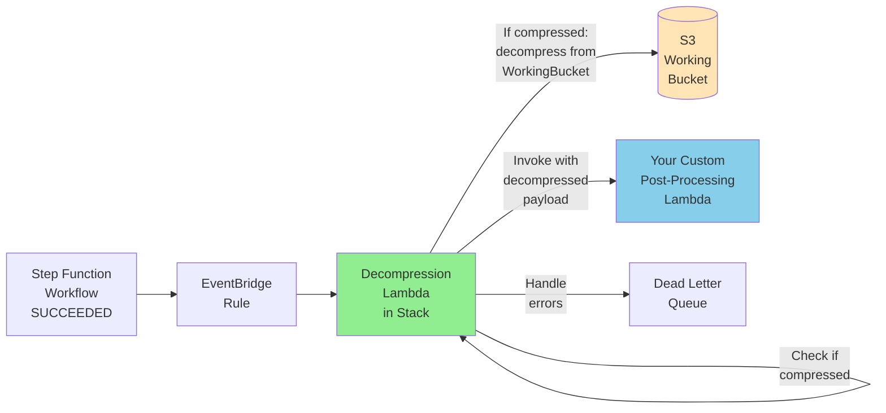

Copyright Amazon.com, Inc. or its affiliates. All Rights Reserved.
SPDX-License-Identifier: MIT-0

# Post-Processing Lambda Hook

The GenAIIDP solution supports an optional post-processing Lambda hook that enables custom downstream processing of document extraction results. This integration allows you to automatically trigger custom workflows, notifications, or data transformations immediately after a document is successfully processed.

## How It Works

1. **Document Processing Complete**
   - The IDP workflow completes successfully for a document
   - All extraction, assessment, and summarization steps finish
   - Document results are saved to the output S3 bucket

2. **EventBridge Integration**
   - The solution automatically publishes a custom event to EventBridge
   - Event contains complete document processing details and output locations
   - EventBridge rule matches the event pattern and triggers the decompression lambda

3. **Document Decompression** (New as of compression feature)
   - An intermediate lambda function in the IDP stack receives the event
   - If the document is compressed, it decompresses it using `idp_common.models.Document.load_document()`
   - The decompressed document is reconstructed into the original payload format
   - The decompression lambda then invokes your custom post-processing lambda

4. **Custom Processing**
   - Your Lambda function receives the document processing event with a **decompressed** document
   - No need to import `idp_common` or handle decompression logic
   - Function can directly access extraction results, confidence scores, and metadata
   - Implement custom logic for notifications, data transformation, or system integration

5. **Error Handling**
   - Built-in retry logic for transient failures
   - Dead letter queue for failed invocations
   - CloudWatch monitoring and alerting

## Architecture



**Key Components:**
- **EventBridge Rule**: Triggers on StepFunction SUCCEEDED status
- **Decompression Lambda** (in IDP stack): Handles document decompression transparently
- **Your Custom Lambda** (external): Receives decompressed payload, no `idp_common` dependency needed
- **S3 Working Bucket**: Temporary storage for compressed documents
- **Dead Letter Queue**: Captures failed invocations for retry/analysis

## Important Notes

> **Backward Compatibility**: The decompression lambda was introduced to handle document compression feature added in a previous release. Your custom post-processing lambda receives the document in its **original uncompressed format**, maintaining backward compatibility.

> **No External Dependencies**: Your custom post-processing lambda does **not** need to import the `idp_common` package. The IDP stack's decompression lambda handles all compression/decompression internally.

> **Payload Format**: The event payload structure remains unchanged from the original implementation. All document data, including sections, pages, and attributes, is provided in the standard format documented below.

> **Performance**: The decompression step adds minimal latency (typically < 1 second) and is transparent to your custom lambda function.

## Configuration

Configure the post-processing hook during stack deployment:

```yaml
PostProcessingLambdaHookFunctionArn:
  Type: String
  Default: ""
  Description: Optional Lambda ARN for custom post-processing. Leave empty to disable.
  
# Example values:
# arn:aws:lambda:us-east-1:123456789012:function:my-post-processor
# arn:aws:lambda:us-east-1:123456789012:function:enterprise-integration:PROD
```

When configured, the solution automatically:
- Creates an EventBridge rule to match document completion events
- Grants necessary permissions for EventBridge to invoke your Lambda function
- Sets up dead letter queue handling for failed invocations
- Configures CloudWatch monitoring for the integration

## Event Payload Structure

Your Lambda function receives an EventBridge event from AWS Step Functions with the following structure:

```json
{
  "version": "0",
  "id": "09904ff3-f768-572b-6f5f-904d4d15e600",
  "detail-type": "Step Functions Execution Status Change",
  "source": "aws.states",
  "account": "123456789012",
  "time": "2024-01-15T14:30:00Z",
  "region": "us-east-1",
  "resources": [
    "arn:aws:states:us-east-1:123456789012:execution:IDP-Workflow:doc_12345"
  ],
  "detail": {
    "executionArn": "arn:aws:states:us-east-1:123456789012:execution:IDP-Workflow:doc_12345",
    "stateMachineArn": "arn:aws:states:us-east-1:123456789012:stateMachine:IDP-Workflow",
    "name": "doc_12345",
    "status": "SUCCEEDED",
    "startDate": 1705329600000,
    "stopDate": 1705329660000,
    "input": "{\"document\": {\"document_id\": \"invoice-001.pdf\", ...}}",
    "output": "{\"document\": {\"id\": \"invoice-001.pdf\", \"input_bucket\": \"my-input-bucket\", \"input_key\": \"invoice-001.pdf\", \"output_bucket\": \"my-output-bucket\", \"status\": \"EVALUATING\", \"num_pages\": 3, \"sections\": [{\"section_id\": \"1\", \"classification\": \"Invoice\", \"page_ids\": [\"1\", \"2\", \"3\"], \"extraction_result_uri\": \"s3://my-output-bucket/invoice-001.pdf/sections/1/result.json\", \"attributes\": {\"invoice_number\": \"INV-2024-001\", \"vendor_name\": \"ABC Corporation\", \"total_amount\": \"$1,250.00\"}}], \"metering\": {\"OCR/textract/analyze_document\": {\"pages\": 3}, \"Classification/bedrock/claude-3-haiku\": {\"inputTokens\": 1234, \"outputTokens\": 56}}, \"summary_report_uri\": \"s3://my-output-bucket/invoice-001.pdf/summary/summary.md\"}}",
    "inputDetails": {
      "included": true
    },
    "outputDetails": {
      "included": true
    }
  }
}
```

**Note**: The `input` and `output` fields are JSON-encoded strings that need to be parsed. The decompression lambda automatically handles this and provides your custom lambda with fully decompressed document data.

## Lambda Function Implementation

### Basic Example

```python
import json
import boto3
import logging
from typing import Dict, Any

logger = logging.getLogger()
logger.setLevel(logging.INFO)

s3_client = boto3.client('s3')

def lambda_handler(event: Dict[str, Any], context) -> Dict[str, Any]:
    """
    Post-processing Lambda hook for IDP document completion events
    """
    try:
        # Parse the output from Step Functions
        detail = event['detail']
        output_data = json.loads(detail['output'])
        document = output_data['document']
        
        # Extract document details
        document_id = document['id']
        input_bucket = document['input_bucket']
        input_key = document['input_key']
        output_bucket = document['output_bucket']
        num_pages = document['num_pages']
        sections = document.get('sections', [])
        
        logger.info(f"Processing completed document: {document_id} ({num_pages} pages, {len(sections)} sections)")
        
        # Process each section
        for section in sections:
            section_id = section['section_id']
            classification = section['classification']
            extraction_uri = section.get('extraction_result_uri')
            
            logger.info(f"Section {section_id}: {classification}")
            
            # Download extraction results if available
            if extraction_uri:
                extraction_results = download_from_s3_uri(extraction_uri)
                process_section_results(section, extraction_results)
        
        # Access metering data for cost tracking
        metering = document.get('metering', {})
        log_cost_data(document_id, metering)
        
        return {
            'statusCode': 200,
            'body': json.dumps({
                'message': f'Successfully processed document {document_id}',
                'sectionsProcessed': len(sections)
            })
        }
        
    except Exception as e:
        logger.error(f"Error processing document: {str(e)}")
        # Re-raise to trigger retry logic
        raise e

def download_from_s3_uri(s3_uri: str) -> Dict[str, Any]:
    """Download and parse JSON from S3 URI"""
    try:
        # Parse S3 URI (format: s3://bucket/key)
        parts = s3_uri.replace('s3://', '').split('/', 1)
        bucket = parts[0]
        key = parts[1]
        
        response = s3_client.get_object(Bucket=bucket, Key=key)
        content = response['Body'].read().decode('utf-8')
        return json.loads(content)
    except Exception as e:
        logger.error(f"Failed to download {s3_uri}: {str(e)}")
        raise e

def process_section_results(section: Dict[str, Any], extraction_results: Dict[str, Any]):
    """Process extraction results for a section"""
    classification = section['classification']
    attributes = extraction_results.get('attributes', {})
    
    if classification == "Invoice":
        process_invoice(attributes)
    elif classification == "Bank-Statement":
        process_bank_statement(attributes)
    else:
        logger.info(f"No specific processing for classification: {classification}")

def process_invoice(attributes: Dict[str, Any]):
    """Process invoice-specific logic"""
    invoice_number = attributes.get('invoice_number')
    vendor_name = attributes.get('vendor_name')
    total_amount = attributes.get('total_amount')
    
    logger.info(f"Invoice: {invoice_number} from {vendor_name} for {total_amount}")
    
    # Example integrations:
    # - Update ERP system
    # - Send approval notifications
    # - Trigger payment workflows
        
def process_bank_statement(attributes: Dict[str, Any]):
    """Process bank statement-specific logic"""
    account_number = attributes.get('account_number')
    transactions = attributes.get('transactions', [])
    
    logger.info(f"Bank statement: Account {account_number} with {len(transactions)} transactions")
    
    # Example integrations:
    # - Update accounting system
    # - Reconcile transactions
    # - Generate financial reports

def log_cost_data(document_id: str, metering: Dict[str, Any]):
    """Log cost/metering data for tracking"""
    for context, metrics in metering.items():
        logger.info(f"Document {document_id} - {context}: {metrics}")
```


## Use Cases and Implementation Patterns

### Enterprise System Integration

```python
def integrate_with_erp_system(event: Dict[str, Any]):
    """Integrate processed documents with ERP systems"""
    
    # Parse document from event
    output_data = json.loads(event['detail']['output'])
    document = output_data['document']
    
    # Example: SAP integration for Invoice sections
    for section in document.get('sections', []):
        if section['classification'] == 'Invoice':
            # Download extraction results
            extraction_uri = section.get('extraction_result_uri')
            if extraction_uri:
                attributes = download_from_s3_uri(extraction_uri).get('attributes', {})
                
                # Create vendor invoice in SAP
                sap_payload = {
                    'vendor_id': map_vendor_name_to_id(attributes.get('vendor_name')),
                    'invoice_number': attributes.get('invoice_number'),
                    'amount': parse_currency(attributes.get('total_amount')),
                    'due_date': parse_date(attributes.get('due_date')),
                    'gl_account': determine_gl_account(attributes)
                }
                
                # Post to SAP via API
                post_to_sap_api(sap_payload)
                
                # Update document status in tracking system
                update_document_status(document['id'], 'ERP_INTEGRATED')
```

### Automated Workflow Triggers

```python
def trigger_approval_workflow(event: Dict[str, Any]):
    """Trigger approval workflows based on document content"""
    
    # Parse document from event
    output_data = json.loads(event['detail']['output'])
    document = output_data['document']
    
    for section in document.get('sections', []):
        if section['classification'] == 'Contract':
            # Download extraction results
            extraction_uri = section.get('extraction_result_uri')
            if extraction_uri:
                attributes = download_from_s3_uri(extraction_uri).get('attributes', {})
                contract_value = parse_currency(attributes.get('contract_value', '0'))
                
                # Route based on contract value
                if contract_value > 100000:
                    trigger_executive_approval(document, section, attributes)
                elif contract_value > 10000:
                    trigger_manager_approval(document, section, attributes)
                else:
                    auto_approve_contract(document, section, attributes)

def trigger_executive_approval(document: Dict[str, Any], section: Dict[str, Any], attributes: Dict[str, Any]):
    """Trigger executive approval workflow"""
    approval_payload = {
        'document_id': document['id'],
        'section_id': section['section_id'],
        'approval_level': 'EXECUTIVE',
        'urgency': 'HIGH',
        'contract_value': attributes.get('contract_value'),
        'summary_uri': section.get('attributes', {}).get('summary_uri')
    }
    
    send_to_approval_system(approval_payload)
```

### Real-time Notifications

```python
def send_intelligent_notifications(event: Dict[str, Any]):
    """Send context-aware notifications based on document content"""
    
    # Parse document from event
    output_data = json.loads(event['detail']['output'])
    document = output_data['document']
    
    # Check for low confidence alerts
    for section in document.get('sections', []):
        confidence_alerts = section.get('confidence_threshold_alerts', [])
        
        if confidence_alerts:
            send_quality_alert(document, section, confidence_alerts)
        
        # Classification-specific notifications
        classification = section['classification']
        if classification == 'Invoice':
            send_invoice_notification(document, section)
        elif classification == 'Bank-Statement':
            send_bank_statement_notification(document, section)

def send_quality_alert(document: Dict[str, Any], section: Dict[str, Any], alerts: list):
    """Send alerts for low-confidence extractions"""
    alert_message = {
        'type': 'QUALITY_ALERT',
        'document_id': document['id'],
        'section_id': section['section_id'],
        'classification': section['classification'],
        'low_confidence_fields': [
            {
                'attribute': alert['attribute_name'],
                'confidence': alert['confidence'],
                'threshold': alert['confidence_threshold']
            }
            for alert in alerts
        ],
        'requires_review': True
    }
    
    send_slack_notification(alert_message)
    send_email_alert(alert_message)
```

### Data Pipeline Integration

```python
def feed_data_pipeline(event: Dict[str, Any]):
    """Feed extracted data into analytics and ML pipelines"""
    
    # Parse document from event
    detail = event['detail']
    output_data = json.loads(detail['output'])
    document = output_data['document']
    
    # Calculate processing time
    start_date = detail['startDate']
    stop_date = detail['stopDate']
    processing_time_ms = stop_date - start_date
    
    # Transform data for analytics
    analytics_record = {
        'document_id': document['id'],
        'execution_arn': detail['executionArn'],
        'processing_time_ms': processing_time_ms,
        'num_pages': document['num_pages'],
        'num_sections': len(document.get('sections', [])),
        'status': document.get('status'),
        'metering': document.get('metering', {})
    }
    
    # Send to data lake
    send_to_kinesis_data_stream(analytics_record)
    
    # Update ML feature store
    update_feature_store(analytics_record)
    
    # Trigger batch analytics jobs if threshold reached
    check_and_trigger_batch_processing()
```

## Security Considerations

### IAM Permissions

Your Lambda function needs appropriate permissions to access IDP resources:

```json
{
  "Version": "2012-10-17",
  "Statement": [
    {
      "Effect": "Allow",
      "Action": [
        "s3:GetObject"
      ],
      "Resource": [
        "arn:aws:s3:::your-output-bucket/*",
        "arn:aws:s3:::your-working-bucket/*"
      ]
    },
    {
      "Effect": "Allow",
      "Action": [
        "logs:CreateLogGroup",
        "logs:CreateLogStream",
        "logs:PutLogEvents"
      ],
      "Resource": "arn:aws:logs:*:*:*"
    },
    {
      "Effect": "Allow",
      "Action": [
        "sns:Publish"
      ],
      "Resource": "arn:aws:sns:*:*:notification-topic"
    }
  ]
}
```


### Data Protection

Implement appropriate data protection measures:

```python
def sanitize_sensitive_data(document_data: Dict[str, Any]) -> Dict[str, Any]:
    """Remove or mask sensitive information"""
    
    # Define sensitive fields by document type
    sensitive_fields = {
        'Bank Statement': ['account_number', 'routing_number', 'ssn'],
        'Medical Record': ['patient_id', 'ssn', 'dob'],
        'Invoice': ['tax_id', 'bank_account']
    }
    
    document_class = document_data['documentClass']
    fields_to_mask = sensitive_fields.get(document_class, [])
    
    # Create sanitized copy
    sanitized_data = copy.deepcopy(document_data)
    
    for section in sanitized_data.get('sections', []):
        attributes = section.get('attributes', {})
        for field in fields_to_mask:
            if field in attributes:
                attributes[field] = mask_sensitive_value(attributes[field])
    
    return sanitized_data
```

## Monitoring and Alerting

### CloudWatch Metrics

The solution automatically creates CloudWatch metrics for the post-processing hook:

- `PostProcessing/Invocations` - Number of Lambda invocations
- `PostProcessing/Errors` - Number of processing errors
- `PostProcessing/Duration` - Processing duration
- `PostProcessing/Throttles` - Number of throttled invocations

### Custom Metrics

Add custom metrics to track your specific use cases:

```python
import boto3

cloudwatch = boto3.client('cloudwatch')

def publish_custom_metrics(document_data: Dict[str, Any], processing_result: Dict[str, Any]):
    """Publish custom CloudWatch metrics"""
    
    document_class = document_data['documentClass']
    
    # Publish document class metrics
    cloudwatch.put_metric_data(
        Namespace='IDP/PostProcessing',
        MetricData=[
            {
                'MetricName': 'DocumentsProcessed',
                'Dimensions': [
                    {
                        'Name': 'DocumentClass',
                        'Value': document_class
                    }
                ],
                'Value': 1,
                'Unit': 'Count'
            },
            {
                'MetricName': 'ProcessingLatency',
                'Dimensions': [
                    {
                        'Name': 'DocumentClass',
                        'Value': document_class
                    }
                ],
                'Value': processing_result.get('processing_time_ms', 0),
                'Unit': 'Milliseconds'
            }
        ]
    )
```

### Alerting Configuration

Set up CloudWatch alarms for critical issues:

```yaml
PostProcessingErrorAlarm:
  Type: AWS::CloudWatch::Alarm
  Properties:
    AlarmName: !Sub "${AWS::StackName}-PostProcessing-Errors"
    AlarmDescription: "Post-processing Lambda errors"
    MetricName: Errors
    Namespace: AWS/Lambda
    Statistic: Sum
    Period: 300
    EvaluationPeriods: 1
    Threshold: 1
    ComparisonOperator: GreaterThanOrEqualToThreshold
    Dimensions:
      - Name: FunctionName
        Value: !Ref PostProcessingFunction
    AlarmActions:
      - !Ref AlertTopic
```

## Best Practices

### Error Handling and Resilience

1. **Implement Retry Logic**: Handle transient failures with exponential backoff
2. **Use Dead Letter Queues**: Capture failed events for analysis and reprocessing
3. **Validate Input Data**: Check event structure and required fields before processing
4. **Graceful Degradation**: Continue processing even if optional integrations fail

### Performance Optimization

1. **Optimize Lambda Configuration**:
   - Set appropriate memory allocation (512MB-1024MB typically sufficient)
   - Configure timeout based on expected processing time (30-60 seconds)
   - Use provisioned concurrency for consistent performance

2. **Efficient Data Access**:
   - Cache frequently accessed configuration data
   - Use S3 Transfer Acceleration for large documents
   - Implement connection pooling for external APIs

3. **Batch Processing**:
   - Consider batching multiple documents for bulk operations
   - Use SQS FIFO queues for ordered processing when needed

### Testing and Validation

1. **Unit Testing**:
   - Test individual processing functions with mock data
   - Validate event parsing and data transformation logic
   - Test error handling scenarios

2. **Integration Testing**:
   - Test end-to-end flow with sample documents
   - Validate external system integrations
   - Test retry and error recovery mechanisms

3. **Load Testing**:
   - Test with expected document volumes
   - Validate performance under concurrent processing
   - Monitor memory usage and execution duration

## Troubleshooting

### Common Issues and Solutions

#### 1. Lambda Function Not Triggered

**Symptoms**: Documents process successfully but post-processing Lambda never executes

**Troubleshooting Steps**:
1. Verify the `PostProcessingLambdaHookFunctionArn` parameter is correctly configured
2. Check EventBridge rules in the AWS Console
3. Verify Lambda function permissions allow EventBridge invocation
4. Check CloudWatch Logs for EventBridge rule matching

**Solution**:
```bash
# Check EventBridge rules
aws events list-rules --name-prefix "idp-post-processing"

# Test EventBridge rule manually
aws events put-events --entries file://test-event.json
```

#### 2. S3 Access Denied Errors

**Symptoms**: Lambda function fails with S3 access denied errors

**Troubleshooting Steps**:
1. Verify Lambda execution role has S3 permissions
2. Check bucket policies for access restrictions
3. Verify S3 object keys are correct
4. Check for S3 encryption requirements

**Solution**:
```json
{
  "Effect": "Allow",
  "Action": [
    "s3:GetObject"
  ],
  "Resource": [
    "arn:aws:s3:::output-bucket/*"
  ]
}
```

#### 3. Processing Timeout Issues

**Symptoms**: Lambda function times out during processing

**Troubleshooting Steps**:
1. Monitor CloudWatch metrics for execution duration
2. Identify bottlenecks in processing logic
3. Consider increasing Lambda timeout
4. Optimize data processing algorithms

**Solution**:
```python
# Implement processing with timeout checks
import signal

class TimeoutError(Exception):
    pass

def timeout_handler(signum, frame):
    raise TimeoutError("Processing timeout")

def process_with_timeout(document_data, timeout_seconds=50):
    # Set up timeout handler
    signal.signal(signal.SIGALRM, timeout_handler)
    signal.alarm(timeout_seconds)
    
    try:
        result = process_document_data(document_data)
        signal.alarm(0)  # Cancel timeout
        return result
    except TimeoutError:
        logger.error("Processing timed out, implementing graceful shutdown")
        # Implement graceful shutdown logic
        raise
```

### Debugging Tools

1. **CloudWatch Logs Insights**: Query logs across multiple executions
2. **X-Ray Tracing**: Enable X-Ray for detailed execution tracing
3. **Lambda Test Events**: Create test events for debugging
4. **Local Testing**: Use SAM CLI for local Lambda testing

### Performance Monitoring

Monitor these key metrics:
- **Invocation Rate**: Number of documents processed per hour
- **Error Rate**: Percentage of failed post-processing attempts
- **Execution Duration**: Average and maximum processing time
- **Memory Utilization**: Peak memory usage during processing
- **External API Response Time**: Latency for downstream integrations

Set up CloudWatch dashboards to track these metrics and identify performance trends over time.
