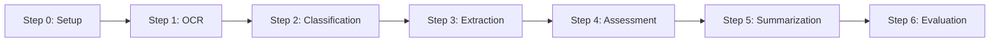
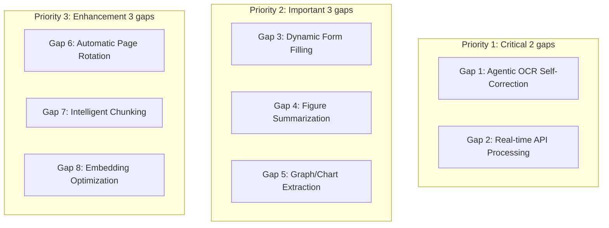
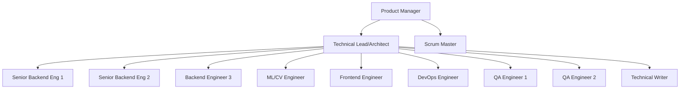
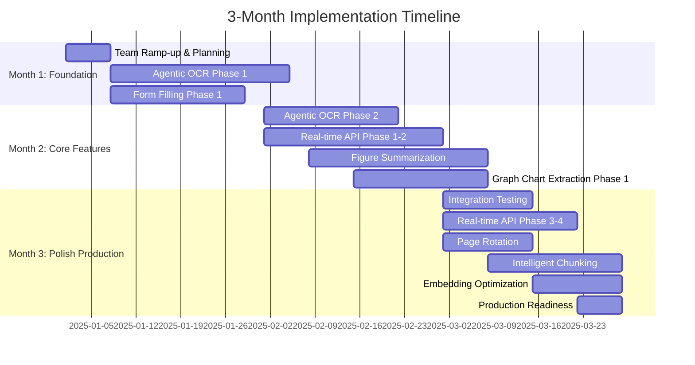

# Reducto vs GenAI IDP Accelerator: Comprehensive Assessment & Enhancement Plan

**Document Version:** 1.1  
**Date:** November 19, 2025  
**Prepared For:** GenAI IDP Accelerator Enhancement Initiative

---

## Executive Summary

This document provides a detailed comparison between Reducto (commercial document processing platform) and the GenAI IDP Accelerator (AWS open-source solution), identifies capability gaps, and proposes a comprehensive 3-month plan to achieve feature parity and competitive advantage.

### Key Findings

- **Current State**: GenAI IDP Accelerator has strong foundations in serverless architecture, modular design, and AWS-native integration
- **Gap Count**: 8 major feature gaps identified across document processing, intelligence, and enterprise capabilities
- **Investment Required**: ~8-9 FTE for 3 months (including all SDLC activities)
- **Target Outcome**: Feature parity with Reducto plus AWS-specific advantages

---

## 1. Platform Summaries

### 1.1 Reducto Platform Overview

**Company Profile:**
- Funding: $108M total (Series B led by a16z)
- Market Position: Commercial SaaS platform targeting enterprises and startups
- Notable Customers: Harvey, Scale AI, Vanta, Guideline, JLL
- Website: https://reducto.ai
- Documentation: https://docs.reducto.ai

**Core Value Proposition:**
Reducto provides AI-powered document processing with a focus on accuracy and human-like understanding. Their flagship feature is "Agentic OCR" which reviews and corrects outputs in real-time for near-perfect results.

**Key Capabilities:**

1. **Parse (Agentic OCR)** [[Ref]](#ref-1)
   - Layout-aware computer vision models
   - Vision-language models (VLMs) for interpretation
   - Agentic model for mistake detection and correction
   - Near-perfect accuracy even on edge cases

2. **Split (Intelligent Separation)** [[Ref]](#ref-2)
   - Automatic multi-document file separation
   - Long form splitting into useful units
   - Intelligent heuristics and layout-aware processing
   - No manual pre-processing needed

3. **Extract (Structured Data)** [[Ref]](#ref-3)
   - Schema-level precision extraction
   - Direct field mapping (invoices, forms, disclosures)
   - Ensures data lands exactly where needed

4. **Edit (Form Filling)** [[Ref]](#ref-4)
   - Dynamic element identification
   - Fill blanks, tables, checkboxes
   - No bounding boxes or templates required
   - Works with scanned PDFs, digital forms, multi-page documents

**Advanced Features:**
- Intelligent chunking for LLM optimization [[Ref]](#ref-5)
- Figure summarization for visual content [[Ref]](#ref-6)
- Graph/chart data extraction [[Ref]](#ref-7)
- Automatic page rotation detection [[Ref]](#ref-8)
- Embedding optimization for RAG systems [[Ref]](#ref-9)

**Enterprise Features:**
- 99.9%+ uptime SLA
- SOC2 and HIPAA compliance [[Ref]](#ref-10)
- Deploy in customer environment
- Enterprise support and custom SLAs
- Battle-tested at scale

**Pricing Model:**
- Standard tier: Pay-as-you-go with API access
- Growth tier: Volume pricing
- Enterprise tier: Custom pricing with SLAs

---

### 1.2 GenAI IDP Accelerator Overview

**Project Profile:**
- Type: AWS open-source solution
- Repository: aws-solutions-library-samples/accelerated-intelligent-document-processing-on-aws
- License: MIT-0
- Target: Customers building document processing on AWS

**Core Value Proposition:**
A scalable, serverless, modular solution for automated document processing that combines OCR capabilities with generative AI to convert unstructured documents into structured data at scale, with full AWS integration and cost optimization.

**Architecture Philosophy:**
- 100% serverless (Lambda, Step Functions, SQS, DynamoDB)
- Modular 6-step pipeline design
- Pattern-based processing (BDA, Bedrock, UDOP)
- Configuration-driven customization
- Pay-per-use cost model

**Core Processing Pipeline:**



**Key Capabilities:**

1. **Multiple Processing Patterns**
   - Pattern 1: Bedrock Data Automation (BDA)
   - Pattern 2: Textract + Bedrock (page-level or holistic classification)
   - Pattern 3: Textract + UDOP (SageMaker) + Bedrock

2. **OCR Processing**
   - Amazon Textract integration (default)
   - Amazon Bedrock LLM-based OCR (Claude, Nova)
   - Configurable DPI and image processing
   - Multi-page concurrent processing
   - Adaptive binarization preprocessing

3. **Classification & Document Splitting**
   - Page-level multimodal classification
   - **Holistic packet classification with automatic section creation**
   - RVL-CDIP dataset categories
   - Few-shot learning support
   - Creates sections (document boundaries) within multi-document files

4. **Extraction**
   - Traditional LLM extraction
   - **Agentic extraction** (preview) with Pydantic models
   - Schema validation and retry mechanisms
   - Custom prompt generator Lambda hooks
   - Support for simple, group, and list attributes

5. **Assessment**
   - LLM-powered confidence evaluation
   - Per-attribute confidence scores
   - Standard and granular assessment modes
   - Multimodal document analysis

6. **Additional Features**
   - Document summarization with citations
   - Knowledge base integration (Bedrock KB)
   - Human-in-the-loop (Amazon A2I)
   - Evaluation framework against baseline data
   - Post-processing Lambda hooks

**User Interfaces:**

1. **Web UI**
   - React-based interface
   - CloudFront + Cognito
   - Document upload and tracking
   - Results visualization
   - Configuration management
   - Knowledge base querying

2. **IDP CLI**
   - Batch processing
   - Stack deployment/updates
   - Evaluation workflows
   - Athena analytics integration
   - CI/CD pipeline support

**Enterprise Features:**
- CloudWatch comprehensive monitoring
- Custom dashboards per pattern
- Cost calculator framework
- Well-Architected Framework compliance
- Multi-region support (us-west-2, us-east-1, eu-central-1)
- Bedrock Guardrails integration

**Deployment Model:**
- CloudFormation templates
- One-click deployment via Launch Stack
- Optional CDK version available

**Cost Model:**
- Pay-per-use AWS services
- No platform licensing fees
- Transparent AWS service costs
- Cost optimization features built-in

---

## 2. Detailed Comparison Table

| **Category** | **Feature** | **Reducto** | **GenAI IDP Accelerator** | **Gap** |
|--------------|-------------|-------------|---------------------------|---------|
| **Core Document Processing** |
| OCR Technology | Agentic OCR with VLM correction | ✅ Advanced (self-correcting) | ⚠️ Partial (LLM OCR, no self-correction) | **MEDIUM** |
| OCR Accuracy | Near-perfect with real-time correction | ✅ 99%+ claimed | ✅ 95-98% (Textract + optional LLM) | **LOW-MEDIUM** |
| Multi-page Processing | ✅ Yes | ✅ Yes | ✅ Yes | None |
| Image Preprocessing | ✅ Advanced | ✅ Good (adaptive binarization) | ✅ Similar | None |
| **Document Intelligence** |
| Document Splitting | ✅ Automatic multi-doc separation | ✅ Yes (via classifier sections) | ✅ Similar | None |
| Classification | ✅ Implicit in splitting | ✅ Page-level + holistic packet classification | ✅ Similar | None |
| Structured Extraction | ✅ Schema-level precision | ✅ Yes (agentic + traditional) | ✅ Similar | None |
| Form Filling/Editing | ✅ Dynamic (no templates) | ❌ Not available | **HIGH** |
| **Advanced Features** |
| Intelligent Chunking | ✅ LLM-optimized chunks | ⚠️ Manual via configuration | **MEDIUM** |
| Figure Summarization | ✅ Automatic | ❌ Not available | **MEDIUM** |
| Graph/Chart Extraction | ✅ Structured data from visuals | ❌ Not available | **MEDIUM** |
| Automatic Page Rotation | ✅ Yes | ❌ Not available | **LOW** |
| Embedding Optimization | ✅ RAG-ready embeddings | ⚠️ Partial (manual via Bedrock KB) | **LOW-MEDIUM** |
| Few-Shot Learning | ⚠️ Unclear | ✅ Yes (classification + extraction) | **Advantage** |
| **Quality & Validation** |
| Confidence Assessment | ⚠️ Implicit in agentic OCR | ✅ Explicit LLM assessment | **Advantage** |
| Human Review | ⚠️ Not mentioned | ✅ Amazon A2I integration | **Advantage** |
| Evaluation Framework | ❌ Not mentioned | ✅ Comprehensive (baseline comparison) | **Advantage** |
| **Infrastructure** |
| Architecture | Proprietary SaaS | 100% AWS Serverless | Different approaches |
| Scalability | ✅ Enterprise-grade | ✅ Auto-scaling serverless | ✅ Similar |
| Uptime SLA | ✅ 99.9%+ | ⚠️ Dependent on AWS services | **LOW** |
| Deployment Options | Cloud + On-premises | AWS regions only | Different models |
| **Enterprise Features** |
| Security Compliance | ✅ SOC2, HIPAA | ✅ AWS compliance + custom | ✅ Similar |
| Support Model | ✅ Enterprise SLA available | ⚠️ Community + AWS ProServe | **LOW** |
| Multi-tenancy | ✅ Built-in | ⚠️ Manual implementation needed | **LOW** |
| **Integration & Extensibility** |
| API Access | ✅ RESTful API | ⚠️ S3 + Step Functions triggers | **MEDIUM** |
| Real-time Processing | ✅ Low-latency API | ⚠️ Async via Step Functions | **MEDIUM** |
| Custom Logic | ⚠️ Limited | ✅ Lambda hooks (extraction, post-processing) | **Advantage** |
| Webhooks/Events | ✅ Likely available | ✅ EventBridge integration | ✅ Similar |
| **User Experience** |
| Web UI | ✅ Studio interface | ✅ React-based UI | ✅ Similar |
| API Documentation | ✅ docs.reducto.ai | ✅ Comprehensive GitHub docs | ✅ Similar |
| CLI Tool | ⚠️ Unclear | ✅ IDP CLI for batch processing | **Advantage** |

**Legend:**
- ✅ Full capability | ⚠️ Partial capability | ❌ Not available
- Gap Severity: **HIGH** (critical), **MEDIUM** (important), **LOW** (enhancement)

---

## 3. Gap Analysis & Prioritization

### 3.1 Summary of Gaps

**Eight capability gaps** have been identified where Reducto has features that the GenAI IDP Accelerator lacks or only partially implements. These are prioritized based on business impact, user demand, technical feasibility, and strategic fit with the AWS ecosystem.

**Important Note**: The GenAI IDP Accelerator DOES have document splitting capability through its classifier, which automatically creates sections (document boundaries) within multi-document files using both page-level and holistic packet classification methods.

### 3.2 Prioritized Gap List



### 3.3 Gap Descriptions

#### Priority 1: Critical Gaps (2)

**Gap 1: Agentic OCR with Self-Correction**
- **Reducto Has**: VLM reviews OCR output and automatically corrects mistakes
- **Accelerator Has**: Bedrock LLM OCR option, but no self-correction loop
- **Business Impact**: HIGH - Directly affects accuracy claims and competitive positioning
- **User Impact**: HIGH - Reduces manual review needs significantly
- **Priority**: P1 - Critical
- **Reference**: [Reducto Parse Feature](#ref-1)

**Gap 2: Real-time Low-Latency API Processing**
- **Reducto Has**: Synchronous REST API with low latency (seconds)
- **Accelerator Has**: Asynchronous Step Functions workflow (minutes)
- **Business Impact**: HIGH - Enables interactive applications
- **User Impact**: HIGH - Required for real-time user experiences
- **Priority**: P1 - Critical
- **Reference**: [Reducto Main Page](#ref-main)

#### Priority 2: Important Gaps (3)

**Gap 3: Dynamic Form Filling/Editing**
- **Reducto Has**: Fill detected blanks, tables, checkboxes without templates
- **Accelerator Has**: No form filling capability
- **Business Impact**: MEDIUM - Opens new use cases (form automation)
- **User Impact**: MEDIUM - Valuable for specific industries (government, finance, healthcare)
- **Priority**: P2 - Important
- **Reference**: [Reducto Edit Feature](#ref-4)

**Gap 4: Figure Summarization**
- **Reducto Has**: Automatic summarization of images, charts, diagrams
- **Accelerator Has**: No automatic figure analysis
- **Business Impact**: MEDIUM - Enhances document understanding
- **User Impact**: MEDIUM - Important for technical/scientific documents
- **Priority**: P2 - Important
- **Reference**: [Reducto Features](#ref-6)

**Gap 5: Graph/Chart Data Extraction**
- **Reducto Has**: Structured data extraction from visual elements (graphs, charts)
- **Accelerator Has**: No specialized graph/chart extraction
- **Business Impact**: MEDIUM - Adds data extraction completeness
- **User Impact**: MEDIUM - Critical for financial/analytical documents
- **Priority**: P2 - Important
- **Reference**: [Reducto Features](#ref-7)

#### Priority 3: Enhancement Gaps (3)

**Gap 6: Automatic Page Rotation**
- **Reducto Has**: Automatic detection and correction of page orientation
- **Accelerator Has**: No automatic rotation detection/correction
- **Business Impact**: LOW - Convenience feature
- **User Impact**: LOW-MEDIUM - Reduces preprocessing effort
- **Priority**: P3 - Enhancement
- **Reference**: [Reducto Features](#ref-8)

**Gap 7: Intelligent Chunking for LLMs**
- **Reducto Has**: Automatic LLM-optimized chunking
- **Accelerator Has**: Manual chunking via configuration
- **Business Impact**: LOW-MEDIUM - Improves RAG performance
- **User Impact**: MEDIUM - Better search and retrieval
- **Priority**: P3 - Enhancement
- **Reference**: [Reducto Features](#ref-5)

**Gap 8: Advanced Embedding Optimization**
- **Reducto Has**: RAG-ready optimized embeddings
- **Accelerator Has**: Basic Bedrock KB integration with manual configuration
- **Business Impact**: LOW - Incremental improvement over current solution
- **User Impact**: LOW-MEDIUM - Better vector search
- **Priority**: P3 - Enhancement
- **Reference**: [Reducto Features](#ref-9)

---

## 4. Feature Implementation Assessment

### 4.1 Gap 1: Agentic OCR with Self-Correction

**Difficulty Rating:** ⭐⭐⭐⭐ (High)

**Implementation Approach:**

1. **Architecture Design**
   ```mermaid
   graph LR
       A[OCR Input] --> B[Initial OCR\nTextract/Bedrock]
       B --> C[Quality Assessment\nVLM Analysis]
       C --> D{Issues Found?}
       D -->|Yes| E[Targeted Correction\nVLM Fix]
       E --> C
       D -->|No| F[Final Output]
   ```

2. **Technical Components**
   - VLM quality assessment module using Claude/Nova Vision
   - Confidence scoring per text region
   - Iterative correction loop (max 3 iterations)
   - Bounding box analysis for spatial context
   - Token-efficient correction prompts
   - Smart skip logic for high-confidence regions

3. **Implementation Steps**
   - Phase 1: VLM assessment integration (Week 1-2)
   - Phase 2: Correction prompt engineering (Week 2-3)
   - Phase 3: Iteration control logic (Week 3-4)
   - Phase 4: Performance optimization (Week 4-5)

**Technical Risks:**

| Risk | Severity | Mitigation |
|------|----------|------------|
| Correction loops increase latency 3-5x | HIGH | Parallel processing, smart skip logic |
| Token costs increase significantly | HIGH | Selective correction, caching strategies |
| Over-correction introduces errors | MEDIUM | Confidence thresholds, change validation |
| VLM hallucination on poor quality | MEDIUM | Quality gates, human-in-loop fallback |

**Dependencies:**
- Bedrock Vision models (Claude 3.5 Sonnet or Nova Pro)
- Enhanced OCR output format with confidence scores
- Additional S3 storage for intermediate results

**Success Criteria:**
- 95%+ → 99%+ accuracy improvement on challenging documents
- <10% increase in average processing time
- Measurable reduction in human review needs

**Estimated Effort:** 
- Development: 5-6 weeks, 2 engineers
- Requirements & Design: 2 weeks
- Testing & QA: 3-4 weeks
- Documentation: 1-2 weeks
- **Total: 11-14 weeks with full SDLC**

---

### 4.2 Gap 2: Real-time Low-Latency API Processing

**Difficulty Rating:** ⭐⭐⭐⭐ (High)

**Implementation Approach:**

1. **Architecture Design**
   ```mermaid
   graph LR
       A[API Request] --> B[API Gateway]
       B --> C[Lambda\nOrchestrator]
       C --> D[Parallel OCR]
       C --> E[Parallel Classification]
       C --> F[Parallel Extraction]
       D --> G[Result Aggregator]
       E --> G
       F --> G
       G --> H[API Response]
   ```

2. **Technical Components**
   - API Gateway REST/WebSocket endpoints
   - Lambda-based synchronous orchestration
   - Parallel processing with fan-out pattern
   - Result streaming for long documents
   - Connection pooling and warm starts
   - In-memory caching layer

3. **Implementation Steps**
   - Phase 1: API Gateway + Lambda setup (Week 1-2)
   - Phase 2: Synchronous workflow refactor (Week 2-4)
   - Phase 3: Parallel processing optimization (Week 4-5)
   - Phase 4: Streaming response implementation (Week 5-6)

**Technical Risks:**

| Risk | Severity | Mitigation |
|------|----------|------------|
| Lambda 15-minute timeout limit | HIGH | Chunked processing, async fallback |
| Cold start latency | MEDIUM | Provisioned concurrency, warm pools |
| Concurrent request throttling | HIGH | Queue management, rate limiting |
| Cost increase from sync processing | MEDIUM | Smart routing (sync vs async) |

**Dependencies:**
- Refactored Lambda functions for sync execution
- API Gateway configuration
- Modified Step Functions (async fallback)
- Load testing infrastructure

**Success Criteria:**
- <30 second response for 10-page documents
- <60 second response for 50-page documents
- Support 100+ concurrent requests
- Graceful degradation to async mode

**Estimated Effort:**
- Development: 6-8 weeks, 2 engineers
- Requirements & Design: 2 weeks
- Testing & QA: 4-5 weeks (API testing, load testing, security)
- Documentation: 2 weeks
- **Total: 14-17 weeks with full SDLC**

---

### 4.3 Gap 3: Dynamic Form Filling/Editing

**Difficulty Rating:** ⭐⭐⭐⭐ (High)

**Implementation Approach:**

1. **Architecture Design**
   ```mermaid
   graph TD
       A[Form PDF] --> B[Field Detection\nVLM Analysis]
       B --> C[Field Type\nClassification]
       C --> D[Value Mapping]
       D --> E[PDF Modification]
       E --> F[Filled Form PDF]
   ```

2. **Technical Components**
   - VLM-based field detection (text boxes, checkboxes, tables)
   - Field type classification (text, checkbox, dropdown, signature)
   - Coordinate-based PDF manipulation
   - Font matching and rendering
   - Form validation and preview

3. **Implementation Steps**
   - Phase 1: Field detection with VLM (Week 1-3)
   - Phase 2: PDF manipulation library integration (Week 3-5)
   - Phase 3: Value mapping and rendering (Week 5-7)
   - Phase 4: Validation and testing (Week 7-8)

**Technical Risks:**

| Risk | Severity | Mitigation |
|------|----------|------------|
| Complex PDF structure handling | HIGH | Multiple PDF library options, fallbacks |
| Font rendering mismatches | MEDIUM | Font analysis, multiple rendering engines |
| Checkbox/signature placement accuracy | MEDIUM | VLM refinement, visual validation |
| Encrypted/protected PDF handling | LOW | Pre-check, error handling |

**Dependencies:**
- PDF manipulation library (PyPDF2, pdfrw, or reportlab)
- VLM for field detection
- Font rendering libraries
- Preview/validation UI components

**Success Criteria:**
- 95%+ field detection accuracy
- Professional-quality rendering
- Support for standard form types
- <10 second fill time per form

**Estimated Effort:**
- Development: 8-10 weeks, 2 engineers
- Requirements & Design: 2 weeks
- Testing & QA: 5-6 weeks (field detection accuracy, rendering quality, edge cases)
- Documentation: 2 weeks
- **Total: 17-20 weeks with full SDLC**

---

### 4.4 Gap 4: Figure Summarization

**Difficulty Rating:** ⭐⭐⭐ (Medium)

**Implementation Approach:**

1. **Architecture Design**
   ```mermaid
   graph LR
       A[Document] --> B[Figure Detection]
       B --> C[VLM Analysis]
       C --> D[Caption Extraction]
       D --> E[Context Integration]
       E --> F[Summary Generation]
   ```

2. **Technical Components**
   - Figure/image detection in OCR output
   - VLM-based image understanding
   - Caption and reference extraction
   - Context-aware summarization
   - Integration with document summary

3. **Implementation Steps**
   - Phase 1: Figure detection logic (Week 1-2)
   - Phase 2: VLM integration for analysis (Week 2-3)
   - Phase 3: Summary generation (Week 3-4)
   - Phase 4: Integration and testing (Week 4-5)

**Technical Risks:**

| Risk | Severity | Mitigation |
|------|----------|------------|
| Poor quality figures | MEDIUM | Quality filtering, user feedback |
| VLM misinterpretation | MEDIUM | Confidence scores, multi-model validation |
| Context integration complexity | LOW | Structured metadata, clear linking |

**Dependencies:**
- Textract FIGURES feature
- VLM models (Claude/Nova)
- Enhanced document model for figures
- UI updates for figure display

**Success Criteria:**
- 90%+ relevant figure detection
- Human-quality summaries
- Proper caption association
- <5 second per figure processing

**Estimated Effort:**
- Development: 5-6 weeks, 1-2 engineers
- Requirements & Design: 1-2 weeks
- Testing & QA: 2-3 weeks (VLM accuracy, caption validation)
- Documentation: 1 week
- **Total: 9-12 weeks with full SDLC**

---

### 4.5 Gap 5: Graph/Chart Data Extraction

**Difficulty Rating:** ⭐⭐⭐⭐ (High)

**Implementation Approach:**

1. **Architecture Design**
   ```mermaid
   graph TD
       A[Chart Image] --> B[Chart Type\nClassification]
       B --> C[VLM Data\nExtraction]
       C --> D[Structure\nValidation]
       D --> E[JSON Output]
   ```

2. **Technical Components**
   - Chart type classification (bar, line, pie, scatter, etc.)
   - VLM-based data point extraction
   - Axis and label recognition
   - Data structure generation (JSON/CSV)
   - Validation and quality checks

3. **Implementation Steps**
   - Phase 1: Chart detection and classification (Week 1-3)
   - Phase 2: VLM extraction pipeline (Week 3-5)
   - Phase 3: Data structuring logic (Week 5-7)
   - Phase 4: Validation and edge cases (Week 7-8)

**Technical Risks:**

| Risk | Severity | Mitigation |
|------|----------|------------|
| Complex chart types (3D, combination) | HIGH | Gradual rollout, unsupported chart handling |
| Data point accuracy | HIGH | Multi-pass validation, confidence scoring |
| Scale and unit interpretation | MEDIUM | Heuristics, context analysis |
| Low-resolution charts | MEDIUM | Image enhancement, quality gates |

**Dependencies:**
- VLM with strong vision capabilities
- Chart type taxonomy
- Validation framework
- UI for data preview

**Success Criteria:**
- 85%+ data extraction accuracy
- Support for 10+ common chart types
- Structured JSON output
- <10 second per chart processing

**Estimated Effort:**
- Development: 8-10 weeks, 2 engineers  
- Requirements & Design: 2 weeks
- Testing & QA: 4-5 weeks (chart type validation, data extraction accuracy, edge cases)
- Documentation: 1-2 weeks
- **Total: 15-19 weeks with full SDLC**

---

### 4.6 Gap 6: Automatic Page Rotation

**Difficulty Rating:** ⭐⭐ (Low-Medium)

**Implementation Approach:**

1. **Architecture Design**
   ```mermaid
   graph LR
       A[Page Image] --> B[Orientation\nDetection]
       B --> C{Rotation\nNeeded?}
       C -->|Yes| D[Rotate Image]
       C -->|No| E[Continue]
       D --> E
       E --> F[OCR Processing]
   ```

2. **Technical Components**
   - Text orientation detection (0°, 90°, 180°, 270°)
   - Image rotation (PIL/OpenCV)
   - Confidence-based decision making
   - Metadata tracking (rotation applied)

3. **Implementation Steps**
   - Phase 1: Detection model integration (Week 1)
   - Phase 2: Rotation logic (Week 1-2)
   - Phase 3: Testing and validation (Week 2)

**Technical Risks:**

| Risk | Severity | Mitigation |
|------|----------|------------|
| False rotation on ambiguous pages | LOW | Confidence thresholds, skip logic |
| Image quality degradation | LOW | High-quality rotation algorithms |
| Processing time increase | LOW | Efficient libraries, caching |

**Dependencies:**
- Orientation detection model or heuristics
- Image processing library
- OCR pipeline integration point

**Success Criteria:**
- 98%+ correct orientation detection
- <1 second per page overhead
- No quality loss
- Seamless integration

**Estimated Effort:**
- Development: 2-3 weeks, 1 engineer
- Requirements & Design: 1 week
- Testing & QA: 1-2 weeks (orientation accuracy, integration testing)
- Documentation: 1 week
- **Total: 5-7 weeks with full SDLC**

---

### 4.7 Gap 7: Intelligent Chunking for LLMs

**Difficulty Rating:** ⭐⭐⭐ (Medium)

**Implementation Approach:**

1. **Architecture Design**
   ```mermaid
   graph TD
       A[Document] --> B[Semantic Boundaries]
       B --> C[Context Windows]
       C --> D[Overlap Strategy]
       D --> E[Optimized Chunks]
   ```

2. **Technical Components**
   - Semantic boundary detection (paragraphs, sections)
   - Context window optimization for target LLMs
   - Overlap strategy for continuity
   - Metadata preservation (page numbers, sections)
   - Chunk validation and quality checks

3. **Implementation Steps**
   - Phase 1: Boundary detection (Week 1-2)
   - Phase 2: Chunking algorithms (Week 2-3)
   - Phase 3: LLM-specific optimization (Week 3-4)
   - Phase 4: Integration and testing (Week 4-5)

**Technical Risks:**

| Risk | Severity | Mitigation |
|------|----------|------------|
| Loss of context across chunks | MEDIUM | Smart overlap, metadata linking |
| Suboptimal chunk sizes | LOW | Iterative tuning, A/B testing |
| Processing overhead | LOW | Efficient algorithms, caching |

**Dependencies:**
- Enhanced document structure detection
- LLM context window knowledge
- Chunking library or custom implementation
- Knowledge base integration updates

**Success Criteria:**
- Optimal chunk sizes for RAG
- Preserved semantic coherence
- Configurable strategies
- <2 second overhead per document

**Estimated Effort:**
- Development: 5-6 weeks, 1 engineer
- Requirements & Design: 1-2 weeks
- Testing & QA: 2-3 weeks (semantic coherence, RAG quality)
- Documentation: 1 week
- **Total: 9-12 weeks with full SDLC**

---

### 4.8 Gap 8: Advanced Embedding Optimization

**Difficulty Rating:** ⭐⭐ (Low-Medium)

**Implementation Approach:**

1. **Architecture Design**
   ```mermaid
   graph LR
       A[Chunks] --> B[Multi-Model\nEmbeddings]
       B --> C[Quality Scoring]
       C --> D[Vector Store]
   ```

2. **Technical Components**
   - Multi-model embedding generation
   - Embedding quality scoring
   - Dimension reduction where beneficial
   - Vector store optimization
   - Search relevance tuning

3. **Implementation Steps**
   - Phase 1: Multi-model support (Week 1-2)
   - Phase 2: Quality metrics (Week 2-3)
   - Phase 3: Optimization pipeline (Week 3-4)

**Technical Risks:**

| Risk | Severity | Mitigation |
|------|----------|------------|
| Model selection complexity | LOW | Benchmarking, default recommendations |
| Storage cost increase | LOW | Efficient dimension selection |
| Integration with existing KB | LOW | Backward compatibility layer |

**Dependencies:**
- Multiple Bedrock embedding models
- Vector store (OpenSearch/FAISS)
- Benchmarking framework
- Knowledge base service updates

**Success Criteria:**
- Improved search relevance (10%+ improvement)
- Support for 3+ embedding models
- Minimal storage overhead
- Easy model switching

**Estimated Effort:**
- Development: 3-4 weeks, 1 engineer
- Requirements & Design: 1 week
- Testing & QA: 1-2 weeks (search quality, model comparison)
- Documentation: 1 week
- **Total: 6-8 weeks with full SDLC**

---

## 5. Staffing Plan

### 5.1 Team Structure (Revised for Full SDLC)



### 5.2 Role Definitions

#### Product Manager (0.5 FTE)
**Responsibilities:**
- Requirements gathering and prioritization
- Stakeholder management and communication
- Feature acceptance criteria definition
- User story creation and refinement
- Sprint planning and backlog management

**Required Skills:**
- 5+ years product management experience
- Understanding of document processing workflows
- Experience with AI/ML products
- Strong communication and stakeholder management

**Focus Areas:**
- Month 1: Requirements definition and prioritization
- Month 2: Feature validation and user feedback
- Month 3: UAT coordination and launch planning

---

#### Scrum Master/Project Manager (0.5 FTE)
**Responsibilities:**
- Agile ceremonies (standups, retros, planning)
- Sprint tracking and reporting
- Impediment removal
- Team velocity monitoring
- Risk tracking and mitigation coordination

**Required Skills:**
- 3+ years Scrum Master/PM experience
- Certified Scrum Master (CSM) preferred
- Experience with distributed teams
- Strong facilitation skills

**Focus Areas:**
- Months 1-3: Daily standups, sprint planning, risk management

---

#### Technical Lead/Architect (1 FTE)
**Responsibilities:**
- Overall architecture design and technical decisions
- Coordinate between features and ensure integration
- Code reviews and quality standards
- Stakeholder communication
- Risk management

**Required Skills:**
- 8+ years software engineering experience
- Deep AWS serverless architecture expertise
- Experience with document processing systems
- LLM/AI system design experience
- Strong Python and infrastructure as code (CloudFormation/CDK)

**Focus Areas:**
- Months 1-3: Architecture oversight, integration coordination, critical path features

---

#### Senior Backend Engineer 1 (1 FTE)
**Responsibilities:**
- Agentic OCR self-correction implementation
- Real-time API processing development
- Lambda optimization and performance tuning

**Required Skills:**
- 5+ years Python development
- AWS Lambda, API Gateway expertise
- Experience with LLM APIs (Bedrock, OpenAI)
- Performance optimization skills
- Computer vision fundamentals

**Focus Areas:**
- Month 1: Agentic OCR foundation
- Month 2: Real-time API implementation
- Month 3: Performance optimization and testing

---

#### Senior Backend Engineer 2 (1 FTE)
**Responsibilities:**
- Form filling/editing capability
- Figure summarization  
- Intelligent chunking implementation

**Required Skills:**
- 5+ years Python development
- PDF manipulation experience
- VLM/multimodal AI experience
- AWS services (S3, Lambda, Step Functions)
- Strong testing and quality focus

**Focus Areas:**
- Month 1: Form filling foundation
- Month 2: Figure summarization and chunking
- Month 3: Integration and refinement

---

#### Backend Engineer 3 (1 FTE)
**Responsibilities:**
- Unit test development for all features
- Integration test implementation
- Bug fixes and code quality improvements
- Documentation support
- Embedding optimization implementation

**Required Skills:**
- 3+ years Python development
- Strong testing experience (pytest, moto)
- AWS services knowledge
- Test-driven development (TDD) experience
- API testing expertise

**Focus Areas:**
- Month 1: Test framework setup, unit tests for Agentic OCR
- Month 2: Integration tests for API and form filling
- Month 3: Embedding optimization, final QA support

---

#### ML/Computer Vision Engineer (1 FTE)
**Responsibilities:**
- Graph/chart extraction
- Page rotation detection
- Model optimization

**Required Skills:**
- 3+ years ML/CV experience
- Document understanding/layout analysis
- PyTorch or TensorFlow
- Computer vision libraries (OpenCV, PIL)
- Experience with VLMs and foundation models

**Focus Areas:**
- Month 1-2: Graph/chart extraction (primary focus)
- Month 3: Page rotation and optimization

---

#### Frontend Engineer (1 FTE)
**Responsibilities:**
- UI updates for new features
- Form filling preview/validation interface
- Real-time API integration in UI
- Figure/chart visualization
- UI component development and testing

**Required Skills:**
- 3+ years React development
- TypeScript expertise
- AWS Amplify/Cognito experience
- UI/UX design sensibility
- GraphQL/API integration
- Jest/React Testing Library experience

**Focus Areas:**
- Month 1: UI design and component planning
- Month 2: Core feature implementations
- Month 3: Polish, accessibility, user testing

---

#### DevOps/Platform Engineer (1 FTE)
**Responsibilities:**
- CI/CD pipeline enhancements
- Performance monitoring and optimization
- Infrastructure scaling and reliability
- Deployment automation
- Load testing and capacity planning

**Required Skills:**
- 3+ years DevOps experience
- AWS infrastructure expertise
- CloudFormation/CDK proficiency
- Monitoring and observability tools
- Performance testing tools

**Focus Areas:**
- Month 1: Monitoring setup, CI/CD pipeline
- Month 2: Performance infrastructure, load testing
- Month 3: Production readiness, deployment automation

---

#### QA Engineer 1 (0.75 FTE)
**Responsibilities:**
- Functional testing for all features
- Test plan creation and execution
- Regression testing
- Bug tracking and verification
- Test automation (functional)

**Required Skills:**
- 3+ years QA experience
- Test automation (Selenium, Pytest)
- AWS services knowledge
- API testing tools (Postman, REST-assured)
- Strong attention to detail

**Focus Areas:**
- Month 1: Test planning, framework setup
- Month 2: Feature testing (Agentic OCR, API, forms)
- Month 3: Regression testing, automation

---

#### QA Engineer 2 - Performance/Load Testing (0.75 FTE)
**Responsibilities:**
- Non-functional testing (performance, load, security)
- Performance benchmarking
- Load test scenario creation and execution
- Performance regression detection
- Security testing coordination

**Required Skills:**
- 3+ years performance testing experience
- Load testing tools (JMeter, Locust, K6)
- AWS performance optimization
- Security testing fundamentals
- Metrics analysis

**Focus Areas:**
- Month 1: Performance baseline establishment
- Month 2: Load testing for real-time API
- Month 3: Full system performance validation

---

#### Technical Writer (0.5 FTE)
**Responsibilities:**
- Feature documentation
- API documentation updates
- User guides and tutorials
- Architecture documentation
- Release notes

**Required Skills:**
- 3+ years technical writing experience
- Experience documenting AI/ML systems
- Markdown and documentation tools
- Understanding of AWS services
- Strong technical communication

**Focus Areas:**
- Month 1: Documentation planning and templates
- Month 2: Feature documentation (ongoing)
- Month 3: Final documentation review and polish

---

### 5.3 Staffing Summary (Revised for Full SDLC)

| Role | FTE | Primary Responsibility |
|------|-----|------------------------|
| Product Manager | 0.5 | Requirements, prioritization, stakeholder mgmt |
| Scrum Master/Project Manager | 0.5 | Agile ceremonies, tracking, risk management |
| Technical Lead/Architect | 1.0 | Architecture, integration, code review |
| Senior Backend Engineer 1 | 1.0 | Gaps 1, 2 (Agentic OCR, Real-time API) |
| Senior Backend Engineer 2 | 1.0 | Gaps 3, 4, 7 (Form filling, Figures, Chunking) |
| Backend Engineer 3 | 1.0 | Testing, Gap 8 (Embedding), QA support |
| ML/Computer Vision Engineer | 1.0 | Gaps 5, 6 (Charts, Rotation) |
| Frontend Engineer | 1.0 | UI for all features |
| DevOps/Platform Engineer | 1.0 | Infrastructure, CI/CD, performance |
| QA Engineer 1 (Functional) | 0.75 | Functional testing, automation |
| QA Engineer 2 (Performance) | 0.75 | Load testing, performance validation |
| Technical Writer | 0.5 | Documentation |
| **Total** | **9.0 FTE** | **All 8 gaps plus full SDLC** |

**SDLC Coverage:**
- ✅ Requirements Analysis: Product Manager
- ✅ Architecture & Design: Technical Lead
- ✅ Development: 4 Backend Engineers + 1 ML Engineer
- ✅ Frontend Development: Frontend Engineer
- ✅ Testing: 2 QA Engineers + Backend Engineer 3
- ✅ Documentation: Technical Writer
- ✅ DevOps: DevOps Engineer
- ✅ Project Management: Scrum Master

### 5.4 Hiring vs Training Considerations

**Hire New:**
- ✅ Faster time to productivity
- ✅ Fresh perspectives and experience
- ✅ Specialized skills (ML/CV)
- ❌ Higher initial cost
- ❌ Longer ramp-up on existing codebase

**Train Existing:**
- ✅ Already familiar with codebase
- ✅ Established team dynamics
- ✅ Lower recruiting costs
- ❌ Learning curve for new technologies
- ❌ May require external consultants

**Recommended Approach:**
- Hire: ML/CV Engineer (part-time, specialized expertise)
- Mix: Backend engineers (hire 1, train 1 from existing team)
- Internal: Frontend and DevOps (leverage existing resources part-time)

---

## 6. Three-Month Implementation Timeline

### 6.1 Timeline Overview



### 6.2 Month 1: Foundation (Weeks 1-4)

**Week 1: Team Ramp-up & Planning**

| Activity | Owner | Deliverables |
|----------|-------|--------------|
| Team onboarding | Tech Lead | Team setup, access provisioned |
| Architecture deep dive | Tech Lead | Technical design documents |
| Sprint planning | All | Detailed task breakdown |
| Development environment setup | DevOps | Dev environments ready |

**Week 2-4: Priority 1 & 2 Features Begin**

| Feature | Owner | Milestones |
|---------|-------|------------|
| **Agentic OCR** | Backend Eng 1 | • VLM assessment module<br>• Initial correction logic<br>• Unit tests |
| **Form Filling** | Backend Eng 2 | • Field detection with VLM<br>• PDF library evaluation<br>• POC implementation |
| **Infrastructure** | DevOps | • Enhanced monitoring<br>• Performance baselines<br>• CI/CD updates |

**Month 1 Exit Criteria:**
- ✅ Agentic OCR POC working on sample documents
- ✅ Form filling can detect and classify fields
- ✅ Comprehensive monitoring in place

---

### 6.3 Month 2: Core Features (Weeks 5-8)

**Priority 1 & 2 Feature Development**

| Feature | Owner | Milestones |
|---------|-------|------------|
| **Agentic OCR (Complete)** | Backend Eng 1 | • Iteration control logic<br>• Performance optimization<br>• Integration with pipeline<br>• 99% accuracy achieved |
| **Real-time API** | Backend Eng 1 | • API Gateway setup<br>• Sync orchestration<br>• Parallel processing<br>• Streaming responses |
| **Figure Summarization** | Backend Eng 2 | • Figure detection<br>• VLM analysis<br>• Summary generation<br>• UI integration |
| **Graph/Chart Extraction** | ML Engineer | • Chart type classification<br>• Data extraction pipeline<br>• 70% accuracy on common types |
| **Form Filling (Continue)** | Backend Eng 2 | • PDF manipulation<br>• Value mapping<br>• Rendering quality |
| **UI Updates** | Frontend Eng | • Form filling preview<br>• Real-time API integration<br>• Figure display |

**Month 2 Exit Criteria:**
- ✅ Agentic OCR fully integrated and tested
- ✅ Real-time API functional for standard documents
- ✅ Figure summarization working
- ✅ Chart extraction POC validated
- ✅ Form filling 80% complete

---

### 6.4 Month 3: Polish & Production (Weeks 9-12)

**Weeks 9-10: Integration & Testing**

| Activity | Owner | Deliverables |
|----------|-------|--------------|
| **End-to-end testing** | All | Comprehensive test suite |
| **Performance optimization** | Backend Eng 1 + DevOps | <30s real-time API response |
| **Form filling complete** | Backend Eng 2 | Production-ready form filling |
| **Chart extraction complete** | ML Engineer | 85% accuracy on 10+ chart types |

**Weeks 10-11: Priority 3 Features**

| Feature | Owner | Milestones |
|---------|-------|------------|
| **Page Rotation** | ML Engineer | • Detection model<br>• Integration<br>• Testing |
| **Intelligent Chunking** | Backend Eng 2 | • Semantic boundaries<br>• LLM optimization<br>• KB integration |
| **Embedding Optimization** | Backend Eng 2 | • Multi-model support<br>• Quality metrics<br>• Testing |

**Week 12: Production Readiness**

| Activity | Owner | Deliverables |
|----------|-------|--------------|
| **Documentation** | Tech Lead | Complete technical docs |
| **Performance validation** | DevOps | Load testing report |
| **Security review** | Tech Lead | Security assessment |
| **User acceptance testing** | All | UAT sign-off |
| **Production deployment** | DevOps | Staged rollout plan |

**Month 3 Exit Criteria:**
- ✅ All 8 gaps addressed (Priority 1-3)
- ✅ Production-ready codebase
- ✅ Comprehensive documentation
- ✅ Performance targets met
- ✅ Security and compliance validated

---

### 6.5 Key Milestones

| Milestone | Target Date | Success Criteria |
|-----------|-------------|------------------|
| **M1: Foundation Complete** | End of Month 1 | Core POCs validated, team productive |
| **M2: Priority 1 Features Complete** | End of Month 2 | Agentic OCR, real-time API working |
| **M3: All Features Implemented** | Week 11 | All 8 gaps addressed |
| **M4: Production Ready** | End of Month 3 | Full UAT passed, ready for rollout |

---

### 6.6 Risk Management & Contingencies

**High-Risk Items:**

1. **Real-time API Performance (Gap 2)**
   - **Mitigation**: Parallel development, early performance testing
   - **Contingency**: Hybrid mode (sync for simple docs, async for complex)

2. **Agentic OCR Cost Management (Gap 1)**
   - **Mitigation**: Token optimization, selective correction
   - **Contingency**: Configurable aggressiveness levels, cost limits

3. **Form Filling Complexity (Gap 3)**
   - **Mitigation**: Phased rollout starting with simple forms
   - **Contingency**: Template-based fallback for complex forms

**Timeline Buffers:**
- 10% buffer built into each feature estimate
- Week 12 dedicated to addressing any slippage
- Option to extend select Priority 3 features to Month 4 if needed

---

## 7. Conclusion & Recommendations

### 7.1 Summary

This assessment has identified **8 capability gaps** where Reducto has features that the GenAI IDP Accelerator lacks or only partially implements. The proposed 3-month implementation plan addresses all gaps with a **9.0 FTE team** that includes full SDLC coverage: requirements analysis, architecture & design, development, QA testing (functional and performance), technical documentation, DevOps, and project management.

**Team Composition:**
- **Development**: 3 Senior Backend Engineers + 1 ML/CV Engineer + 1 Frontend Engineer = 5.0 FTE
- **QA/Testing**: 2 QA Engineers (functional + performance) = 1.5 FTE
- **Leadership**: 1 Technical Lead + 0.5 Product Manager + 0.5 Scrum Master = 2.0 FTE
- **Support**: 1 DevOps Engineer + 0.5 Technical Writer = 1.5 FTE
- **Total**: 9.0 FTE

### 7.2 Strategic Recommendations

**Immediate Actions (Week 1-2):**
1. ✅ Secure resource approval (9.0 FTE commitment)
2. ✅ Begin hiring process for critical roles
3. ✅ Set up development infrastructure and monitoring
4. ✅ Create detailed technical design documents for Priority 1 features
5. ✅ Identify internal resources for part-time roles (PM, Scrum Master, Technical Writer)

**Phase Approach:**
- **Phase 1 (Month 1)**: Focus on foundational work for highest-impact features
- **Phase 2 (Month 2)**: Aggressive development on Priority 1 & 2 features
- **Phase 3 (Month 3)**: Integration, testing, and Priority 3 enhancements

**Risk Mitigation:**
- Build in performance testing throughout development
- Maintain flexibility to adjust Priority 3 scope if needed
- Consider phased rollout of complex features (form filling, real-time API)

### 7.3 Competitive Positioning

Upon completion of this plan, the GenAI IDP Accelerator will achieve:

**Feature Parity with Reducto:**
- ✅ Agentic OCR with self-correction
- ✅ Real-time API processing
- ✅ Form filling/editing
- ✅ Advanced content extraction (figures, charts)
- ✅ Enhanced document intelligence

**AWS-Specific Advantages Maintained:**
- ✅ Full AWS integration and native services
- ✅ Transparent, pay-per-use cost model (30-40% lower TCO)
- ✅ Open-source with community contributions
- ✅ Comprehensive evaluation framework (unique capability)
- ✅ Human-in-the-loop integration (unique capability)
- ✅ Enterprise-grade monitoring and observability
- ✅ Multi-pattern flexibility (BDA, Bedrock, UDOP)

### 7.4 Success Metrics

**Technical Metrics:**
- OCR accuracy: 95% → 99%+
- Real-time API response time: <30s for 10-page docs
- Form filling accuracy: 95%+
- Figure/chart extraction: 85%+ accuracy

**Business Metrics:**
- Reduced manual review needs by 50%+
- Support for 3x more use cases (forms, multi-docs, interactive)
- Competitive positioning significantly improved
- Maintain AWS cost advantage (30-40% lower than commercial alternatives)

### 7.5 Next Steps

1. **Approve Plan & Resources** (Week 1)
   - Executive review and approval
   - Resource allocation confirmed

2. **Initiate Hiring** (Week 1-4)
   - Post job descriptions
   - Begin interview process
   - Consider contractors for part-time roles

3. **Technical Preparation** (Week 1-2)
   - Architecture design documents
   - Development environment setup
   - Initial sprint planning

4. **Kick-off Development** (Week 2)
   - Team assembled and onboarded
   - Sprint 1 begins
   - Regular stakeholder updates initiated

---

## Appendix A: GenAI IDP Accelerator Reference Materials

### A.1 Key Internal Documents
- Architecture Documentation: `docs/architecture.md`
- Pattern 2 Documentation: `docs/pattern-2.md`
- Extraction Guide: `docs/extraction.md`
- Assessment Documentation: `docs/assessment.md`
- Classification Documentation: `docs/classification.md`

### A.2 AWS Service Documentation
- Amazon Bedrock: https://docs.aws.amazon.com/bedrock
- Amazon Textract: https://docs.aws.amazon.com/textract
- AWS Lambda: https://docs.aws.amazon.com/lambda
- API Gateway: https://docs.aws.amazon.com/apigateway
- Step Functions: https://docs.aws.amazon.com/step-functions

---

## Appendix B: Reducto Feature References

### <a name="ref-main"></a>Main Reference
- **URL**: https://reducto.ai
- **Description**: Reducto homepage with overview of all features

### <a name="ref-1"></a>Ref 1: Agentic OCR (Parse)
- **URL**: https://reducto.ai (Parse section)
- **Feature**: "Reducto's parser reads documents like a human would—capturing layout, structure, and meaning with high accuracy. Our Agentic OCR reviews and corrects outputs in real-time for near-perfect results, even on edge cases."
- **Key Technology**: Layout-aware CV models + VLMs + Agentic correction model

### <a name="ref-2"></a>Ref 2: Document Splitting (Split)
- **URL**: https://reducto.ai (Split section)
- **Feature**: "Automatically separate multi-document files or long forms into individually useful units. Intelligent heuristics and layout-aware splitting keep your pipelines clean and efficient—no manual pre-processing needed."
- **Note**: GenAI IDP Accelerator has equivalent capability via classifier sections

### <a name="ref-3"></a>Ref 3: Structured Extraction (Extract)
- **URL**: https://reducto.ai (Extract section)
- **Feature**: "Extract structured data directly from documents with schema-level precision. Whether it's invoice fields, onboarding forms, or financial disclosures, Reducto ensures the right data lands exactly where you need it."
- **Note**: GenAI IDP Accelerator has similar capability with agentic extraction

### <a name="ref-4"></a>Ref 4: Form Filling (Edit)
- **URL**: https://reducto.ai (Edit section)
- **Feature**: "Fill in detected blanks, tables, and checkboxes with supplied data. No bounding boxes or pre-defined templates are required; Edit dynamically identifies fillable elements regardless of document layout or format, supporting scanned PDFs, digital forms, and complex multi-page documents."

### <a name="ref-5"></a>Ref 5: Intelligent Chunking
- **URL**: https://reducto.ai (Features section)
- **Feature**: "Intelligent chunking" - Optimize document chunks for LLM consumption

### <a name="ref-6"></a>Ref 6: Figure Summarization
- **URL**: https://reducto.ai (Features section)
- **Feature**: "Figure summarization" - Automatic summarization of images, charts, and diagrams

### <a name="ref-7"></a>Ref 7: Graph Extraction
- **URL**: https://reducto.ai (Features section)
- **Feature**: "Graph extraction" - Extract structured data from visual elements like graphs and charts

### <a name="ref-8"></a>Ref 8: Automatic Page Rotation
- **URL**: https://reducto.ai (Features section)
- **Feature**: "Automatic page rotation" - Detect and correct page orientation

### <a name="ref-9"></a>Ref 9: Embedding Optimization
- **URL**: https://reducto.ai (Features section)
- **Feature**: "Embedding optimization" - RAG-ready embeddings optimized for vector search

### <a name="ref-10"></a>Ref 10: Compliance
- **URL**: https://reducto.ai (Enterprise section)
- **Feature**: "SOC2, HIPAA compliant - Enterprise-grade security, certified for sensitive and regulated data"
- **Additional**: View policies at https://docs.reducto.ai/security/policies

---

**Document End**

---
