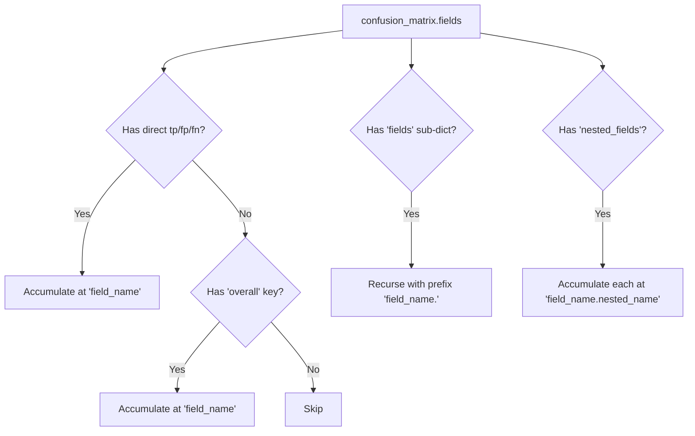

# Aggregator Design

> **🔄 Updated 2026-02-12:** [Stickler PR #74](https://github.com/awslabs/stickler/pull/74) shipped `aggregate_from_comparisons()` and `update_from_comparison_result()`. The custom `BulkEvaluationAggregator` class described below is now only needed as a standalone zero-dep shim in the `test_results_resolver` Lambda. For `idp_common` (notebooks, CLI, Docker Lambdas), use `from stickler import aggregate_from_comparisons` directly.

## Two-Tier Approach

| Context | Aggregation Engine | Location |
|---------|-------------------|----------|
| `idp_common` (notebooks, CLI, Docker Lambdas) | `stickler.aggregate_from_comparisons()` | Stickler package (already a dependency) |
| `test_results_resolver` Lambda (bare Zip) | `BulkEvaluationAggregator` standalone shim | `test_results_resolver/bulk_aggregator.py` |

## Stickler-Native API (`idp_common` contexts)

```python
from stickler import aggregate_from_comparisons

# Takes list of compare_with() result dicts, returns ProcessEvaluation
result = aggregate_from_comparisons(comparison_results)

# Access metrics
result.document_count    # int
result.metrics           # dict: overall P/R/F1/Accuracy + raw counts
result.field_metrics     # dict: per-field P/R/F1/Accuracy + raw counts
result.errors            # list: error records
result.pretty_print_metrics()  # formatted console output
```

## Lambda Shim: `BulkEvaluationAggregator`

Location: `nested/appsync/src/lambda/test_results_resolver/bulk_aggregator.py`

This is a standalone ~80-line file with zero imports beyond `collections.defaultdict` and `typing`. It replicates Stickler's accumulation logic for use in the bare Zip Lambda.

## Public API

```python
class BulkEvaluationAggregator:
    """Accumulates per-document confusion matrices into aggregate field-level metrics."""

    def __init__(self) -> None: ...
    def reset(self) -> None: ...
    def update(self, confusion_matrix: dict, doc_id: str | None = None) -> None: ...
    def compute(self) -> dict: ...
```

| Method | Purpose |
|--------|---------|
| `__init__()` | Initialize empty accumulators |
| `reset()` | Clear all accumulated state |
| `update(cm, doc_id)` | Add one document's confusion matrix to the running totals |
| `compute()` | Return aggregated metrics dict |

## Metric Keys Tracked

| Key | Meaning |
|-----|---------|
| `tp` | True Positive — field present in both expected and actual, values match |
| `fp` | False Positive — field present in actual but not expected, or value wrong |
| `fn` | False Negative — field present in expected but missing/empty in actual |
| `tn` | True Negative — field absent in both expected and actual |
| `fd` | False Discovery (Stickler-specific) |
| `fa` | False Alarm (Stickler-specific) |

## Derived Metrics

| Metric | Formula |
|--------|---------|
| Precision | `tp / (tp + fp)` |
| Recall | `tp / (tp + fn)` |
| F1 | `2 * P * R / (P + R)` |
| Accuracy | `(tp + tn) / (tp + tn + fp + fn)` |

All derived metrics default to `0.0` when the denominator is zero.

## Input: Confusion Matrix Shape

The `update()` method accepts the `confusion_matrix` dict from Stickler's `compare_with(include_confusion_matrix=True)`:

```python
# Flat field
{"fields": {"invoice_id": {"tp": 1, "fp": 0, "fn": 0, "tn": 0}}}

# Nested/list field (has overall + nested_fields)
{"fields": {"line_items": {
    "overall": {"tp": 3, "fp": 1, "fn": 0, "tn": 0},
    "nested_fields": {
        "description": {"tp": 1, "fp": 0, "fn": 0, "tn": 0},
        "amount": {"tp": 1, "fp": 1, "fn": 0, "tn": 0}
    }
}}}

# Hierarchical (has overall + fields)
{"fields": {"address": {
    "overall": {"tp": 2, "fp": 0, "fn": 0, "tn": 0},
    "fields": {
        "street": {"tp": 1, "fp": 0, "fn": 0, "tn": 0},
        "city": {"tp": 1, "fp": 0, "fn": 0, "tn": 0}
    }
}}}
```

## Output: `compute()` Return Shape

```python
{
    "document_count": 75,
    "overall": {
        "tp": 450, "fp": 12, "fn": 8, "tn": 5,
        "precision": 0.974, "recall": 0.982, "f1": 0.978, "accuracy": 0.957
    },
    "fields": {
        "invoice_id":              {"tp": 75, "fp": 0, "fn": 0, "tn": 0, "precision": 1.0, ...},
        "customer_name":           {"tp": 68, "fp": 3, "fn": 4, "tn": 0, ...},
        "line_items":              {"tp": 210, "fp": 6, "fn": 3, "tn": 0, ...},
        "line_items.description":  {"tp": 70, "fp": 2, "fn": 1, "tn": 0, ...},
        "line_items.amount":       {"tp": 70, "fp": 3, "fn": 1, "tn": 0, ...},
        "line_items.quantity":     {"tp": 70, "fp": 1, "fn": 1, "tn": 0, ...},
    },
    "errors": []
}
```

Note: Fields are **dot-path flattened** — `line_items.description` represents the `description` nested field within `line_items`. Both the parent (`line_items`) and children appear in the output.

## Field Path Resolution



## Design Decisions

| Decision | Rationale |
|----------|-----------|
| Stickler-native for `idp_common` | PR #74 resolved the API mismatch; no reason to maintain custom code where Stickler is available |
| Standalone shim for Lambda only | Lambda is bare Zip with no deps; Stickler + transitive deps = 221 MB |
| Single copy of shim (Lambda dir only) | No sync risk — `idp_common` uses Stickler directly |
| Parity test required | Must verify Lambda shim produces identical output to `aggregate_from_comparisons()` |
| Micro-averaging | Each field instance counts equally — standard for NER/extraction tasks |
| Dot-path flattening | Enables flat table display in UI while preserving hierarchy info |
| `errors` list | Captures malformed confusion matrices without failing the whole aggregation |
| `reset()` method | Enables reuse of aggregator instance across test runs |
