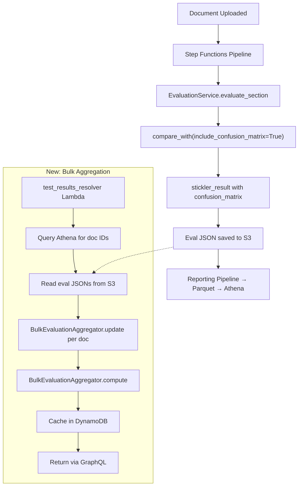

# Data Flow: Per-Document → Bulk Aggregation

## End-to-End Data Flow



## Current State: What Exists Today

| Step | Component | What Happens |
|------|-----------|-------------|
| 1 | `evaluate_section()` | Calls `expected_instance.compare_with(actual_instance, document_field_comparisons=True)` |
| 2 | `_transform_stickler_result()` | Extracts `field_scores`, builds `SectionEvaluationResult` with per-field TP/FP/FN/TN |
| 3 | Eval JSON → S3 | Per-document results saved as JSON to output bucket |
| 4 | Reporting pipeline | Flattens results to parquet → Athena tables (`document_evaluations`, `attribute_evaluations`) |
| 5 | `test_results_resolver` | Queries Athena for `AVG(accuracy)`, `AVG(precision)`, etc. across documents |
| 6 | GraphQL → UI | Returns averaged metrics to Test Studio |

## Gap: What's Missing

The `compare_with()` call does **not** currently pass `include_confusion_matrix=True`. This means the raw confusion matrix (with per-field TP/FP/FN/TN counts in Stickler's native format) is **not** in the eval JSON.

The current per-document metrics (TP/FP/FN/TN) are computed in `_transform_stickler_result()` at the IDP level, not from Stickler's confusion matrix. These are **document-level** counts, not the field-level confusion matrix needed for bulk aggregation.

## Proposed State: KISS Approach (S3 Direct)

| Step | Component | Change |
|------|-----------|--------|
| 1 | `evaluate_section()` | Add `include_confusion_matrix=True` to `compare_with()` call |
| 2 | `_transform_stickler_result()` | Pass through `confusion_matrix` key to result dict |
| 3 | Eval JSON → S3 | Now includes `confusion_matrix` — **no other pipeline changes** |
| 4 | `test_results_resolver` | New function: query doc IDs from Athena, read eval JSONs from S3, aggregate |
| 5 | `BulkEvaluationAggregator` | Accumulates confusion matrices, computes field-level P/R/F1 |
| 6 | DynamoDB cache | Store computed bulk metrics (one-time per test run) |
| 7 | GraphQL → UI | New `fieldLevelMetrics` field on `TestRun` type |

## Confusion Matrix Structure (from Stickler)

This is the shape of data that `compare_with(include_confusion_matrix=True)` returns:

```json
{
  "confusion_matrix": {
    "overall": { "tp": 8, "fp": 1, "fn": 1, "tn": 0 },
    "fields": {
      "invoice_id": { "tp": 1, "fp": 0, "fn": 0, "tn": 0 },
      "customer_name": { "tp": 1, "fp": 0, "fn": 0, "tn": 0 },
      "line_items": {
        "overall": { "tp": 3, "fp": 1, "fn": 0, "tn": 0 },
        "nested_fields": {
          "description": { "tp": 1, "fp": 0, "fn": 0, "tn": 0 },
          "amount": { "tp": 1, "fp": 1, "fn": 0, "tn": 0 },
          "quantity": { "tp": 1, "fp": 0, "fn": 0, "tn": 0 }
        }
      }
    }
  }
}
```

## Aggregation Example (3 Documents)

| Field | Doc 1 | Doc 2 | Doc 3 | **Aggregate** | **P** | **R** | **F1** |
|-------|-------|-------|-------|---------------|-------|-------|--------|
| invoice_id | TP=1 | TP=1 | TP=1 | TP=3, FP=0, FN=0 | 1.000 | 1.000 | 1.000 |
| customer_name | TP=1 | FP=1 | TP=1 | TP=2, FP=1, FN=0 | 0.667 | 1.000 | 0.800 |
| line_items.amount | TP=1,FP=1 | TP=1 | FN=1 | TP=2, FP=1, FN=1 | 0.667 | 0.667 | 0.667 |

The aggregator sums raw counts across documents, then derives P/R/F1 from the totals. This is **micro-averaging** — each field instance counts equally regardless of which document it came from.
