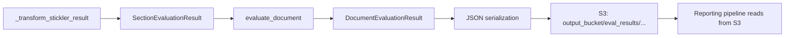

# Evaluation Service Changes

## Files Modified

| File | Change Type |
|------|-------------|
| `lib/idp_common_pkg/idp_common/evaluation/service.py` | Modify `evaluate_section()` and `_transform_stickler_result()` |

## Change 1: Enable `include_confusion_matrix` in `compare_with()`

### Current Code (line ~1434)

```python
stickler_result = expected_instance.compare_with(
    actual_instance,
    document_field_comparisons=True,
)
```

### Proposed Code

```python
stickler_result = expected_instance.compare_with(
    actual_instance,
    document_field_comparisons=True,
    include_confusion_matrix=True,       # ← ADD
)
```

### Impact

- Stickler will include a `confusion_matrix` key in the result dict
- No change to existing `field_scores`, `overall_score`, or `field_comparisons` — those remain as-is
- Slight increase in result dict size (adds ~1-5KB per document depending on field count)

## Change 2: Pass through `confusion_matrix` in `_transform_stickler_result()`

The `_transform_stickler_result()` method returns a `SectionEvaluationResult`. The confusion matrix needs to be preserved so it ends up in the eval JSON saved to S3.

### Option A: Add to `SectionEvaluationResult` model

```python
@dataclass
class SectionEvaluationResult:
    section_id: str
    document_class: str
    attributes: List[AttributeEvaluationResult]
    metrics: Dict[str, Any]
    confusion_matrix: Optional[Dict[str, Any]] = None   # ← ADD
```

### Option B: Embed in `metrics` dict

```python
# At the end of _transform_stickler_result():
metrics["confusion_matrix"] = stickler_result.get("confusion_matrix", {})
```

### Recommendation

**Option B** is simpler — no model changes, and the confusion matrix naturally flows through the existing serialization path to S3. The `metrics` dict is already a flexible `Dict[str, Any]`.

## Verification: Where Does the Eval JSON Get Saved?



The confusion matrix in `metrics` will be serialized to JSON and saved to S3 automatically through the existing pipeline. No changes needed downstream for persistence.

## What NOT to Change

- `_transform_stickler_result()` logic for TP/FP/FN/TN counting — that stays as-is for per-document metrics
- `SectionEvaluationResult` dataclass (if using Option B)
- `AttributeEvaluationResult` — no changes
- Reporting pipeline parquet schema (KISS approach — skip Athena column)
