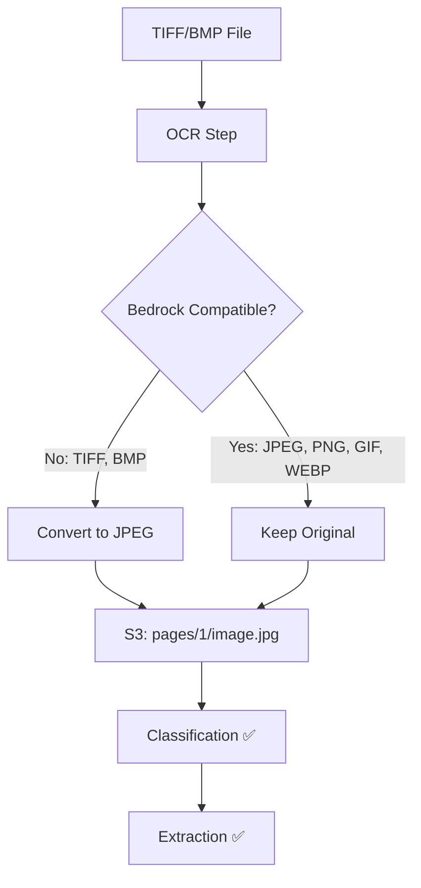
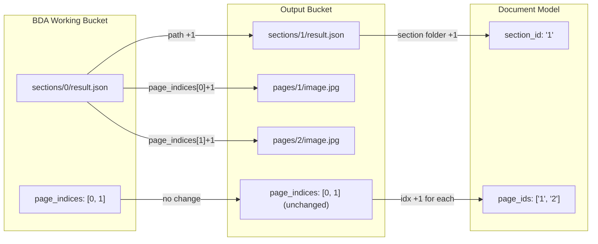
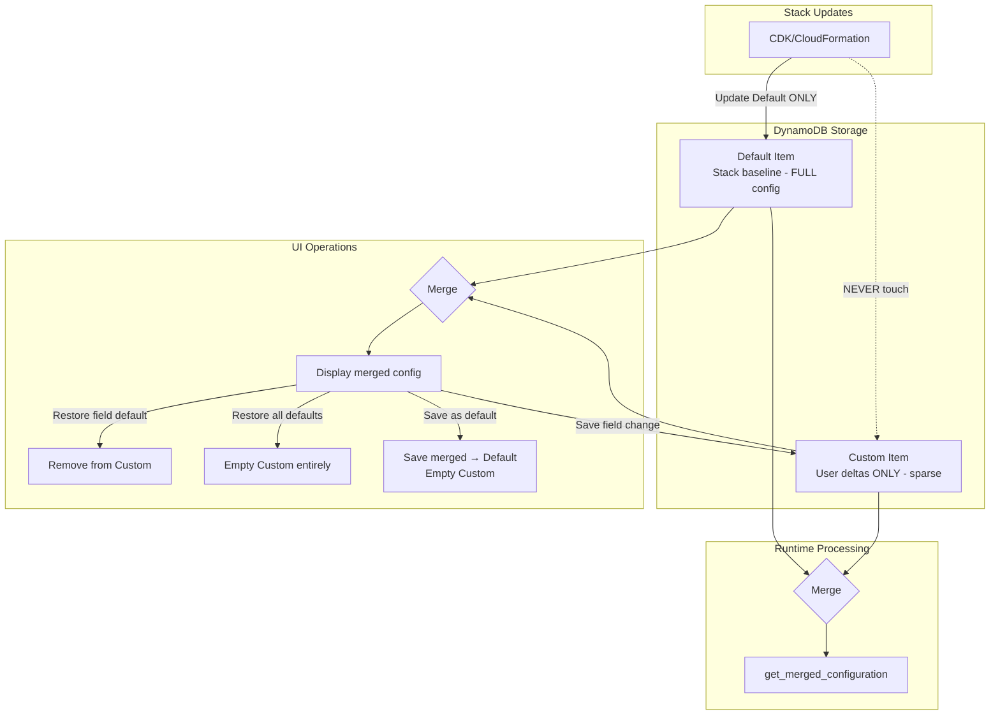

# Active Context

## Current Work Focus

### TIFF Image Format Support Fix (February 6, 2026)
**Status:** ✅ Completed

#### Problem
Processing TIFF image files failed during classification with error:
```
Error classifying page 1: Unsupported image format: TIFF
```

#### Root Cause
1. Amazon Bedrock's multimodal APIs only support: **JPEG, PNG, GIF, WEBP**
2. OCR step preserved TIFF format when storing page images to S3
3. Classification step's `prepare_bedrock_image_attachment()` failed when encountering TIFF

#### Solution
Modified `_process_image_file_direct()` in `lib/idp_common_pkg/idp_common/ocr/service.py` to convert non-Bedrock-compatible formats (TIFF, BMP) to JPEG during OCR processing:

```python
# Define Bedrock-compatible formats
BEDROCK_COMPATIBLE_FORMATS = {"jpeg", "jpg", "png", "gif", "webp"}

# In _process_image_file_direct():
if img_format not in self.BEDROCK_COMPATIBLE_FORMATS:
    logger.info(f"Converting {img_format.upper()} to JPEG for Bedrock compatibility")
    if pil_img.mode not in ("RGB", "L"):
        pil_img = pil_img.convert("RGB")
    img_buffer = io.BytesIO()
    pil_img.save(img_buffer, format="JPEG", quality=95, optimize=True)
    img_data = img_buffer.getvalue()
    img_ext = "jpg"
    img_format = "jpeg"
```

#### Key Learnings
- **TIFF can be multi-page** (like PDF) - PyMuPDF handles this transparently
- **PDF pages → always JPEG** (via `_extract_page_image()` which calls `pix.tobytes("jpeg")`)
- **Image files → format was preserved** (now converted if not Bedrock-compatible)

#### Data Flow After Fix


---

### Page/Section Number Alignment Fix (Pattern-1 to Pattern-2)
**Date:** February 6, 2026
**Status:** ✅ Completed (Corrected)

#### Problem
BDA (pattern-1) uses 0-based page and section indices, while pattern-2 and ground truth test sets use 1-based page IDs for S3 paths and display. Evaluation mismatches occurred when using the same test sets for both patterns.

#### Understanding: Two Different Indexing Schemes
There are two different concepts that must be kept distinct:

| Concept | Base | Use Case | Example |
|---------|------|----------|---------|
| **page_indices** (array indices) | 0-based | Internal JSON references, result.json | `[0, 1, 2]` |
| **page_id / section_id** (identifiers) | 1-based | S3 paths, display, Document model | `"1"`, `"2"`, `"3"` |

#### Solution Implemented
Modified `patterns/pattern-1/src/processresults_function/index.py` to:
- Keep `page_indices` **0-based** in result.json (unchanged from BDA output)
- Transform `page_id` and `section_id` to **1-based** for S3 paths and Document model



#### Changes Made

| Function | Change |
|----------|--------|
| `create_pdf_page_images()` | S3 path: `pages/{page_num+1}/` (1-based) |
| `process_bda_sections()` | section_id path: `"0"` → `"1"` (1-based S3 folder) |
| `process_bda_sections()` | page_ids: Convert 0-based page_indices to 1-based strings |
| `process_bda_sections()` | result.json `page_indices` stays **0-based** (no transformation) |
| `process_bda_pages()` | page_id: `str(page_index + 1)` (1-based) |
| `extract_page_from_multipage_json()` | metadata indices stay **0-based** |
| `process_segments()` | page_indices_1based used for matching geometry.page (already 1-based) |

#### Key Finding
BDA output has **two different indexing conventions**:
- `split_document.page_indices` → 0-based (matches array indexing)
- `geometry[].page` → Already 1-based (matches human-readable page numbers)

Both patterns now use this same convention - page_indices are 0-based arrays, page_ids are 1-based identifiers.

#### Result
Pattern-1 now outputs:
- **result.json page_indices**: `[0, 1, 2]` (0-based, consistent with pattern-2)
- **S3 paths**: `pages/1/`, `sections/1/` (1-based)
- **Document page_ids**: `["1", "2", "3"]` (1-based)
- **Document section_ids**: `["1", "2", "3"]` (1-based)

---


### Default/Custom Configuration Design Pattern (CRITICAL)
**Date:** January 22, 2026
**Status:** Fixing implementation to match original design intent

#### Design Intent

The configuration system uses a **sparse delta pattern** for storing user customizations:



#### Key Principles

1. **Default Item**: 
   - Contains complete stack baseline configuration
   - Created at deployment time (config_library + system_defaults merge)
   - Updated ONLY by stack deployments (CDK/CloudFormation)
   - NEVER modified by user UI actions (except "Save as default")

2. **Custom Item**:
   - Contains ONLY user-modified fields (sparse delta)
   - Empty initially (no values = use all defaults)
   - NEVER touched by stack updates
   - User customizations survive stack upgrades

3. **UI Operations**:
   - **Display**: Merge(Default + Custom) - show combined config
   - **Save change**: Write only changed field to Custom
   - **Restore field**: Remove specific field from Custom
   - **Restore all**: Empty/delete Custom item entirely
   - **Save as default**: Save merged → Default, then empty Custom

4. **Runtime Processing**:
   - Always use `get_merged_configuration()` for actual processing
   - Never use raw Custom (it's incomplete)

5. **getConfiguration API Response**:
   - Returns `{Schema, Default, Custom}` separately
   - Custom should return RAW deltas (not Pydantic-filled)
   - Frontend handles display merging

#### Why This Matters

- **Stack upgrades can safely update Default** without losing user customizations
- **Diff detection works** because Custom only has what user changed
- **Empty Custom = all defaults** - clean reset capability
- **Pydantic defaults must NOT fill Custom** - would break delta pattern

#### Anti-patterns to AVOID

❌ Auto-copying Default → Custom when Custom is empty
❌ Using Pydantic validation on Custom (fills in defaults)
❌ Returning "full" Custom config from getConfiguration API
❌ Modifying Default item from UI (except "Save as default")

### GitHub Issue #87 - System Defaults Configuration ✅
**Issue:** Simplify configuration management with system defaults
**Date:** January 20, 2026

## Recent Changes (January 20, 2026)

### Implemented System Defaults and Config CLI Commands

#### Part 1: System Defaults YAML Structure ✅

Created `config_library/system_defaults/` with:

| File | Lines | Purpose |
|------|-------|---------|
| `base.yaml` | ~280 | Common defaults shared across all patterns |
| `pattern-1.yaml` | ~150 | BDA-specific defaults (null OCR/classification/extraction models) |
| `pattern-2.yaml` | ~550 | Full Bedrock LLM defaults with complete prompt templates |
| `pattern-3.yaml` | ~130 | UDOP fine-tuned model defaults |
| `README.md` | ~110 | Documentation for the defaults system |

Key Design Decisions:
- `_inherits: base.yaml` - Pattern files declare inheritance
- Complete prompts only in pattern-2.yaml (most commonly used)
- `enabled: false` for optional features (summarization, evaluation)
- Pattern-specific models use `null` when BDA/UDOP handle internally

#### Part 2: Merge Utilities ✅

Extended `lib/idp_common_pkg/idp_common/config/merge_utils.py`:

```python
# Key functions added:
load_system_defaults(pattern: str) -> Dict[str, Any]
merge_config_with_defaults(user_config, pattern, validate=False) -> Dict[str, Any]
generate_config_template(features, pattern, include_prompts=False) -> str
validate_config(config, pattern) -> Dict[str, Any]
```

#### Part 3: CLI Commands ✅

Added to `idp_cli/idp_cli/cli.py`:

```bash
# Generate minimal config template
idp-cli create-config --features min --pattern pattern-2 --output config.yaml

# Validate config file
idp-cli validate-config --custom-config ./config.yaml

# Download config from deployed stack (full or minimal diff)
idp-cli download-config --stack-name my-stack --output config.yaml --format minimal
```

#### Part 4: Deploy Integration ✅

Updated `idp_cli/idp_cli/deployer.py`:
- `upload_local_config()` now merges user config with system defaults before upload
- Auto-detects pattern from config content (classification method)
- Falls back gracefully if idp_common not available

### User Workflow Now

**Before (600+ line config required):**
```yaml
notes: "..."
ocr:
  backend: "textract"
  features:
    - name: LAYOUT
  # ... 50 more lines
classification:
  model: "..."
  # ... 100 more lines
# etc...
```

**After (20 line minimal config):**
```yaml
notes: "My lending package config"

classification:
  model: us.amazon.nova-2-lite-v1:0

extraction:
  model: us.amazon.nova-2-lite-v1:0

classes:
  - $id: W2
    type: object
    x-aws-idp-document-type: W2 Tax Form
    properties:
      employer_name:
        type: string
```

## File Structure

```
config_library/
└── system_defaults/
    ├── README.md
    ├── base.yaml         # Common defaults
    ├── pattern-1.yaml    # BDA defaults
    ├── pattern-2.yaml    # Bedrock LLM defaults
    └── pattern-3.yaml    # UDOP defaults

lib/idp_common_pkg/idp_common/config/
└── merge_utils.py        # Extended with system defaults functions

idp_cli/idp_cli/
├── cli.py                # Added create-config, validate-config, download-config
└── deployer.py           # Updated upload_local_config() for merge
```

## Next Steps

1. **Documentation Updates**
   - Update `docs/configuration.md` with minimal config examples
   - Add `idp-cli config` section to `docs/idp-cli.md`

2. **Testing**
   - Test `create-config` command output
   - Test `validate-config` with valid/invalid configs
   - Test deploy with minimal config file
   - Test `download-config --format minimal` diff calculation

3. **Optional Enhancements**
   - Add `idp-cli deploy-config` for fast config-only updates (DynamoDB direct write)
   - Add `--pattern` option to `deploy` command for explicit pattern selection

## Important Patterns and Preferences

### Configuration Merge Priority
1. User's custom config (highest)
2. Pattern-specific defaults (pattern-X.yaml)
3. Base defaults (base.yaml)
4. Pydantic model defaults (lowest)

### Auto-Detection Logic
Pattern is auto-detected from config:
- `classificationMethod: "bda"` → pattern-1
- `classificationMethod: "udop"` → pattern-3
- Default → pattern-2

## Learnings and Project Insights

1. **YAML inheritance via `_inherits` key**: Useful for documentation but handled programmatically
2. **Prompt templates are large**: Pattern-2 prompts alone are 200+ lines
3. **Graceful fallback is important**: Deploy should work even if idp_common not installed
4. **Classes are always required**: Users must always specify document classes - no default