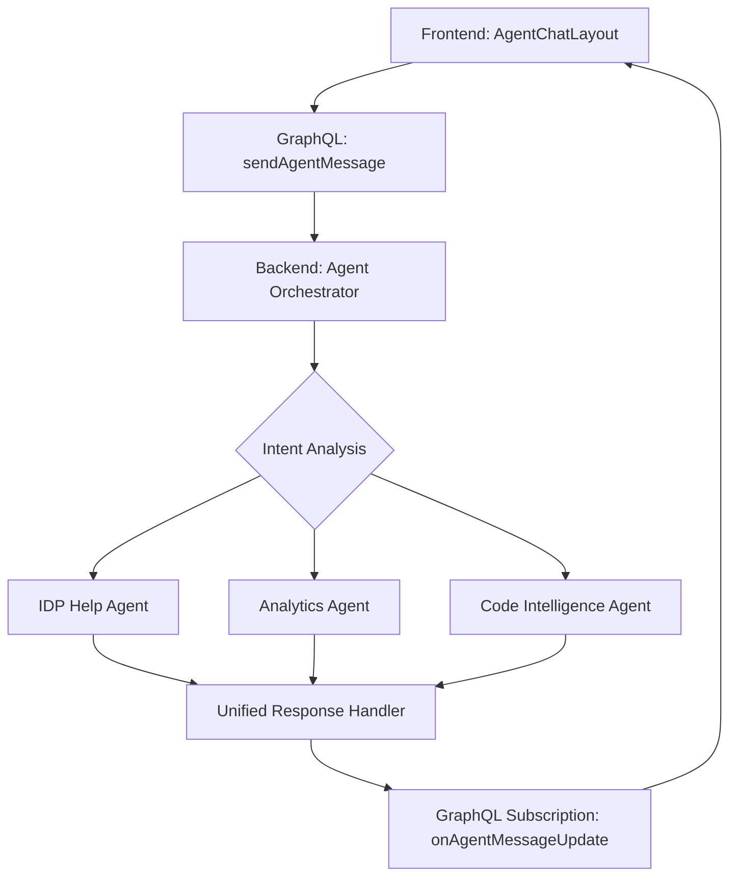

# Agent Chat Components

This directory contains generic, reusable chat components for the IDP Accelerator that can be used with multiple agent types while maintaining backward compatibility with the existing IDP Help functionality.

## Architecture Overview

The generic agent chat system is designed to:

- **Maintain backward compatibility** with existing IDP Help functionality
- **Enable easy extension** for future agent types (Analytics, Code Intelligence, etc.)
- **Provide a unified chat experience** across all agent types
- **Support backend agent orchestration** where routing is handled server-side

## Components

### AgentChatLayout.jsx

The main generic chat layout component that provides:

- **Configurable title and placeholder text**
- **Responsive chat interface** with message history
- **Markdown rendering** for rich text responses
- **Real-time streaming** message support
- **Error handling** and loading states
- **Customizable styling** via CSS classes

#### Props

```jsx
<AgentChatLayout
  title="AI Assistant" // Chat interface title
  placeholder="Ask me anything!" // Input placeholder text
  agentConfig={{}} // Optional agent configuration
  className="" // Additional CSS classes
  showHeader={true} // Show/hide header container
  customStyles={{}} // Inline styles
/>
```

### AgentChatLayout.css

Comprehensive styling for the chat interface including:

- **Message bubbles** with distinct user/assistant styling
- **Responsive design** for mobile and desktop
- **Loading animations** and thinking indicators
- **Code syntax highlighting** support
- **Markdown formatting** styles

## Hooks

### use-agent-chat.js

Generic chat hook that provides:

- **Configurable GraphQL operations** for different agent types
- **Message state management** with streaming support
- **Error handling** and loading states
- **Session management** with unique IDs
- **Backward compatibility** with existing IDP Help backend

#### Usage

```javascript
const { messages, isLoading, waitingForResponse, error, sendMessage, clearError } = useAgentChat(config);
```

#### Configuration Options

```javascript
const config = {
  agentType: 'idp-help', // Agent type identifier
  mutation: SEND_IDP_HELP_MESSAGE, // GraphQL mutation
  subscription: ON_IDP_HELP_MESSAGE_UPDATE, // GraphQL subscription
  method: 'chat', // Request method
};
```

## GraphQL Operations

### agentChatQueries.js

Contains both generic and backward-compatible GraphQL operations:

#### Generic Operations (Future Use)

- `SEND_AGENT_MESSAGE` - Generic agent message mutation
- `ON_AGENT_MESSAGE_UPDATE` - Generic agent message subscription
- `LIST_AVAILABLE_AGENTS` - Query available agents
- `SUBMIT_AGENT_QUERY` - Submit query to multiple agents
- `GET_AGENT_JOB_STATUS` - Check agent job status
- `ON_AGENT_JOB_COMPLETE` - Agent job completion subscription

#### Backward Compatibility

- `SEND_IDP_HELP_MESSAGE` - Existing IDP Help mutation
- `ON_IDP_HELP_MESSAGE_UPDATE` - Existing IDP Help subscription

## Implementation Example

### Current IDP Help Usage

```jsx
// src/ui/src/components/idp-help/IdpHelpLayout.jsx
import React from 'react';
import AgentChatLayout from '../agent-chat';

const IdpHelpLayout = () => {
  return (
    <div id="idpHelpDiv">
      <AgentChatLayout
        title="IDP Accelerator Help"
        placeholder="Ask me anything about the IDP Accelerator!"
        className="idp-help-layout"
      />
    </div>
  );
};
```

### Future Agent Usage Examples

#### Analytics Agent

```jsx
const AnalyticsChatLayout = () => (
  <AgentChatLayout
    title="Analytics Assistant"
    placeholder="Ask questions about your document analytics..."
    agentConfig={{ agentType: 'analytics' }}
    className="analytics-chat"
  />
);
```

#### Code Intelligence Agent

```jsx
const CodeIntelChatLayout = () => (
  <AgentChatLayout
    title="Code Intelligence"
    placeholder="Ask about code patterns and architecture..."
    agentConfig={{ agentType: 'code-intelligence' }}
    className="code-intel-chat"
  />
);
```

#### Multi-Agent Orchestrator

```jsx
const UniversalChatLayout = () => (
  <AgentChatLayout
    title="AI Assistant"
    placeholder="Ask me anything - I'll route to the right expert!"
    agentConfig={{ agentType: 'orchestrator' }}
    className="universal-chat"
  />
);
```

## Backend Integration

The generic architecture is designed to work with a backend agent orchestrator that:

- **Routes requests** to appropriate agents based on content analysis
- **Handles multiple agent types** transparently
- **Maintains streaming responses** for real-time interaction
- **Provides unified response format** across all agents

### Expected Backend Flow



## Migration Benefits

### For Developers

- **Reduced code duplication** across agent interfaces
- **Consistent UX patterns** for all chat interactions
- **Easy to add new agents** without UI changes
- **Maintainable codebase** with clear separation of concerns

### For Users

- **Familiar interface** across all agent types
- **Consistent behavior** and interaction patterns
- **Seamless experience** when switching between agents
- **Future-proof** for new agent capabilities

## File Structure

```
src/ui/src/components/agent-chat/
├── AgentChatLayout.jsx     # Main chat component
├── AgentChatLayout.css     # Chat interface styles
├── index.js                # Component exports
└── README.md               # This documentation

src/ui/src/hooks/
└── use-agent-chat.js       # Generic chat hook

src/ui/src/graphql/queries/
└── agentChatQueries.js     # GraphQL operations
```

## Testing

The implementation has been tested to ensure:

- ✅ **Backward compatibility** - Existing IDP Help functionality works unchanged
- ✅ **Compilation success** - No build errors or warnings
- ✅ **Component loading** - All components render correctly
- ✅ **Import resolution** - All module imports work properly
- ✅ **Styling consistency** - UI matches existing design patterns

## Future Enhancements

1. **Agent Selection UI** - Optional dropdown for manual agent selection
2. **Multi-Agent Conversations** - Support for agent-to-agent communication
3. **Context Persistence** - Cross-session conversation history
4. **Advanced Routing** - ML-based intent classification
5. **Agent Capabilities** - Dynamic feature discovery and display
